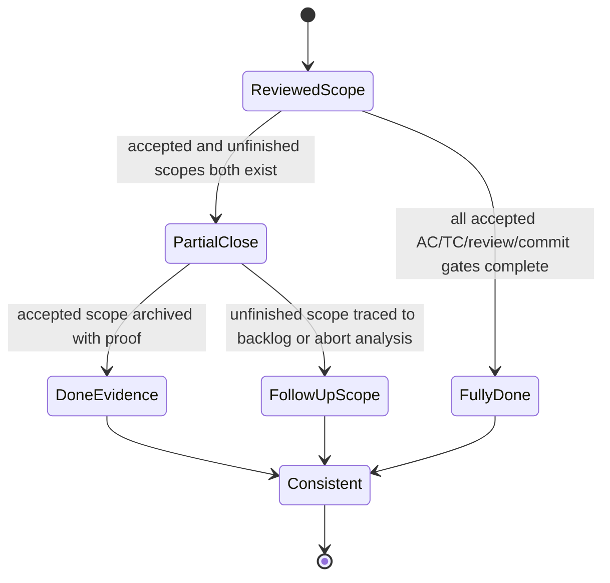
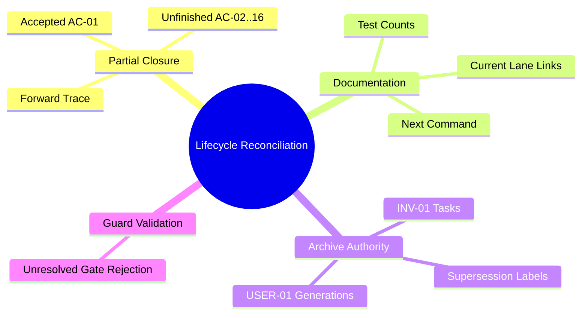

# User Story: Reconcile utCodeAgentCLI partial closure and lifecycle evidence

> **Story ID:** US-SPECFLOW-REPAIR-01 | **State:** doing | **Priority:** P1
> **Source:** `.catdd/spec/analyzedNews/20260830-reconcile-utCodeAgentCLI-closure-and-session-contract-Issue.md`
> **Related Closed Story:** `.catdd/spec/doneUS/20260607-utCodeAgentCLI-US-INVENTOR-01-UserStory.md`
> **CaTDD Class:** P1 Design
> **Primary Category:** State
> **Created:** 2026-08-30

---

## Active Work Status

- Status: OPEN.
- Opened by `/SPEC_openUserStory` on 2026-08-30.
- Lifecycle transition: `.catdd/spec/todoUS/` -> `.catdd/spec/doingUS/`.
- Branch: `fix/utcodeagentcli-partial-closure-reconciliation`.
- Planned by `/SPEC_makePlan` on 2026-08-30.
- Requirement surfaces updated by `/SPEC_updateUserStory` on 2026-08-30; review pending.
- Requirement review by `/SPEC_reviewUserStory` on 2026-08-30: REVISE with REQ-REV-01 through REQ-REV-04.
- Requirement corrections applied by `/SPEC_updateUserStory` on 2026-08-30; attempt 2 of 3, re-review pending.
- Requirement re-review by `/SPEC_reviewUserStory` on 2026-08-30: REVISE with REQ-REV-05; REQ-REV-01 through REQ-REV-04 pass.
- REQ-REV-05 routing metadata corrected by `/SPEC_updateUserStory` on 2026-08-30; final attempt 3 of 3, re-review pending.
- Final requirement re-review by `/SPEC_reviewUserStory` on 2026-08-30: PASS; transfer to initial detail design.
- Initial detail design created by `/SPEC_takeDetailDesign` on 2026-08-30; review pending.
- Design validation: focused interface/fixture/routing checks, README mirrors, documentation contract, and SpecFlow artifact-policy checks PASS.
- Baseline observation: `scripts/test_specflow_take_plan.sh` expects obsolete `*-TASKs.md` text while committed `SPEC_makePlan.md` uses `*-UserStory-Tasks.md`; neither file is changed by this story.
- Detail-design review by `/SPEC_reviewDetailDesign` on 2026-08-30: REVISE with DD-REV-01 through DD-REV-03.
- Detail-design corrections applied by `/SPEC_updateDetailDesign` on 2026-08-30; attempt 1 of 3, re-review pending.
- Developer architecture decision on 2026-08-30 superseded the DetailDesign route: all `utCodeAgentCLI` DetailDesign files are removed and ArchDesign becomes the sole design authority.
- Architecture-only policy recorded in `ADR_ArchitectureOnlyDesignPolicy.md`, module subproject context, and both ArchDesign mirrors; architecture review pending.
- Work orientation: requirement-oriented first, then implementation-oriented validation.
- Paired tasks: `.catdd/spec/doingUS/20260830-utCodeAgentCLI-partial-closure-reconciliation-UserStory-Tasks.md`.
- Subproject context: [projectContext-utCodeAgentCLI.md](../projectContext-utCodeAgentCLI.md).
- Architecture decision: [ADR_ArchitectureOnlyDesignPolicy.md](../../../codeAgents/utCodeAgentCLI/ADRs/ADR_ArchitectureOnlyDesignPolicy.md).
- Design authority: [README_ArchDesign.md](../../../codeAgents/utCodeAgentCLI/README_ArchDesign.md).
- Next recommended command: `/SPEC_reviewArchDesign`.

## Detail-Design Review Result

- **Result:** REVISE.
- **Review attempt:** 1 of 3.
- **Passing evidence:** read-only ownership, `--repo-root` interface, exit-code classes, deterministic phase order, fixture isolation, Bash 3.2 compatibility, architecture boundary, and AC-01 through AC-04 design mappings are explicit.
- **DD-REV-01 - Unowned CLI misuse contract:** TC-LIFECYCLE-008 verifies invalid `--repo-root` and unknown-option behavior but has no story AC. Developer decision: add AC-05 to US-SPECFLOW-REPAIR-01. Update the story, authoritative ledger count/total, detail-design acceptance mapping, fixture mapping, and CaTDD handoff before test design.
- **DD-REV-02 - Undefined closure-pair discovery:** AC-04 says a future fully closed story with unresolved gates must fail, while the design only says `tracked story/task pairs`. Define which `doneUS` stories are eligible, how `*-UserStory.md` pairs with current `*-UserStory-Tasks.md` and legacy `*-TASKs.md`, how missing/ambiguous pairs fail, and how explicitly partial/historical archives are excluded from full-closure evaluation.
- **DD-REV-03 - Undefined verification target semantics:** AC-02 requires links, executable counts, historical/current guidance, and a valid next-command target, but the design does not identify authoritative fields or the command-to-artifact mapping. Define the exact inspected documents/fields, relative-link resolution algorithm, executable-count metadata format, and valid lifecycle target rule for current commands.
- **Baseline test note:** `scripts/test_specflow_take_plan.sh` remains an unrelated pre-existing failure caused by obsolete filename text and is not a blocker for correcting this design.
- **Next gate after correction:** rerun `/SPEC_reviewDetailDesign`; do not create test skeletons before PASS.

### Detail-Design Correction Attempt 1

- **DD-REV-01 corrected:** developer-approved AC-05 owns invalid checker invocation behavior; the module ledger now records five DOING repair ACs and total 261.
- **DD-REV-02 corrected:** detail design defines eligible full-closure records, current/legacy pair candidates, exact zero/two-pair failures, partial-closure exclusion, and historical unchecked-task handling.
- **DD-REV-03 corrected:** module verification design exposes exact current story, tasks, command, and executable-count metadata; detail design defines relative-link resolution, command agreement, and valid-target rules.
- No script or product code was implemented.

## Architecture-Only Supersession

- The prior DetailDesign draft/review/update sequence is preserved above as historical evidence and is no longer an active gate.
- Root `README_DetailDesign.md` and module `README_DetailDesign.md` / `README_DetailDesign_ZH.md` are removed by developer decision.
- The lifecycle checker remains in story scope; ArchDesign owns its read-only boundary, exit-code contract, safety constraints, and repository/module separation.
- Tests and implementation will own exact parsing mechanics after architecture review passes.

## Requirement Update Result

- [README_UserStoryStatus.md](../../../codeAgents/utCodeAgentCLI/README_UserStoryStatus.md) records US-INVENTOR-01 as 1 DONE / 15 TODO and the active repair story as five DOING ACs, for an aggregate total of 261.
- [README_UserStory4INVENTOR-01.md](../../../codeAgents/utCodeAgentCLI/USs/README_UserStory4INVENTOR-01.md) marks AC-01 DONE and AC-02 through AC-16 TODO without changing any AC ID or wording.
- [README_UserGuide.md](../../../codeAgents/utCodeAgentCLI/README_UserGuide.md) and [README_UserGuide_ZH.md](../../../codeAgents/utCodeAgentCLI/README_UserGuide_ZH.md) explain partial-closure interpretation consistently.
- [README_VerifyDesign.md](../../../codeAgents/utCodeAgentCLI/README_VerifyDesign.md) distinguishes current lifecycle state from historical review evidence and reports two executable delegation bodies.
- The archived INV-01 story/TASKs now represent partial closure; the 2026-06-28 USER-01 story is the authoritative 32-AC completion record, while its paired TASKs remain labeled as an incomplete historical planning snapshot and the 2026-06-07 five-AC story is legacy scope.
- No architecture or detail-design contract was changed.
- Rework attempt: 1 of 3.

## Requirement Review Result

- **Result:** REVISE.
- **Review attempt:** 1 of 3.
- **Passing evidence:** partial-closure arithmetic is 1 DONE / 15 TODO; AC-01 through AC-16 identities and wording are preserved; bilingual UserGuide headings remain aligned; historical dates, commits, and unchecked task evidence remain intact; stale INV-01 `doingUS` links were removed.
- **REQ-REV-01 - Missing unfinished-scope owner:** AC-02 through AC-16 are described as forward-traced, but no todo/doing/abort story owns their future implementation. US-UTCLI-REPAIR-01 explicitly excludes implementing them. Add one explicit owner or mark the forward route as unresolved without claiming the checkpoint is satisfied.
- **REQ-REV-02 - Invalid AS-02 precondition:** AS-02 says `doingUS/` is empty, but US-SPECFLOW-REPAIR-01 is active in that lane. Rewrite the precondition around the related closed INV-01 story having no active duplicate.
- **REQ-REV-03 - Missing CaTDD AC identity:** The active story defines AS-01 through AS-04 but no stable AC IDs, so future test skeletons cannot satisfy mandatory US -> AC -> TC traceability. Assign stable AC IDs without changing accepted behavior.
- **REQ-REV-04 - Active story absent from authoritative ledger:** `README_UserStoryStatus.md` is the accepted project ledger exception, but it contains no US-SPECFLOW-REPAIR-01 row or AC status. Add the active repair story with its reviewed AC count and update aggregate totals while keeping the existing module stories unchanged.
- **Next gate after correction:** rerun `/SPEC_reviewUserStory`; do not begin test design before PASS.

### Requirement Correction Attempt 2

- **REQ-REV-01 corrected:** [US-INVENTOR-01-FOLLOWUP-01](../todoUS/20260830-utCodeAgentCLI-US-INVENTOR-01-remaining-delegation-UserStory.md) is the single lifecycle owner for existing AC-02 through AC-16 and TC-DELEGATE-002 through TC-DELEGATE-016.
- **REQ-REV-02 corrected:** repair AC-02 now asserts that archived INV-01 has no duplicate active-lane copy; it no longer requires the entire `doingUS/` lane to be empty.
- **REQ-REV-03 corrected:** the repair story now has stable AC-01 through AC-04 identities, preserving the four accepted behaviors.
- **REQ-REV-04 corrected:** `README_UserStoryStatus.md` now includes US-SPECFLOW-REPAIR-01 with four DOING ACs and aggregate total 260.
- Re-review is required before test design.

## Requirement Re-review Result

- **Result:** REVISE.
- **Review attempt:** 2 of 3.
- **REQ-REV-01:** PASS; US-INVENTOR-01-FOLLOWUP-01 owns existing AC-02 through AC-16 and TC-DELEGATE-002 through TC-DELEGATE-016.
- **REQ-REV-02:** PASS; repair AC-02 checks that archived INV-01 has no active duplicate without requiring an empty `doingUS/` lane.
- **REQ-REV-03:** PASS; the repair story has stable AC-01 through AC-04 identities.
- **REQ-REV-04:** PASS; the authoritative module ledger includes four DOING repair ACs and totals 260.
- **REQ-REV-05 - Conflicting current next command:** The story header and final `Next Recommended Command` still select `/SPEC_updateUserStory` attempt 2, while the paired TASKs correctly select `/SPEC_reviewUserStory` after attempt 2. Normalize both story locations to update attempt 3 now, then to re-review after the correction; do not change passing requirement content.
- **Loop guard:** attempt 3 is the final allowed requirement update. If changed evidence does not resolve REQ-REV-05, stop and route to `ASK` or `SPEC_abortUserStory` instead of another silent retry.

### Requirement Correction Attempt 3

- **REQ-REV-05 corrected:** the active story header, final recommendation, paired task selection, and checklist now route consistently to `/SPEC_reviewUserStory` final re-review.
- No requirement, AC, ledger, archive, usage, verification, architecture, or detail-design content changed in this attempt.
- Attempt 3 of 3 is complete; no further silent requirement update is permitted.

## Final Requirement Review Result

- **Result:** PASS; transfer to design-oriented work.
- **Review attempt:** 3 of 3.
- **REQ-REV-01:** PASS; one dedicated todo continuation owns existing INV-01 AC-02 through AC-16 and TC-DELEGATE-002 through TC-DELEGATE-016.
- **REQ-REV-02:** PASS; repair AC-02 checks the related archived story for an active duplicate without assuming the entire active lane is empty.
- **REQ-REV-03:** PASS; US-SPECFLOW-REPAIR-01 has four stable, atomic, testable AC IDs.
- **REQ-REV-04:** PASS; the authoritative module ledger represents four DOING repair ACs and its 260 total is arithmetically consistent.
- **REQ-REV-05:** PASS; active story and TASKs current-command fields consistently select this final re-review before the result is recorded.
- **Clarity and scope:** PASS; partial closure, archive authority, unfinished ownership, preservation policy, and non-goals are explicit.
- **Usage and traceability:** PASS; bilingual guidance, lifecycle links, archived evidence, and current verification guidance agree.
- **Design transfer:** Initial detail design is required for the focused lifecycle checker because no existing design defines its script ownership, inputs, exit/failure behavior, or fixture strategy. Architecture design is not required because no module boundary or dependency direction changes.

## Story Statement

**As a** Developer,
**I want** closed SpecFlow artifacts to distinguish accepted partial scope from unfinished scope and stale history,
**So that** lifecycle lanes, status ledgers, task checklists, and next-command guidance provide one trustworthy project state.

## Mode Decision

- `analysis_mode`: BRAINSTORM.
- `analysis_depth`: detailed.
- The developer selected two repair stories and chose partial closure for `US-INVENTOR-01`.
- AC-01 is preserved as accepted done evidence; AC-02 through AC-16 remain unfinished and must be traceable as follow-up scope.
- This story owns lifecycle and documentation reconciliation; product implementation belongs to `US-UTCLI-REPAIR-01`.

## Story Readiness Snapshot

| Lens | Answer | Evidence |
| --- | --- | --- |
| User value is explicit | yes | Developers need one reliable next action and lifecycle state. |
| Observable outcome exists | yes | Lane, task, AC/TC status, links, authority markers, and next command can be checked from files. |
| Concrete examples exist | yes | Closed INV-01 and duplicate USER-01 archives are named below. |
| Blocking questions remain | no | Developer chose partial closure and two-story decomposition. |
| Story size is acceptable | yes | Product behavior is excluded; this story is bounded to lifecycle evidence. |
| Ready decision | Ready | Partial-closure semantics and expected repository state are explicit. |

## Priority

| Dimension | Score (1-9) | Rationale |
| --- | --- | --- |
| Business Value | 8 | Restores trust in team-shared SpecFlow state. |
| User Value | 9 | Prevents developers and CodeAgents from following impossible or stale commands. |
| Cost / Effort | 5 | Several linked lifecycle and verification artifacts require coordinated updates. |
| Risk / Complexity | 7 | Historical evidence must be preserved without falsely completing unfinished ACs. |

**Priority Score:** (8 + 9) / (5 + 7) = **1.42** | **Priority:** P1 Design / State

## Independent Test Intent

Starting from the reconciled repository, a lifecycle checker can identify AC-01 as accepted done scope, AC-02 through AC-16 as unfinished follow-up scope, no stale `doingUS` links, no unchecked close sequence presented as completed, and one authoritative status/next-command interpretation for each archived story generation.

## Example Mapping

| Card | ID | Content | Trace / Decision |
| --- | --- | --- | --- |
| Yellow Story | US-SPECFLOW-REPAIR-01 | Trustworthy partial-closure evidence | Source issue observations 3-6 |
| Blue Rule | RULE-01 | A full story cannot be represented as complete when only partial scope was accepted. | AC-01 |
| Green Example | EX-01 | AC-01 remains accepted; AC-02..AC-16 are explicitly unfinished and linked forward. | Developer decision |
| Green Counter-Example | CEX-01 | Story says DONE while all 16 ACs remain TODO and 15 TCs remain PLANNED without split semantics. | Current archive |
| Blue Rule | RULE-02 | Closed artifacts cannot direct readers to nonexistent active-lane files or completed gates. | AC-02 |
| Green Example | EX-02 | Verification links target `doneUS` or a new todo story and report current review state. | AC-02 |
| Green Counter-Example | CEX-02 | Verification design points to `doingUS` and recommends a review against no active story. | Current docs |
| Blue Rule | RULE-03 | Superseded archive generations declare authority and cannot expose contradictory next actions. | AC-03 |
| Green Example | EX-03 | The 2026-06-28 USER-01 artifact is marked superseded/incomplete history with its authoritative successor. | AC-03 |
| Green Counter-Example | CEX-03 | An artifact in `doneUS` retains unchecked review/commit/close and says implementation is next. | Current archive |
| Blue Rule | RULE-04 | Invalid checker invocation stops before repository inspection. | AC-05 |
| Green Example | EX-04 | `--repo-root` without a value exits 2 and emits usage without reading lifecycle files. | AC-05 |
| Green Counter-Example | CEX-04 | An unknown option is ignored and repository validation continues. | Rejected behavior |

**Example Mapping Decision:** Ready

## Visual Model

### Model Gap Analysis

| # | Gap Found | Question | Resolution |
| --- | --- | --- | --- |
| 1 | Current archive jumps from partially implemented to DONE. | Is closure full or partial? | Answered: partial. |
| 2 | Unfinished AC-02..AC-16 had no explicit post-close route. | Where is unfinished scope retained? | Answered: US-INVENTOR-01-FOLLOWUP-01 owns the existing unfinished AC/TC set. |
| 3 | Duplicate USER-01 generations expose conflicting state. | Which artifact is authoritative? | Determine from commit/review evidence and mark the other as superseded history. |

## Input and Output Dictionary

| Element | Kind | Type / Format | Required | Allowed Values / Limits | Producer | Consumer | Validation |
| --- | --- | --- | --- | --- | --- | --- | --- |
| Closed story | input | Markdown artifact | yes | Preserved historical facts and commit refs | SpecFlow | developer/CodeAgent | Must not claim unresolved scope completed. |
| Paired TASKs | input/output | Markdown checklist | yes | Completed items checked; unfinished items routed explicitly | SpecFlow | developer/CodeAgent | Lane and checklist meaning agree. |
| AC status ledger | input/output | Markdown table | yes | Accepted done and unfinished states sum to story total | module requirements | SpecFlow | Status counts match scope decision. |
| Verification design | input/output | Markdown contract | yes | Current links, counts, results, and next action | test design | developer/CodeAgent | No stale active-lane links or superseded recommendation. |
| Follow-up trace | output | story link/status | yes | AC-02..AC-16 retained without duplication | repair story | future SpecFlow | One authoritative owner per unfinished slice. |

## Acceptance Criteria

### AC-01: Partial closure preserves accepted and unfinished scope

**Rule:** RULE-01
**Given** `US-INVENTOR-01` has accepted AC-01 implementation evidence and AC-02 through AC-16 remain unimplemented
**When** its lifecycle artifacts and module ledger are reconciled
**Then** AC-01 is represented as accepted done scope, AC-02 through AC-16 remain explicitly unfinished with a forward trace, and no artifact claims all 16 ACs are complete

### AC-02: Verification guidance reflects current lanes and product state

**Rule:** RULE-02
**Given** the related US-INVENTOR-01 story is archived and has no duplicate copy under `doingUS/`
**When** a developer reads `README_VerifyDesign.md` and linked artifacts
**Then** every story link resolves to its current lane, historical results are distinguished from current state, executable-test counts match the files, and the recommended command targets a valid lifecycle artifact

### AC-03: Duplicate historical stories declare authority

**Rule:** RULE-03
**Given** two archived `US-USER-01` generations contain conflicting task completion state
**When** lifecycle history is normalized
**Then** the authoritative completed generation is explicit, superseded or incomplete historical evidence is labeled without deletion, and it exposes no contradictory current next command

### AC-04: Full closure rejects unresolved evidence

**Rule:** RULE-01
**Given** a future story still has unresolved AC, TC, review, commit, or ledger evidence
**When** full closure is evaluated
**Then** closure does not produce a fully completed `doneUS` state and reports the unresolved gate

### AC-05: Invalid checker invocation is rejected

**Rule:** RULE-02
**Given** a developer invokes the lifecycle checker with an unknown option, a missing `--repo-root` value, or a repository root that is not a directory
**When** checker argument validation runs
**Then** no lifecycle artifact is inspected, exit code is 2, and stderr contains the checker usage contract

## Business Rules

No external business rules were found because this is a process-state repair. Repository constraints are:

| ID | Rule | Type | Implied Functional Requirement |
| --- | --- | --- | --- |
| BR-01 | `doneUS` means closure evidence is complete for the scope represented there. | Fact | Full and partial closure must be distinguishable. |
| BR-02 | Unfinished scope is preserved, not silently marked done or deleted. | Constraint | Add an explicit forward lifecycle trace. |
| BR-03 | Closed story references cannot point to stale `doingUS` paths. | Constraint | Normalize links during closure/reconciliation. |
| BR-04 | One story generation has one authoritative current interpretation. | Constraint | Label superseded historical artifacts. |
| BR-05 | The module dashboard is the accepted ledger exception for `utCodeAgentCLI`. | Fact | Synchronize `README_UserStoryStatus.md` with partial scope. |

## Feature Tree and Split Decision

**Split Decision:** Keep these lifecycle surfaces together because they jointly determine one authoritative project state. Product/session correction remains in `US-UTCLI-REPAIR-01`.

## Scope

**In scope:**

- Reconcile `US-INVENTOR-01` as an explicitly partial closure.
- Preserve AC-01 accepted evidence and trace AC-02 through AC-16 as unfinished scope.
- Synchronize the module status dashboard, verification design, archived story, and paired TASKs.
- Correct stale `doingUS` links, test counts, review status, and next commands.
- Mark authority/supersession for conflicting archived `US-USER-01` generations.
- Add or strengthen a focused lifecycle validation that detects the diagnosed inconsistency.

**Non-goals:**

- Implement AC-02 through AC-16.
- Change canonical asset-session product code or tests.
- Delete historical lifecycle evidence.
- Retroactively fabricate review, commit, or CI results.
- Replace the module-ledger exception with a new root `README_UserStories.md` without a separate decision.

## Risks & Assumptions

| # | Risk / Assumption | Severity | Mitigation / Clarification Needed |
| --- | --- | --- | --- |
| 1 | Rewriting history could erase why the invalid closure happened. | High | Preserve dates, commits, prior decisions, and supersession notes. |
| 2 | AC-02..AC-16 could be duplicated across ledgers or future stories. | High | Give unfinished scope one explicit forward owner/reference. |
| 3 | Existing contract scripts do not detect semantic lifecycle drift. | High | Add a focused check for lane/link/checklist/status consistency. |
| 4 | Module dashboard remains an exception to generic project-ledger policy. | Medium | Preserve the recorded developer decision; do not expand scope. |

## Initial Acceptance Questions

| # | Question | Raised By | Blocks Ready? | Owner / Next Evidence | Status |
| --- | --- | --- | --- | --- | --- |
| 1 | Should the prior closure be treated as full, partial, or invalid? | state-model gap | yes | Developer | answered: partial |
| 2 | Should product and lifecycle repairs share one story? | story-size analysis | yes | Developer | answered: split |
| 3 | Should historical duplicate files be deleted? | risk analysis | yes | Source contract | answered: no, preserve and label |

**Gate:** READY for `/SPEC_openUserStory`.

## Ambiguity Warnings

| # | Ambiguous Term | Found In Section | Resolution |
| --- | --- | --- | --- |
| 1 | "authoritative" | source issue | The artifact that supplies current status and next action; historical alternatives must identify it. |
| 2 | "partial closure" | developer decision | AC-01 accepted in done evidence; AC-02..AC-16 explicitly unfinished and forward-traced. |
| 3 | "normalize" | source issue | Correct state, links, counts, and authority labels without deleting or fabricating history. |

## Issue Analysis & Insights

### Evidence Inventory

| Source | Fact | Confidence | Gap |
| --- | --- | --- | --- |
| Closed INV-01 story | Says DONE and records close commit. | high | Does not reconcile unfinished AC/TC scope. |
| Closed INV-01 TASKs | Still says active and leaves seven lifecycle steps unchecked. | high | Contradicts lane and paired story. |
| Module status dashboard | All 16 INV-01 ACs remain TODO. | high | Does not express accepted AC-01 partial scope. |
| Verification design | Links to `doingUS`, reports pending defect, and expects one executable body. | high | Stale after implementation and closure commits. |
| USER-01 archives | Two generations expose conflicting completion state. | high | Authority/supersession is unstated. |
| Repository checks | Current generic docs/structure checks pass. | high | Existing checks miss semantic lifecycle drift. |

### Root-Cause Hypotheses

| Hypothesis | Confidence | Disconfirming Check |
| --- | --- | --- |
| Full close was applied to a partially accepted story without splitting lifecycle scope. | high | Produce evidence that all 16 ACs and required gates were complete at close. |
| Close normalization updated the story file but not its paired tasks, dashboard, and verification links. | high | Show synchronized post-close state across all four surfaces. |
| Existing validators check structure but not cross-artifact semantics. | high | Show a current script that fails on these contradictions. |

### Insights

| Type | Insight | Confidence | Disposition |
| --- | --- | --- | --- |
| Requirement | Partial closure needs explicit accepted/unfinished status semantics. | high | Acceptance criterion AC-01 |
| Design | Lifecycle state is a cross-artifact invariant, not a folder move alone. | high | Acceptance criteria AC-01/AC-02 |
| Test | Passing document structure checks do not prove lane/status consistency. | high | Acceptance criterion AC-04 |
| Risk | Stale next commands can create a deadloop against a missing related active story. | high | Acceptance criterion AC-02 |
| Process | Superseded story generations need durable authority markers. | high | Acceptance criterion AC-03 |

### Follow-Up Candidates

| Candidate | Reason | Recommendation |
| --- | --- | --- |
| Generalize semantic lifecycle validation across all modules. | Current evidence is from `utCodeAgentCLI`; broader policy may need separate design. | Consider a follow-up issue after the focused repair proves the check. |
| Revisit the module-ledger exception. | Generic SpecFlow expects a project ledger, but the exception was explicit. | Defer unless the focused repair cannot remain coherent. |

## Traceability

| From -> To | Link |
| --- | --- |
| This story -> Raw input | `.catdd/spec/analyzedNews/20260830-reconcile-utCodeAgentCLI-closure-and-session-contract-Issue.md` |
| Project/module story ledger | `codeAgents/utCodeAgentCLI/README_UserStoryStatus.md` |
| Related closed story | `.catdd/spec/doneUS/20260607-utCodeAgentCLI-US-INVENTOR-01-UserStory.md` |
| Sibling repair story | `.catdd/spec/todoUS/20260830-utCodeAgentCLI-canonical-asset-session-repair-UserStory.md` |
| Unfinished INV-01 owner | `.catdd/spec/todoUS/20260830-utCodeAgentCLI-US-INVENTOR-01-remaining-delegation-UserStory.md` |
| This story ID | US-SPECFLOW-REPAIR-01 |

## Next Recommended Command

`/SPEC_reviewArchDesign`
