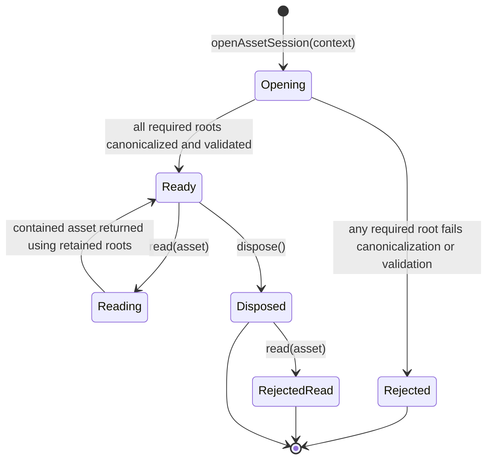
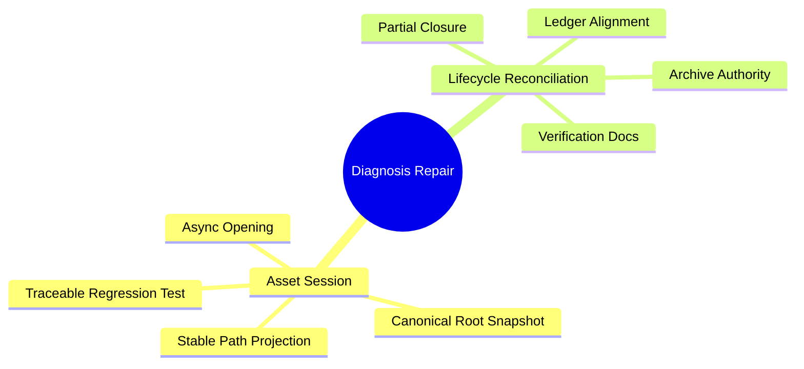

# User Story: Repair utCodeAgentCLI canonical asset-session initialization

> **Story ID:** US-UTCLI-REPAIR-01 | **State:** todo | **Priority:** P1
> **Source:** `.catdd/spec/analyzedNews/20260830-reconcile-utCodeAgentCLI-closure-and-session-contract-Issue.md`
> **Related Closed Story:** `.catdd/spec/doneUS/20260607-utCodeAgentCLI-US-INVENTOR-01-UserStory.md`
> **CaTDD Class:** P1 Design
> **Primary Category:** State
> **Created:** 2026-08-30

---

## Story Statement

**As an** INVENTOR,
**I want** each invocation asset session to canonicalize and retain its configured roots before asset reads,
**So that** all delegated asset paths are resolved and projected against one stable invocation-local filesystem topology.

## Mode Decision

- `analysis_mode`: BRAINSTORM.
- `analysis_depth`: detailed.
- The developer selected two repair stories instead of one combined story.
- The developer selected partial closure for the related closed story: AC-01 remains accepted evidence, while AC-02 through AC-16 remain unfinished scope.
- This story owns only the product contract and its test evidence; lifecycle archive reconciliation belongs to `US-SPECFLOW-REPAIR-01`.

## Story Readiness Snapshot

| Lens | Answer | Evidence |
| --- | --- | --- |
| User value is explicit | yes | INVENTOR needs delegated assets to reflect one stable invocation topology. |
| Observable outcome exists | yes | Root canonicalization call order/count and public path projection are observable through the fake filesystem/runtime. |
| Concrete examples exist | yes | `/workspace-link -> /real/workspace` and canonicalization-failure examples below. |
| Blocking questions remain | no | Story split and closure meaning were answered in BRAINSTORM mode. |
| Story size is acceptable | yes | Product/test correction is separated from lifecycle cleanup. |
| Ready decision | Ready | Scope, expected behavior, failure path, and independent test are explicit. |

## Priority

| Dimension | Score (1-9) | Rationale |
| --- | --- | --- |
| Business Value | 8 | Restores trust that the CLI follows its reviewed source-of-truth design. |
| User Value | 8 | Prevents misleading path evidence for inventors and reviewers. |
| Cost / Effort | 4 | Narrow implementation and focused test correction across existing files. |
| Risk / Complexity | 7 | Filesystem aliases, asynchronous initialization, and session invariants are easy to test incorrectly. |

**Priority Score:** (8 + 8) / (4 + 7) = **1.45** | **Priority:** P1 Design / State

## Independent Test Intent

Use a fake filesystem where `/workspace-link` resolves to `/real/workspace`. Opening one session must canonicalize every required root before returning; multiple reads must not canonicalize those roots again, and the Edge prompt must project as `methodPrompts/CaTDD_methodPrompt4Cat-Edge.md`.

## Example Mapping

| Card | ID | Content | Trace / Decision |
| --- | --- | --- | --- |
| Yellow Story | US-UTCLI-REPAIR-01 | Stable canonical roots per invocation | Source issue observations 1-2 |
| Blue Rule | RULE-01 | Session opening owns root canonicalization and validation. | AS-01 |
| Green Example | EX-01 | `/workspace-link` and its asset roots canonicalize once before the session is returned. | AS-01 |
| Green Counter-Example | CEX-01 | `openAssetSession` returns synchronously and first canonicalizes roots during `read()`. | Current implementation |
| Blue Rule | RULE-02 | Existing TC identity must carry the correction evidence. | AS-02 |
| Green Example | EX-02 | `TC-DELEGATE-001` includes the alias topology and remains the sole executable body for that TC. | AS-02 |
| Green Counter-Example | CEX-02 | An untracked `TC-DELEGATE-001-SYMLINK` body passes beside the unchanged TC. | Current test |
| Blue Rule | RULE-03 | Session creation fails before reads when a required root cannot be canonicalized or validated. | AS-03 |
| Green Example | EX-03 | Missing slash-command `commands/` root rejects session opening with no asset read. | AS-03 |
| Green Counter-Example | CEX-03 | A session is returned and failure occurs only during a later read. | Rejected behavior |

**Example Mapping Decision:** Ready

## Visual Model

### Model Gap Analysis

| # | Gap Found | Question | Resolution |
| --- | --- | --- | --- |
| 1 | The current implementation has no asynchronous Opening state. | Who owns canonicalization before Ready? | Answered: `openAssetSession` through the injected filesystem. |
| 2 | Repeated reads can observe repeated root canonicalization. | Are roots mutable during one session? | Answered: no; retain immutable canonical roots for the invocation. |

## Input and Output Dictionary

| Element | Kind | Type / Format | Required | Allowed Values / Limits | Producer | Consumer | Validation |
| --- | --- | --- | --- | --- | --- | --- | --- |
| `CliExecutionContext` | input | object | yes | Logical workspace, method, slash-command roots plus `AssetFileSystem` | CLI composition | `openAssetSession` | Roots may be symlinks and are not assumed canonical. |
| `CanonicalAssetRoots` | state/output | immutable object | yes | Canonical workspace, method, slash-command, and `commands/` paths | `openAssetSession` | `InvocationAssetSession` | Every required root canonicalized and validated once. |
| `InvocationAssetSession` | output | Promise result | yes | Ready or rejected; never partially initialized | `openAssetSession` | resolvers | Returned only after successful initialization. |
| `PublicAssetPath` | output | normalized relative/root-labeled path | yes | No absolute path, parent traversal, or empty value | session projection | runtime evidence | Compare canonical asset path with retained canonical workspace root. |

## Acceptance Scenarios

### AS-01: Session becomes ready with one canonical root snapshot

**Rule:** RULE-01
**Given** logical configured roots may include `/workspace-link`, which resolves to `/real/workspace`
**When** the caller awaits `openAssetSession(context)` and reads multiple delegated assets
**Then** every required root is canonicalized and validated before the session is returned, no required root is canonicalized again during reads, and workspace-contained assets use workspace-relative public paths

### AS-02: Existing TC carries symlink correction evidence

**Rule:** RULE-02
**Given** `TC-DELEGATE-001` owns the accepted AC-01 delegation behavior
**When** its fixture is corrected for a symlinked workspace
**Then** the alias topology and workspace-relative assertion are part of that TC, with no additional executable body lacking independent US/AC/TC status

### AS-03: Root initialization fails before asset resolution

**Rule:** RULE-03
**Given** one required configured root is missing, not a directory, or cannot be canonicalized
**When** the caller awaits `openAssetSession(context)`
**Then** session creation rejects before any delegated asset content is read or runtime step is prepared

## Business Rules

No external business rules were found because this is a technical design repair. The governing repository constraints are:

| ID | Rule | Type | Implied Functional Requirement |
| --- | --- | --- | --- |
| BR-01 | `methodPrompts` and `slashCommands` remain semantic sources of truth. | Constraint | The CLI resolves assets without embedding fallback semantics. |
| BR-02 | One invocation uses one retained canonical root snapshot. | Constraint | Session initialization precedes asset reads. |
| BR-03 | Every executable CaTDD test has traceable US/AC/TC identity and status. | Constraint | Correct the existing TC instead of adding an untracked duplicate body. |

## Feature Tree and Split Decision

**Split Decision:** Two stories. This story owns `Asset Session`; `US-SPECFLOW-REPAIR-01` owns `Lifecycle Reconciliation`.

## Scope

**In scope:**

- Align `openAssetSession` and its callers with the reviewed asynchronous initialization contract.
- Canonicalize and validate all required roots once and retain them for the session.
- Retarget `TC-DELEGATE-001` so its primary fixture proves the symlink correction.
- Remove or formally reconcile the untracked duplicate executable test body.
- Keep the 38 CLI argument-validation regressions green.

**Non-goals:**

- Implement the remaining AC-02 through AC-16 delegation behavior.
- Normalize archived story/task/ledger documents.
- Add method/CLI version negotiation or persistent semantic caching.
- Change `methodPrompts` or `slashCommands` semantics.

## Risks & Assumptions

| # | Risk / Assumption | Severity | Mitigation / Clarification Needed |
| --- | --- | --- | --- |
| 1 | `await` accepts a synchronous return and can hide contract drift. | High | Assert pre-return canonicalization and root call counts through the fake filesystem. |
| 2 | Changing session opening to async affects all resolver call sites. | Medium | Typecheck and run focused delegation plus CLI regression suites. |
| 3 | Filesystem topology may mutate during an invocation. | Medium | Preserve the documented stable-filesystem boundary; adversarial mutation is out of scope. |

## Initial Acceptance Questions

| # | Question | Raised By | Blocks Ready? | Owner / Next Evidence | Status |
| --- | --- | --- | --- | --- | --- |
| 1 | Should product and lifecycle repair be combined? | story-size analysis | yes | Developer | answered: split |
| 2 | Does this story complete AC-02 through AC-16? | scope analysis | yes | Developer/source issue | answered: no |

**Gate:** READY for `/SPEC_openUserStory`.

## Ambiguity Warnings

| # | Ambiguous Term | Found In Section | Resolution |
| --- | --- | --- | --- |
| 1 | "once per session" | reviewed design | Verify required-root canonicalization call counts and no repeat during reads. |
| 2 | "stable topology" | story value | Means retained canonical root values for one invocation, not protection against adversarial filesystem mutation. |

## Issue Analysis & Insights

### Evidence Inventory

| Source | Fact | Confidence | Gap |
| --- | --- | --- | --- |
| `README_DetailDesign.md` | Async opening and immutable canonical roots are reviewed requirements. | high | Product does not match. |
| `invocationAssetSession.ts` | Session returns synchronously and canonicalizes inside `read()`. | high | No initialization snapshot. |
| Typical delegation test | Separate symlink body passes. | high | It does not prove the existing TC or async contract. |
| Node test run | 43 discovered tests pass. | high | Green result masks contract mismatch. |

### Root-Cause Hypotheses

| Hypothesis | Confidence | Disconfirming Check |
| --- | --- | --- |
| The correction implemented public-path output but not the reviewed session lifecycle. | high | Show that all roots are canonicalized before `openAssetSession` resolves and never during `read()`. |
| The extra symlink test was mistaken for complete TC correction. | high | Show the alias fixture within the metadata-bearing `TC-DELEGATE-001` body. |

### Insights

| Type | Insight | Confidence | Disposition |
| --- | --- | --- | --- |
| Requirement | Session readiness must be observable, not inferred from a passing path assertion. | high | Acceptance scenario AS-01 |
| Design | Canonical roots belong to session initialization and immutable session state. | high | Acceptance scenario AS-01 |
| Test | A passing `await` does not prove an API returns a Promise. | high | Focused assertion strategy |
| Risk | Re-canonicalizing roots per read can mix topology evidence within one invocation. | medium | Story risk 3 |
| Process | Product review evidence must verify the full reviewed contract, not only final output. | high | Follow-up learning candidate |

## Traceability

| From -> To | Link |
| --- | --- |
| This story -> Raw input | `.catdd/spec/analyzedNews/20260830-reconcile-utCodeAgentCLI-closure-and-session-contract-Issue.md` |
| Project/module story ledger | `codeAgents/utCodeAgentCLI/README_UserStoryStatus.md` |
| Related closed story | `.catdd/spec/doneUS/20260607-utCodeAgentCLI-US-INVENTOR-01-UserStory.md` |
| Sibling repair story | `.catdd/spec/doingUS/20260830-utCodeAgentCLI-partial-closure-reconciliation-UserStory.md` |
| This story ID | US-UTCLI-REPAIR-01 |

## Next Recommended Command

`/SPEC_openUserStory`
