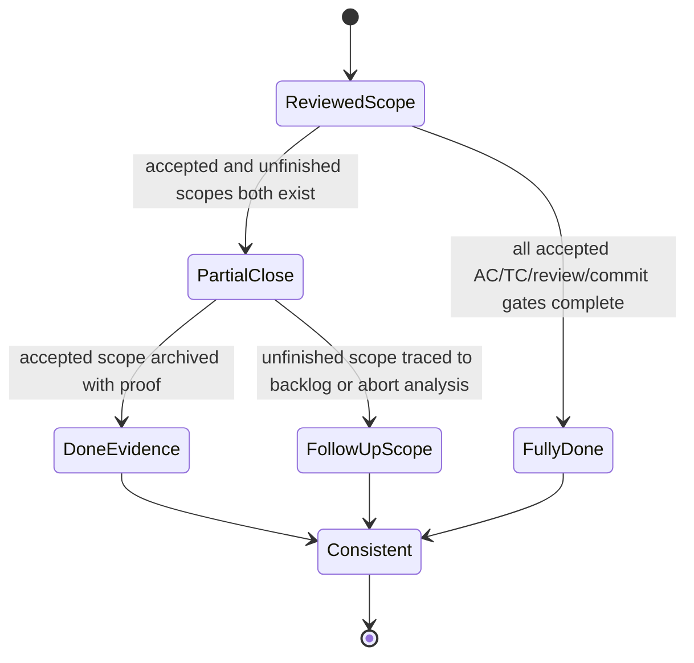
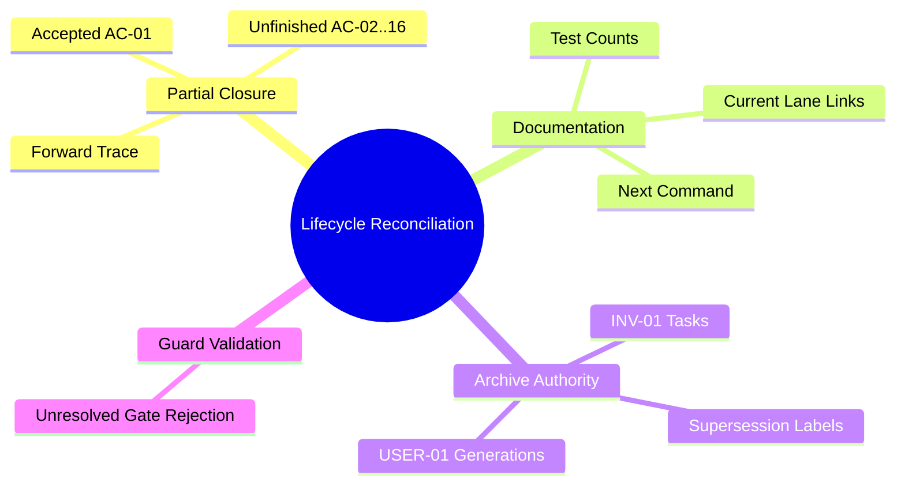

# User Story: Reconcile utCodeAgentCLI partial closure and lifecycle evidence

> **Story ID:** US-SPECFLOW-REPAIR-01 | **State:** todo | **Priority:** P1
> **Source:** `.catdd/spec/analyzedNews/20260830-reconcile-utCodeAgentCLI-closure-and-session-contract-Issue.md`
> **Related Closed Story:** `.catdd/spec/doneUS/20260607-utCodeAgentCLI-US-INVENTOR-01-UserStory.md`
> **CaTDD Class:** P1 Design
> **Primary Category:** State
> **Created:** 2026-08-30

---

## Story Statement

**As a** Developer,
**I want** closed SpecFlow artifacts to distinguish accepted partial scope from unfinished scope and stale history,
**So that** lifecycle lanes, status ledgers, task checklists, and next-command guidance provide one trustworthy project state.

## Mode Decision

- `analysis_mode`: BRAINSTORM.
- `analysis_depth`: detailed.
- The developer selected two repair stories and chose partial closure for `US-INVENTOR-01`.
- AC-01 is preserved as accepted done evidence; AC-02 through AC-16 remain unfinished and must be traceable as follow-up scope.
- This story owns lifecycle and documentation reconciliation; product implementation belongs to `US-UTCLI-REPAIR-01`.

## Story Readiness Snapshot

| Lens | Answer | Evidence |
| --- | --- | --- |
| User value is explicit | yes | Developers need one reliable next action and lifecycle state. |
| Observable outcome exists | yes | Lane, task, AC/TC status, links, authority markers, and next command can be checked from files. |
| Concrete examples exist | yes | Closed INV-01 and duplicate USER-01 archives are named below. |
| Blocking questions remain | no | Developer chose partial closure and two-story decomposition. |
| Story size is acceptable | yes | Product behavior is excluded; this story is bounded to lifecycle evidence. |
| Ready decision | Ready | Partial-closure semantics and expected repository state are explicit. |

## Priority

| Dimension | Score (1-9) | Rationale |
| --- | --- | --- |
| Business Value | 8 | Restores trust in team-shared SpecFlow state. |
| User Value | 9 | Prevents developers and CodeAgents from following impossible or stale commands. |
| Cost / Effort | 5 | Several linked lifecycle and verification artifacts require coordinated updates. |
| Risk / Complexity | 7 | Historical evidence must be preserved without falsely completing unfinished ACs. |

**Priority Score:** (8 + 9) / (5 + 7) = **1.42** | **Priority:** P1 Design / State

## Independent Test Intent

Starting from the reconciled repository, a lifecycle checker can identify AC-01 as accepted done scope, AC-02 through AC-16 as unfinished follow-up scope, no stale `doingUS` links, no unchecked close sequence presented as completed, and one authoritative status/next-command interpretation for each archived story generation.

## Example Mapping

| Card | ID | Content | Trace / Decision |
| --- | --- | --- | --- |
| Yellow Story | US-SPECFLOW-REPAIR-01 | Trustworthy partial-closure evidence | Source issue observations 3-6 |
| Blue Rule | RULE-01 | A full story cannot be represented as complete when only partial scope was accepted. | AS-01 |
| Green Example | EX-01 | AC-01 remains accepted; AC-02..AC-16 are explicitly unfinished and linked forward. | Developer decision |
| Green Counter-Example | CEX-01 | Story says DONE while all 16 ACs remain TODO and 15 TCs remain PLANNED without split semantics. | Current archive |
| Blue Rule | RULE-02 | Closed artifacts cannot direct readers to nonexistent active-lane files or completed gates. | AS-02 |
| Green Example | EX-02 | Verification links target `doneUS` or a new todo story and report current review state. | AS-02 |
| Green Counter-Example | CEX-02 | Verification design points to `doingUS` and recommends a review against no active story. | Current docs |
| Blue Rule | RULE-03 | Superseded archive generations declare authority and cannot expose contradictory next actions. | AS-03 |
| Green Example | EX-03 | The 2026-06-28 USER-01 artifact is marked superseded/incomplete history with its authoritative successor. | AS-03 |
| Green Counter-Example | CEX-03 | An artifact in `doneUS` retains unchecked review/commit/close and says implementation is next. | Current archive |

**Example Mapping Decision:** Ready

## Visual Model

### Model Gap Analysis

| # | Gap Found | Question | Resolution |
| --- | --- | --- | --- |
| 1 | Current archive jumps from partially implemented to DONE. | Is closure full or partial? | Answered: partial. |
| 2 | Unfinished AC-02..AC-16 have no explicit post-close route. | Where is unfinished scope retained? | This repair must add a forward trace without pretending completion. |
| 3 | Duplicate USER-01 generations expose conflicting state. | Which artifact is authoritative? | Determine from commit/review evidence and mark the other as superseded history. |

## Input and Output Dictionary

| Element | Kind | Type / Format | Required | Allowed Values / Limits | Producer | Consumer | Validation |
| --- | --- | --- | --- | --- | --- | --- | --- |
| Closed story | input | Markdown artifact | yes | Preserved historical facts and commit refs | SpecFlow | developer/CodeAgent | Must not claim unresolved scope completed. |
| Paired TASKs | input/output | Markdown checklist | yes | Completed items checked; unfinished items routed explicitly | SpecFlow | developer/CodeAgent | Lane and checklist meaning agree. |
| AC status ledger | input/output | Markdown table | yes | Accepted done and unfinished states sum to story total | module requirements | SpecFlow | Status counts match scope decision. |
| Verification design | input/output | Markdown contract | yes | Current links, counts, results, and next action | test design | developer/CodeAgent | No stale active-lane links or superseded recommendation. |
| Follow-up trace | output | story link/status | yes | AC-02..AC-16 retained without duplication | repair story | future SpecFlow | One authoritative owner per unfinished slice. |

## Acceptance Scenarios

### AS-01: Partial closure preserves accepted and unfinished scope

**Rule:** RULE-01
**Given** `US-INVENTOR-01` has accepted AC-01 implementation evidence and AC-02 through AC-16 remain unimplemented
**When** its lifecycle artifacts and module ledger are reconciled
**Then** AC-01 is represented as accepted done scope, AC-02 through AC-16 remain explicitly unfinished with a forward trace, and no artifact claims all 16 ACs are complete

### AS-02: Verification guidance reflects current lanes and product state

**Rule:** RULE-02
**Given** `doingUS/` is empty and the related story is archived
**When** a developer reads `README_VerifyDesign.md` and linked artifacts
**Then** every story link resolves to its current lane, historical results are distinguished from current state, executable-test counts match the files, and the recommended command targets a valid lifecycle artifact

### AS-03: Duplicate historical stories declare authority

**Rule:** RULE-03
**Given** two archived `US-USER-01` generations contain conflicting task completion state
**When** lifecycle history is normalized
**Then** the authoritative completed generation is explicit, superseded or incomplete historical evidence is labeled without deletion, and it exposes no contradictory current next command

### AS-04: Full closure rejects unresolved evidence

**Rule:** RULE-01
**Given** a future story still has unresolved AC, TC, review, commit, or ledger evidence
**When** full closure is evaluated
**Then** closure does not produce a fully completed `doneUS` state and reports the unresolved gate

## Business Rules

No external business rules were found because this is a process-state repair. Repository constraints are:

| ID | Rule | Type | Implied Functional Requirement |
| --- | --- | --- | --- |
| BR-01 | `doneUS` means closure evidence is complete for the scope represented there. | Fact | Full and partial closure must be distinguishable. |
| BR-02 | Unfinished scope is preserved, not silently marked done or deleted. | Constraint | Add an explicit forward lifecycle trace. |
| BR-03 | Closed story references cannot point to stale `doingUS` paths. | Constraint | Normalize links during closure/reconciliation. |
| BR-04 | One story generation has one authoritative current interpretation. | Constraint | Label superseded historical artifacts. |
| BR-05 | The module dashboard is the accepted ledger exception for `utCodeAgentCLI`. | Fact | Synchronize `README_UserStoryStatus.md` with partial scope. |

## Feature Tree and Split Decision

**Split Decision:** Keep these lifecycle surfaces together because they jointly determine one authoritative project state. Product/session correction remains in `US-UTCLI-REPAIR-01`.

## Scope

**In scope:**

- Reconcile `US-INVENTOR-01` as an explicitly partial closure.
- Preserve AC-01 accepted evidence and trace AC-02 through AC-16 as unfinished scope.
- Synchronize the module status dashboard, verification design, archived story, and paired TASKs.
- Correct stale `doingUS` links, test counts, review status, and next commands.
- Mark authority/supersession for conflicting archived `US-USER-01` generations.
- Add or strengthen a focused lifecycle validation that detects the diagnosed inconsistency.

**Non-goals:**

- Implement AC-02 through AC-16.
- Change canonical asset-session product code or tests.
- Delete historical lifecycle evidence.
- Retroactively fabricate review, commit, or CI results.
- Replace the module-ledger exception with a new root `README_UserStories.md` without a separate decision.

## Risks & Assumptions

| # | Risk / Assumption | Severity | Mitigation / Clarification Needed |
| --- | --- | --- | --- |
| 1 | Rewriting history could erase why the invalid closure happened. | High | Preserve dates, commits, prior decisions, and supersession notes. |
| 2 | AC-02..AC-16 could be duplicated across ledgers or future stories. | High | Give unfinished scope one explicit forward owner/reference. |
| 3 | Existing contract scripts do not detect semantic lifecycle drift. | High | Add a focused check for lane/link/checklist/status consistency. |
| 4 | Module dashboard remains an exception to generic project-ledger policy. | Medium | Preserve the recorded developer decision; do not expand scope. |

## Initial Acceptance Questions

| # | Question | Raised By | Blocks Ready? | Owner / Next Evidence | Status |
| --- | --- | --- | --- | --- | --- |
| 1 | Should the prior closure be treated as full, partial, or invalid? | state-model gap | yes | Developer | answered: partial |
| 2 | Should product and lifecycle repairs share one story? | story-size analysis | yes | Developer | answered: split |
| 3 | Should historical duplicate files be deleted? | risk analysis | yes | Source contract | answered: no, preserve and label |

**Gate:** READY for `/SPEC_openUserStory`.

## Ambiguity Warnings

| # | Ambiguous Term | Found In Section | Resolution |
| --- | --- | --- | --- |
| 1 | "authoritative" | source issue | The artifact that supplies current status and next action; historical alternatives must identify it. |
| 2 | "partial closure" | developer decision | AC-01 accepted in done evidence; AC-02..AC-16 explicitly unfinished and forward-traced. |
| 3 | "normalize" | source issue | Correct state, links, counts, and authority labels without deleting or fabricating history. |

## Issue Analysis & Insights

### Evidence Inventory

| Source | Fact | Confidence | Gap |
| --- | --- | --- | --- |
| Closed INV-01 story | Says DONE and records close commit. | high | Does not reconcile unfinished AC/TC scope. |
| Closed INV-01 TASKs | Still says active and leaves seven lifecycle steps unchecked. | high | Contradicts lane and paired story. |
| Module status dashboard | All 16 INV-01 ACs remain TODO. | high | Does not express accepted AC-01 partial scope. |
| Verification design | Links to `doingUS`, reports pending defect, and expects one executable body. | high | Stale after implementation and closure commits. |
| USER-01 archives | Two generations expose conflicting completion state. | high | Authority/supersession is unstated. |
| Repository checks | Current generic docs/structure checks pass. | high | Existing checks miss semantic lifecycle drift. |

### Root-Cause Hypotheses

| Hypothesis | Confidence | Disconfirming Check |
| --- | --- | --- |
| Full close was applied to a partially accepted story without splitting lifecycle scope. | high | Produce evidence that all 16 ACs and required gates were complete at close. |
| Close normalization updated the story file but not its paired tasks, dashboard, and verification links. | high | Show synchronized post-close state across all four surfaces. |
| Existing validators check structure but not cross-artifact semantics. | high | Show a current script that fails on these contradictions. |

### Insights

| Type | Insight | Confidence | Disposition |
| --- | --- | --- | --- |
| Requirement | Partial closure needs explicit accepted/unfinished status semantics. | high | Acceptance scenario AS-01 |
| Design | Lifecycle state is a cross-artifact invariant, not a folder move alone. | high | Acceptance scenarios AS-01/AS-02 |
| Test | Passing document structure checks do not prove lane/status consistency. | high | Acceptance scenario AS-04 |
| Risk | Stale next commands can create a deadloop against an empty active lane. | high | Acceptance scenario AS-02 |
| Process | Superseded story generations need durable authority markers. | high | Acceptance scenario AS-03 |

### Follow-Up Candidates

| Candidate | Reason | Recommendation |
| --- | --- | --- |
| Generalize semantic lifecycle validation across all modules. | Current evidence is from `utCodeAgentCLI`; broader policy may need separate design. | Consider a follow-up issue after the focused repair proves the check. |
| Revisit the module-ledger exception. | Generic SpecFlow expects a project ledger, but the exception was explicit. | Defer unless the focused repair cannot remain coherent. |

## Traceability

| From -> To | Link |
| --- | --- |
| This story -> Raw input | `.catdd/spec/analyzedNews/20260830-reconcile-utCodeAgentCLI-closure-and-session-contract-Issue.md` |
| Project/module story ledger | `codeAgents/utCodeAgentCLI/README_UserStoryStatus.md` |
| Related closed story | `.catdd/spec/doneUS/20260607-utCodeAgentCLI-US-INVENTOR-01-UserStory.md` |
| Sibling repair story | `.catdd/spec/todoUS/20260830-utCodeAgentCLI-canonical-asset-session-repair-UserStory.md` |
| This story ID | US-SPECFLOW-REPAIR-01 |

## Next Recommended Command

`/SPEC_openUserStory`
