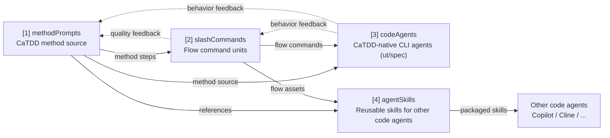

# MyCaTDD

MyCaTDD is a repository that productizes the CaTDD methodology step by step, with the goal of evolving "method usage" from manual execution to automated and intelligent execution.

CaTDD is the methodology invented by EnigmaWU. IOC is a PlayKata module and proving ground that helped CaTDD evolve from idea to real reusable methodology.

Core slogan:

> Comments is Verification Design. LLM Generates Code. Iterate Forward Together.

## What Your Diagram Means (Mapped to This Repository)

Your diagram expresses a four-layer evolution path:

1. [methodPrompts](methodPrompts/README.md)（方法提示词）
2. [slashCommands](slashCommands/README.md)（提示词命令）
3. [codeAgents](codeAgents/README.md)（CaTDD 代码智能体容器，含 ut/spec）
4. [agentSkills](agentSkills/README.md)（智能体技能包）

It also includes a bidirectional improvement loop:

- [1] is used by [2] and [3]
- [2] is used by [3]
- [2] feeds back to [1] to improve method quality
- [3] feeds back to [2] and [1] to adjust behaviors
- [4] is for other code agents (such as Copilot/Cline), not for CaTDD's [3]

Relationship diagram:



This README is organized around that main storyline.

## Four Layers of Assets and Responsibilities

### [1] [methodPrompts](methodPrompts/README.md) (method prompts)

Brief: the language-agnostic source-of-truth methodology layer for CaTDD. It defines comment-alive design skeletons, category method prompts, user-guide materials, and implementation templates. It is method-first and manual-friendly.

Read more: [methodPrompts/README.md](methodPrompts/README.md). Use [methodPrompts/README_UserGuide.md](methodPrompts/README_UserGuide.md) for standalone method-layer usage.

### [2] [slashCommands](slashCommands/README.md) (prompt commands)

Brief: the code-agent-agnostic flow connector layer. It turns stable CaTDD method steps from `methodPrompts` into small triggerable prompt commands and execution flows for Copilot, Cline, Continue, or similar assistants. It is flow-first and automation-friendly. It adapts CaTDD to existing CodeAgents; it does not define CaTDD method semantics itself.

Read more: [slashCommands/README.md](slashCommands/README.md). Use [slashCommands/README_UserGuide.md](slashCommands/README_UserGuide.md) for generator, installer, flow, and command usage.

### [3] [codeAgents](codeAgents/README.md) (code agents)

Brief: this repository's CaTDD-native CLI agent container layer. It holds `utCodeAgentCLI` and `specCodeAgentCLI`. Developers define goals, then agents plan, execute, collect traces, and reflect using [1] and [2].

Read more: [codeAgents/README.md](codeAgents/README.md), [codeAgents/utCodeAgentCLI/README.md](codeAgents/utCodeAgentCLI/README.md), and [codeAgents/specCodeAgentCLI/README.md](codeAgents/specCodeAgentCLI/README.md). Use [codeAgents/utCodeAgentCLI/README_UserGuide.md](codeAgents/utCodeAgentCLI/README_UserGuide.md) for current available CLI-layer usage guidance (`specCodeAgentCLI` currently provides a layer README only).

### [4] [agentSkills](agentSkills/README.md) (skill package)

Brief: the reusable capability packaging layer for other code agents (such as Copilot/Cline). It wraps CaTDD method and flow knowledge into triggerable skills, but is not used by CaTDD-native `codeAgents`.

Read more: [agentSkills/README.md](agentSkills/README.md). Use [agentSkills/README_UserGuide.md](agentSkills/README_UserGuide.md) for packaging and validation steps.

## CaTDD Spec-Driven Flow

`slashCommands` is CaTDD's Spec-Driven Development-style flow layer over `methodPrompts`.

In this repository, the spec is not a separate product-spec DSL. The spec is comment-alive verification design: US/AC/TC skeletons, CaTDD category coverage, priority gates, and test-case status. `methodPrompts` defines that method/spec language; `slashCommands` turns it into repeatable CodeAgent workflow steps; native prompt files are only agent-specific adapters.

For the CaTDD terms **VibeCoding** and **SpecCoding**, see [slashCommands/README.md](slashCommands/README.md). For the executable workflow, see [slashCommands/README_UserGuide.md](slashCommands/README_UserGuide.md).

## Three Collaboration Modes (Aligned with the Diagram)

### Mode A: Manual Developer Mode

- Input: `methodPrompts`
- Method: manually read and execute method steps from the method itself
- Output: verifiable test design and implementation

### Mode B: Developer + Code Assistant (GUI)

- Input: `methodPrompts` + (future) `slashCommands`
- Method: invoke flow-oriented command fragments on demand
- Focus: method decomposition and workflow automation

### Mode C: Developer + Code Agent (CLI)

- Input: `methodPrompts` + `slashCommands` + goal definition
- Method: the agent performs task planning, execution, and reflection
- Focus: intelligent method application and closed-loop optimization

## Iteration Loop (Recommended Execution Path)

1. First, make the method in [1] clear and stable.
2. In [2], commandize high-frequency steps to reduce invocation cost.
3. In [3], hand complete tasks to the agent for execution.
4. Feed issues exposed by [3] back into [2] and [1] for continuous improvement.

## Install / Refresh into Code Agent Projects

Install or refresh CaTDD into an existing Copilot-enabled project with:

```bash
scripts/installCaTDD4Copilot.sh --target /path/to/project --clean-prompts
```

For a new target directory, add `--init`:

```bash
scripts/installCaTDD4Copilot.sh --target /path/to/new-project --init --clean-prompts
```

Install or refresh CaTDD into a Continue project with:

```bash
scripts/installCaTDD4Continue.sh --target /path/to/project
```

Add `--clean-prompts` when you want to remove old generated `UT_*.prompt` and `SPEC_*.prompt` Continue wrappers before regenerating them.

Install or refresh CaTDD into a Cline project with:

```bash
scripts/installCaTDD4Cline.sh --target /path/to/project
```

Install or refresh CaTDD into an Antigravity project with:

```bash
scripts/installCaTDD4Antigravity.sh --target /path/to/project
```

The installer creates or refreshes these target-project assets:

- `.catdd/methodPrompts/`: installed CaTDD method source for manual reading and method truth.
- `.catdd/slashCommands/`: installed portable flow-command source for automation.
- `.github/prompts/UT_*.prompt.md` and `.github/prompts/SPEC_*.prompt.md`: Copilot-native thin adapters generated from `slashCommands`.
- `.github/instructions/catdd.instructions.md`: Copilot instruction file that points agents back to `.catdd/`.
- `.continue/rules/catdd.md`: Continue project rule that points agents back to `.catdd/`.
- `.continue/prompts/UT_*.prompt` and `.continue/prompts/SPEC_*.prompt`: Continue-native thin prompt adapters generated from `slashCommands`.
- `.clinerules/catdd.md`: Cline project rule that points agents back to `.catdd/`.
- `.antigravityrules/catdd.md`: Antigravity project rule that points agents back to `.catdd/`.

In this source repository, generated `.github/prompts/UT_*.prompt.md`, `.github/prompts/SPEC_*.prompt.md`, `.continue/rules/catdd.md`, `.continue/prompts/UT_*.prompt`, `.continue/prompts/SPEC_*.prompt`, `.clinerules/catdd.md`, and `.antigravityrules/catdd.md` files are temporary adapter output and are intentionally ignored. Commit `methodPrompts`, `slashCommands`, scripts, and docs; regenerate native adapters for target projects when needed.

## Quick Start

1. Read `README_UserGuide.md` first for the full picture.
2. Read [methodPrompts/README.md](methodPrompts/README.md) when you need the method prompt map.
3. Read [slashCommands/README.md](slashCommands/README.md) when you want the command layer WHAT/WHY.
4. Read [slashCommands/README_UserGuide.md](slashCommands/README_UserGuide.md) when you want to generate, install, or run stable method-step commands.
5. Read [agentSkills/README.md](agentSkills/README.md) when you want the skill package layer WHAT/WHY.
6. Read [agentSkills/README_UserGuide.md](agentSkills/README_UserGuide.md) when you want to generate or validate reusable skill packages.
7. Read [codeAgents/utCodeAgentCLI/README.md](codeAgents/utCodeAgentCLI/README.md) when you want the CLI agent layer WHAT/WHY.
8. Read [codeAgents/utCodeAgentCLI/README_UserGuide.md](codeAgents/utCodeAgentCLI/README_UserGuide.md) when you want current CLI-layer design guidance.
