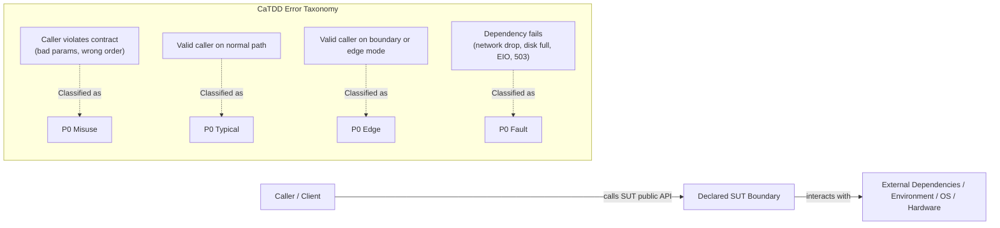
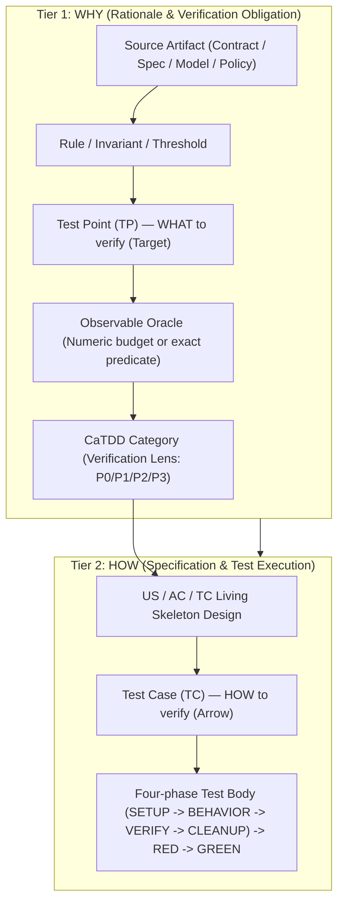
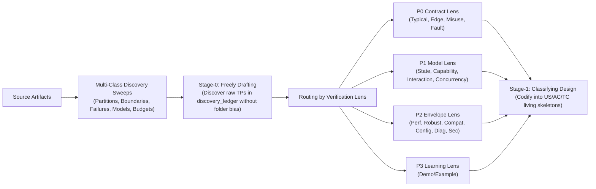

# CaTDD Ubiquitous Language

This file defines the project-root vocabulary that CaTDD installers distribute to target projects.
It is the canonical meaning contract for terms that must stay consistent across method prompts, slash commands, code agents, and generated adapters.

## Who

- Method maintainers evolving `methodPrompts/`.
- Flow maintainers evolving `slashCommands/`.
- Code-agent maintainers evolving `codeAgents/` and `agentSkills/`.
- Project teams installing CaTDD into their repositories.

## What

This is the shared glossary for CaTDD execution environments.

### Core Concepts

| Term | Meaning |
| --- | --- |
| CaTDD | Comment-alive Test-Driven Development. |
| Comment-alive | Verification intent is explicitly encoded in structured comments before code generation. |
| US / AC / TC | User Story / Acceptance Criteria / Test Case traceability chain. |
| Skeleton | Comment-only test design artifact containing traceability markers and planned test intent. |
| RED | Executable failing test state before product-code changes. |
| GREEN | Passing test state after product-code changes. |
| SpecCoding | CaTDD workflow that treats verification design artifacts as the executable spec lifecycle. |
| VibeCoding | Fast ideation/prototyping mode; results should still be reconciled back into CaTDD traceability. |
| Source-First | Review and discovery discipline that inspects authoritative source artifacts (contracts, design models, quality policies) and independently derives expected obligations before reading existing skeletons or test code, preventing author blind spots. |
| TestEvidenceChain | The unbroken evidentiary chain answering WHY we need a test and HOW to test correctly: from source artifact -> rule/invariant -> Test Point (TP) -> observable oracle -> CaTDD category (WHY) -> US/AC/TC -> Test Case (TC) -> RED/GREEN implementation (HOW). |
| SUT | System Under Test: The explicitly declared software boundary under verification (e.g. `SUT: utCodeAgentCLI`, `SUT: PaymentGatewayInterface`). It establishes the strict dividing line between caller behavior (`P0 Misuse` on caller contract violation) and external dependencies/runtime (`P0 Fault` on dependency failure). |
| UT | Unit Testing: Verification focused on a single declared SUT adhering to the project's agreed `sut_unit_convention` (e.g. `module-interface`, `submodule-interface`, `class`, `header-file`, `function`, or `component`). Verifies public contracts, internal design models, and quality properties via CaTDD before implementation. |
| TP | Test Point: A discovered verification obligation or condition (the target). Represents WHAT must be verified from the DEVELOPER / DEFENSIVE perspective (partitions, boundaries, failure phases, interleavings), extracted from sources during Stage-0/Stage-1 discovery and tracked in `discovery_ledger`. Described via concrete `GIVEN technical state/partition, WHEN action/interleaving, THEN observable oracle`. |
| TC | Test Case: An executable verification specification artifact (the arrow). Represents HOW to verify an obligation, structured with `@[Name]`, `@[Expect]`, and four-phase execution (`SETUP -> BEHAVIOR -> VERIFY -> CLEANUP`) linked to `[@AC-n, US-n]`. |
| AC vs TP | AC is from the USER / CALLER perspective (defining external business rules for acceptance: `GIVEN context, WHEN action, THEN outcome`); TP is from the DEVELOPER / DEFENSIVE perspective (defining technical probes across boundaries, error paths, and concurrency to verify whether the AC holds). One AC typically unpacks into multiple TPs ($1:N$). Equating $TP == AC$ causes boundary and failure-mode omissions. |
| TP vs TC | Cardinality between TP and TC is not strictly 1:1. A TP can exist without a TC (`1:0` -> GAP, exposing missing test points); a complex TP may require multiple TCs (`1:N`); and one TC may genuinely verify multiple TPs (`N:1`) when assertions distinguish each obligation. Equating `TC == TP` prematurely hides missing test points. |
| Discovery to Categorization | Two-stage design bridge: In Stage-0 (Freely Drafting), discover TPs breadth-first across sources and sweeps without premature category lock-in. In Stage-1 (Classifying Design), route each discovered TP to its proper CaTDD category based on its verification lens (Contract -> P0, Model -> P1, Envelope -> P2, Learning Surface -> P3), then codify into US/AC/TC skeletons. |
| manualMode | Default interactive execution mode for all SpecFlow orientations. The assistant advances step by step, asks focused questions when intent, criteria, or safety is unclear, and pauses for developer confirmation before proceeding. |
| autonomousMode | Headless / CLI execution mode for Px-SpecFlow. Triggered at entry commands (e.g. `SPEC_importIssue`, `SPEC_openUserStory`) via `execution_mode: autonomousMode`. Strictly supported ONLY for `implementation-oriented` stories. In this mode, the agent automatically executes and advances through Part 2.b test-first implementation and review steps until terminal state (`closeUserStory`, `abortUserStory`, or `suspendUserStory`). Requirements and architecture orientations require human intent and must remain in `manualMode`. |
| analysis_mode | Command-level execution mode within analysis commands (`SPEC_analyzeIssue`, `SPEC_analyzeFeature`) operating under `manualMode`. `BRAINSTORM` (default) engages in interactive step-by-step dialogue with the developer. `AUTONOMOUS` runs the composed SKILL analysis pipeline in one shot to draft `todoUS` without interrupting for each step, but records assumptions/questions and marks the story NOT ready if blocking questions remain. |
| ONE-MORE-THING | Universal safety invariant across CaTDD: The agent MUST halt and ask the developer whenever encountering an uncertain, missing, conflicting, or unconfirmed condition in source artifacts, regardless of whether running in `manualMode` or `autonomousMode`. Autonomy is never a license to guess or invent requirements. In `autonomousMode`, hitting a ONE-MORE-THING condition immediately pauses autonomous progression and reports a structured `manual_required` inquiry. |
| Semantic Falsification Gate | The verification gate distinguishing valid `🔴 RED` from `⚠️ BROKEN_TEST`. A test is validly RED only if it compiles/loads cleanly, executes through SETUP and BEHAVIOR, and fails strictly on an expected domain assertion in VERIFY (`AssertionError`, `Expected X but got Y`). If execution fails due to syntax errors, missing imports, fixture crashes, or unhandled exceptions in test setup, it is `⚠️ BROKEN_TEST`, not valid RED; production code generation is blocked until the test harness is repaired. |
| Anti-Test-Theater | The engineering discipline preventing LLMs from generating hollow, superficial, or self-fulfilling tests. Forbids "mock-testing-mock" (asserting mock return values directly without SUT transformation), forbids vacuous truthiness assertions (`assert != null` or `assert True`), and requires that assertions verify real SUT state mutations, return calculations, or domain invariants. |
| Ambiguity Smell Classifier | The systematic Stage-0 diagnostic instrument scanning requirements for unstated, underspecified, or subjective constructs before test design begins. Based on the Ambiguity Smell Taxonomy (AST), it flags six smell classes: `SMELL-ACTOR` (passive voice without actor), `SMELL-BOUND` (unbounded adjectives), `SMELL-BRANCH` (missing negative/exception paths), `SMELL-STATE` (unstated lifecycle bounds), `SMELL-VAGUE` (vague verbs and loopholes), and `SMELL-RACE` (unstated concurrency rules). Detecting any smell mandates recording a `QUESTION` in `discovery_ledger` and triggers the universal `ONE-MORE-THING` stop rule to prevent AI hallucination. |
| Closed-Loop Regeneration Budget (B) | The formal SGRM safety bound (Algorithm 1 in arXiv:2607.16680) limiting stochastic generation retry cycles to a finite budget (default $B \le 3$). When an agent fails to achieve passing verification ($V(S, I) = \top$) within $B$ attempts, it is strictly forbidden from infinite looping or silently weakening assertions; it must roll back unverified mutations, emit a structured failure diagnostic report, mark the TC as `⚠️ BLOCKED`, and escalate to human governance (L4). |

### Category Vocabulary

| Tier | Categories |
| --- | --- |
| P0 Functional | Typical, Edge, Misuse, Fault |
| P1 Design | State, Capability, Interaction, Concurrency |
| P2 Quality | Performance, Robust, Compatibility, Configuration, Diagnosis, Security |
| P3 Addons | Demo/Example |

### Ownership Vocabulary

| Layer | Responsibility |
| --- | --- |
| `methodPrompts/` | Source of truth for category semantics and CaTDD method constraints. |
| `slashCommands/` | Portable command/flow wrappers over method semantics. |
| `codeAgents/` | Goal-driven orchestration and execution policy. |
| `agentSkills/` | Packaged skills for non-native code agents. |

### Conceptual Diagrams and Examples

#### 1. SUT Boundary Invariant (Misuse vs. Fault)

The explicitly declared **SUT** defines the contract dividing line:



#### 2. TestEvidenceChain (Answering WHY and HOW)

Every test must establish an unbroken evidence chain connecting rationale to code:



#### 3. AC vs. TP vs. TC ($1 \text{ AC} : N \text{ TPs} : M \text{ TCs}$)

- **Acceptance Criteria (AC)**: User perspective — "What business rule must hold?"
- **Test Point (TP)**: Developer perspective — "What technical boundary or failure probe must be verified?" (Target)
- **Test Case (TC)**: Execution perspective — "How do we execute the test in code?" (Arrow)

Worked Example:

```text
AC-01 (User Rule):
  "GIVEN 1 to 100 valid records, WHEN write is called, THEN persist all records and return OK."

Unpacks into Developer Test Points (TPs):
  ├── TP-01 (Typical): Write 2 records (nominal valid partition) -> OK and persisted (P0 Typical)
  ├── TP-02 (Edge):    Write 1 record (minimum valid boundary)   -> OK and persisted (P0 Edge)
  ├── TP-03 (Edge):    Write 100 records (maximum valid boundary)-> OK and persisted (P0 Edge)
  ├── TP-04 (Misuse):  Write 0 records (below valid range)       -> INVALID_COUNT (P0 Misuse)
  └── TP-05 (Misuse):  Write 101 records (above valid range)     -> INVALID_COUNT (P0 Misuse)

Implements into Executable Test Cases (TCs):
  ├── TC-01: verifyWrite_byNominalBatch_expectSuccess      (implements TP-01)
  ├── TC-02: verifyWrite_byBoundaryBatch_expectSuccess     (implements TP-02 & TP-03)
  ├── TC-03: verifyWrite_byZeroBatch_expectInvalidCount    (implements TP-04)
  └── TC-04: verifyWrite_byOversizedBatch_expectInvalidCount(implements TP-05)
```

#### 4. Discovery to Categorization (Stage-0 to Stage-1 Bridge)



## When

Use this glossary when:

- defining new terms in READMEs, prompts, rules, or architecture docs,
- naming new UT_*/SPEC_* commands,
- reviewing wording drift across EN/ZH or across adapters,
- installing CaTDD into a new project.

## Where

- Source of truth in this repository: `README_UbiLang.md` (project root).
- Installed destination in target projects: `<target>/README_UbiLang.md`.
- Referenced by installed rules/instructions (`.github/instructions`, `.continue/rules`, `.clinerules`, `.antigravityrules`, and custom adapter rules).

## Why

CaTDD is method-driven. If key words drift, behavior drifts.

A shared ubiquitous language keeps generated prompts, command flows, review output, and implementation decisions aligned across different code-agent runtimes.

## How

1. Add new domain terms here before spreading them to other docs.
2. Keep wording stable for status/category names used by tools.
3. Reject synonyms that change semantics (for example, do not rename categories casually).
4. During installer updates, ensure this file is copied to target project root.

## Usage Example

Check vocabulary consistency before release:

```bash
rg -n "Typical|Edge|Misuse|Fault|State|Capability|Interaction|Concurrency|Performance|Robust|Compatibility|Configuration|Diagnosis|Security|Demo/Example|US/AC/TC|SpecCoding|VibeCoding|Source-First|TestEvidenceChain|SUT|UT|TP|TC|manualMode|autonomousMode|analysis_mode|ONE-MORE-THING" README*.md methodPrompts slashCommands codeAgents agentSkills
```

Expected result: terms are used with the same meanings as defined in this file.
