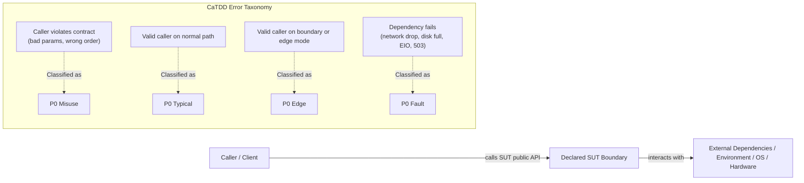
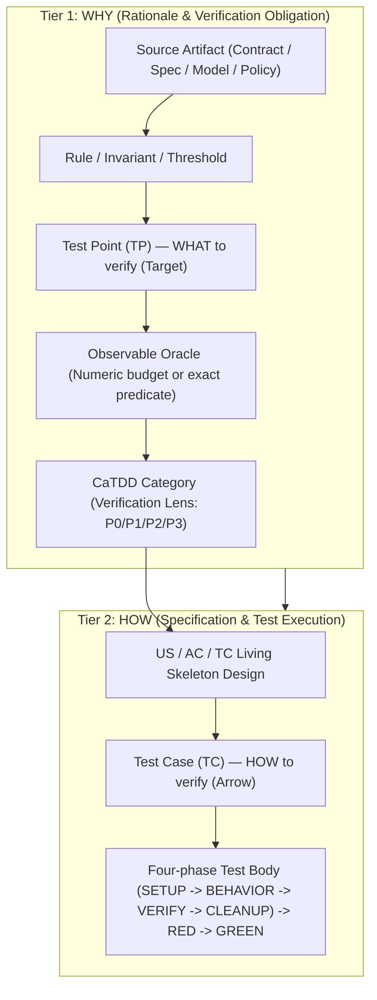
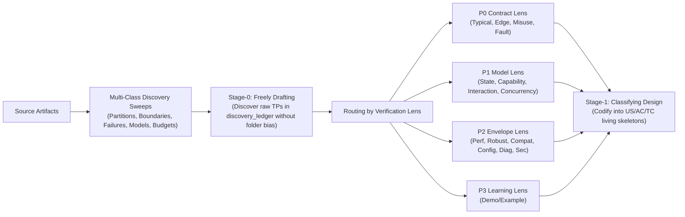

# CaTDD Ubiquitous Language - USER View

Companion: [README_UbiLangDEV.md](README_UbiLangDEV.md) holds the vocabulary for creating and evolving CaTDD itself. This file is the canonical meaning contract for the terms you need **to use CaTDD on your own project**: write tests, run the flow, read a status report, and interpret a gate verdict.

## Who

- Project teams installing CaTDD into their repositories.
- Developers writing US/AC/TC skeletons and running the `UT_*`, `SPEC_*`, and `HARNESS_*` commands.

## What

### Core Concepts

| Term | Meaning |
| --- | --- |
| CaTDD | Comment-alive Test-Driven Development. |
| Comment-alive | Verification intent is encoded in the source file itself, in that language's documentation form (comments, doc comments, or docstrings), adjacent to the code and kept true as the code changes. |
| US / AC / TC | User Story / Acceptance Criteria / Test Case traceability chain. |
| Skeleton | Comment-only test design artifact containing traceability markers and planned test intent. |
| RED | Executable failing test state before product-code changes. |
| GREEN | Passing test state after product-code changes. |
| SpecCoding | CaTDD workflow that treats verification design artifacts as the executable spec lifecycle. |
| VibeCoding | Fast ideation/prototyping mode; results should still be reconciled back into CaTDD traceability. Inside an open story it is entered deliberately through `SPEC_whatsWrong`, is available only in `manualMode`, keeps `ONE-MORE-THING` binding, and leaves exploratory edits `unadopted` until a `SPEC_*` step re-adopts them. |
| SPEC_whatsWrong | The third rung of the Px-SpecFlow escalation ladder and the bridge from SpecCoding into VibeCoding. It classifies the trigger, verifies `manualMode`, freezes the Flow without moving lanes or writing team artifacts, records the excursion in `.catdd/spec/WorkingProcessLog.md` with `adoption_status = unadopted`, routes each finding to its owning command, reports `learning_command = /HARNESS_evolveHarness` with `evolution_mode=auto`, and resumes the Flow with any `SPEC_doXYZ` such as `SPEC_whatsNextTask`. |
| review_verdict | The single gate outcome every review command reports per pass: exactly one of `PASS`, `REVISE`, `BLOCKED`, or `ASK`. It is accompanied by `severity` (`blocking \| advisory`, default `blocking`) and by `rework_route`, which is required whenever the verdict is not `PASS` and names the owning command. Sub-gates such as `cardinality_gate`, `discovery_status`, and `ready_for_implementation` feed the verdict; they are not separate verdict vocabularies. The older per-command dialogs (`GAPS`, `WARN`, `FAIL`, `RISKY`, and the action verdicts) map onto this set in the Px-SpecFlow Review Gate Contract table. |
| PASS | A `review_verdict`: the gate accepts the artifact as it stands. No blocking change is required and the downstream step may consume it. Advisory findings may still be attached with `severity = advisory`; they record risk without stopping work. PASS does not mean perfect, it means safe to proceed, and it requires every sub-gate to be `PASS` for the declared scope. |
| REVISE | A `review_verdict`: the gate judged the artifact and requires a change before anything downstream consumes it. A REVISE always carries at least one blocking finding that names what must change and which command owns it (`rework_route`), and the gate re-runs on the changed evidence. Key difference from PASS: PASS = proceed with the artifact as-is; REVISE = change the artifact first, then re-run the gate. REVISE is therefore a directed action, not merely a severity level. |
| BLOCKED | A `review_verdict` for a missing input: a required source artifact, piece of evidence, or dependency is absent, so the gate cannot judge the artifact at all. It is resolved by whoever can supply that input — usually an owner command named in `rework_route` — and only degenerates into `ASK` when the human is the only possible supplier. A BLOCKED report always names the missing input. Distinct from the TC status marker `🚫 BLOCKED`, which marks a test case that cannot proceed; the verdict describes a gate outcome, the marker describes a test state. |
| ASK | A `review_verdict` for a missing decision: the answer exists only in the human developer's judgment — intent, trade-off, acceptance, or scope. It is the human-in-the-loop token and the same outcome `ONE-MORE-THING` produces, so no rework route exists yet and the gate stops. A well-formed ASK presents options (A/B, yes/no, keep/adopt) so the developer can choose. When the flow cannot yet phrase the question at all, the escalation is `SPEC_whatsWrong` rather than ASK. |
| Source-First | Review and discovery discipline that inspects authoritative source artifacts (contracts, design models, quality policies) and independently derives expected obligations before reading existing skeletons or test code, preventing author blind spots. |
| TestEvidenceChain | The unbroken evidentiary chain answering WHY we need a test and HOW to test correctly: from source artifact -> rule/invariant -> Test Point (TP) -> observable oracle -> CaTDD category (WHY) -> US/AC/TC -> Test Case (TC) -> RED/GREEN implementation (HOW). |
| SUT | System Under Test: The explicitly declared software boundary under verification (e.g. `SUT: utCodeAgentCLI`, `SUT: PaymentGatewayInterface`). It establishes the strict dividing line between caller behavior (`P0 Misuse` on caller contract violation) and external dependencies/runtime (`P0 Fault` on dependency failure). |
| TestLevel | The declared SUT scope of a verification: exactly one of `UnitTesting`, `SysTesting`, or `UserTesting`. Declared inside the test file with `@[TestLevel]` and never encoded in the filename. It answers how much of the developed system is *inside* the SUT, not what that system's runtime is made of — that is `TestScope` — and not which design document owns the strategy. |
| UnitTesting | A `TestLevel`: one unit is the SUT, verified inside its own boundary under the project's `sut_unit_convention` (submodule, class, header file, function, or component). When the project has no subdivision, `UnitTesting` and `SysTesting` name the same SUT and are equivalent. CaTDD categories and the Discovery Gate apply; strategy is designed in `README_DetailVerifyDesign.md`. |
| SysTesting | A `TestLevel`: the composition of units is the SUT — the module in a multi-submodule project, or the whole project when it has no subdivision. CaTDD categories and the Discovery Gate apply; the composition boundary and its `TestScope` strategy are designed in `README_ArchVerifyDesign.md`, and the TP row stays in the detail ledger and is promoted by ID. |
| UserTesting | A `TestLevel` inside `SysTesting`: the same system SUT, oriented to usage scenarios — documented end-to-end, demo, and example flows. It is not CaTDD category testing: it consumes US/AC expectations and category-covered behavior instead of defining category skeletons. |
| `TestScope` | The declared runtime scope of a verification: `mockSysRtm` (the SUT's system runtime — peers, dependencies, runtime environment — is replaced by doubles) or `realSysRtm` (the SUT runs against its real system runtime). Declared with `@[TestScope]` and independent of `TestLevel`, so any level runs at either scope. `mockSysRtm` is the first scope and earns `CLOSED`; `realSysRtm` is the second scope and adds evidence. |
| UT | Unit Testing: Verification focused on a single declared SUT adhering to the project's agreed `sut_unit_convention` (e.g. `module-interface`, `submodule-interface`, `class`, `header-file`, `function`, or `component`). Verifies public contracts, internal design models, and quality properties via CaTDD before implementation. |
| TP | Test Point: A discovered verification obligation or condition (the target). Represents WHAT must be verified from the DEVELOPER / DEFENSIVE perspective (partitions, boundaries, failure phases, interleavings), extracted from sources during Stage-0/Stage-1 discovery and tracked in `discovery_ledger`. Described via concrete `GIVEN technical state/partition, WHEN action/interleaving, THEN observable oracle`. |
| TC | Test Case: An executable verification specification artifact (the arrow). Represents HOW to verify an obligation, structured with `@[Name]`, `@[Expect]`, and four-phase execution (`SETUP -> BEHAVIOR -> VERIFY -> CLEANUP`) linked to `[@AC-n, US-n]`. |
| AC vs TP | AC is from the USER / CALLER perspective (defining external business rules for acceptance: `GIVEN context, WHEN action, THEN outcome`); TP is from the DEVELOPER / DEFENSIVE perspective (defining technical probes across boundaries, error paths, and concurrency to verify whether the AC holds). One AC typically unpacks into multiple TPs ($1:N$). Equating $TP == AC$ causes boundary and failure-mode omissions. |
| TP vs TC | Cardinality between TP and TC is not strictly 1:1. A TP can exist without a TC (`1:0` -> GAP, exposing missing test points); a complex TP may require multiple TCs (`1:N`); and one TC may genuinely verify multiple TPs (`N:1`) when assertions distinguish each obligation. Equating `TC == TP` prematurely hides missing test points. |
| Discovery to Categorization | Two-stage design bridge: In Stage-0 (Freely Drafting), discover TPs breadth-first across sources and sweeps without premature category lock-in. In Stage-1 (Classifying Design), route each discovered TP to its proper CaTDD category based on its verification lens (Contract -> P0, Model -> P1, Envelope -> P2, Learning Surface -> P3), then codify into US/AC/TC skeletons. |
| manualMode | The human-driven form of SpecCoding: the developer types each `SPEC_doXYZ`, the assistant advances step by step, asks focused questions when intent, criteria, or safety is unclear, and pauses for developer confirmation before proceeding. It is the default for a human chat session and the fallback whenever an `autonomousMode` run must halt at the orientation boundary. |
| autonomousMode | The flow-driven form of SpecCoding: the Flow calls the next `SPEC_doXYZ` itself. It is the default for a code agent or CLI runner that drives Px-SpecFlow, such as `specCodeAgentCLI`, and an opt-in for a human session via `execution_mode: autonomousMode` on entry commands. Strictly supported ONLY for `implementation-oriented` stories: requirements and architecture need human intent, so the run halts back to `manualMode` at that boundary. The driver declares the mode explicitly rather than having it inferred, advances through Part 2.b implementation and review steps until terminal state (`closeUserStory`, `abortUserStory`, or `suspendUserStory`), and can never enter VibeCoding because there is no human intent source. |
| analysis_mode | Command-level execution mode within analysis commands (`SPEC_analyzeIssue`, `SPEC_analyzeFeature`) operating under `manualMode`. `BRAINSTORM` (default) engages in interactive step-by-step dialogue with the developer. `AUTONOMOUS` runs the composed SKILL analysis pipeline in one shot to draft `todoUS` without interrupting for each step, but records assumptions/questions and marks the story NOT ready if blocking questions remain. |
| ONE-MORE-THING | Universal safety invariant across CaTDD: The agent MUST halt and ask the developer whenever encountering an uncertain, missing, conflicting, or unconfirmed condition in source artifacts, regardless of whether running in `manualMode` or `autonomousMode`. Autonomy is never a license to guess or invent requirements. In `autonomousMode`, hitting a ONE-MORE-THING condition immediately pauses autonomous progression and reports a structured `manual_required` inquiry. |
| commit span | The lifecycle interval a commit closes, and the unit Px-SpecFlow splits commits by instead of by file set. `pre-story` span = intake/analysis artifacts before `SPEC_openUserStory`; `story` span = `SPEC_openUserStory -> SPEC_closeUserStory`; `step` span = one verified lifecycle step inside the story span. |
| SPEC_commitPreStoryWorks | Story-span command that commits the pre-story interval: import/analysis artifacts, `pendingNews/` to `analyzedNews/` moves, `todoUS/` stories, and the `README_UserStories.md` ledger produced before `SPEC_openUserStory`. Available as an option in `manualMode`; the default pre-story checkpoint when the intake ran headless with `analysis_mode: AUTONOMOUS`. The pre-story span never runs in `autonomousMode`, because autonomous execution is restricted to `implementation-oriented` story work. |
| SPEC_commitStepWorks | Story-span command that commits exactly one verified lifecycle step inside the `SPEC_openUserStory -> SPEC_closeUserStory` interval, only at step boundaries `SPEC_makePlan` recorded as `commit_step = yes` and only after that step's gate reached `PASS`/`GREEN`. Available as an option in `manualMode`; the default at every planned step boundary in `autonomousMode`. |
| SPEC_commitStoryWorks | Story-span command that commits the whole `SPEC_openUserStory -> SPEC_closeUserStory` interval as the just-done UserStory commit, including terminal lifecycle/meta changes. It serves the `pre_close` checkpoint (providing `commit_ref` for `SPEC_closeUserStory`), the `post_close` checkpoint (satisfying `close_commit_required`), and the `span_end` checkpoint after a partial close, abort, or suspend. Available as an option in `manualMode`; the default at story completion in `autonomousMode`. |
| SPEC_commitWorks | General, story-agnostic commit command: it resolves scope from staged files first and most recently modified files second, then generates a repository-style commit log message. It never advances SpecFlow lifecycle state and never closes a commit span. |
| Semantic Falsification Gate | The verification gate distinguishing valid `🔴 RED` from `⚠️ BROKEN_TEST`. A test is validly RED only if it compiles/loads cleanly, executes through SETUP and BEHAVIOR, and fails strictly on an expected domain assertion in VERIFY (`AssertionError`, `Expected X but got Y`). If execution fails due to syntax errors, missing imports, fixture crashes, or unhandled exceptions in test setup, it is `⚠️ BROKEN_TEST`, not valid RED; production code generation is blocked until the test harness is repaired. |
| Anti-Test-Theater | The engineering discipline preventing LLMs from generating hollow, superficial, or self-fulfilling tests. Forbids "mock-testing-mock" (asserting mock return values directly without SUT transformation), forbids vacuous truthiness assertions (`assert != null` or `assert True`), and requires that assertions verify real SUT state mutations, return calculations, or domain invariants. |

### Category Vocabulary

| Tier | Categories |
| --- | --- |
| P0 Functional | Typical, Edge, Misuse, Fault |
| P1 Design | State, Capability, Interaction, Concurrency |
| P2 Quality | Performance, Robust, Compatibility, Configuration, Diagnosis, Security |
| P3 Addons | Demo/Example |

### Verification Design Vocabulary

| Artifact | Owner commands | Level ownership | Owns |
| --- | --- | --- | --- |
| `README_ArchVerifyDesign.md` | create/update `SPEC_takeArchDesign`; revise `SPEC_updateArchDesign`; gate `SPEC_reviewArchDesign` | `SysTesting`, `UserTesting` | Verification topology, the level-and-boundary map (which levels exist for this SUT and what each does not prove), target-runtime environment matrix, peer/dependency double credibility, evidence and equipment ownership, and system-scope quality scenarios. |
| `README_DetailVerifyDesign.md` | create/update `SPEC_takeDetailDesign`; revise `SPEC_updateDetailDesign`; gate `SPEC_reviewDetailDesign` | `UnitTesting` | Behavior inventory, test-point discovery (`discovery_ledger`, P0-P3 sweeps, Discovery Gate report), CaTDD category x Agile quadrant coverage, submodule strategy, fixture and oracle design, and the promotion table for `SysTesting`/`UserTesting` obligations. |

Rules:

- One behavior inventory and one `discovery_ledger` exist for a feature, owned by the detail design; every row carries its `Category and test level`.
- Test-point promotion moves an obligation from detail to architecture design when its `TestLevel` is `SysTesting` or `UserTesting`. The TP ID is preserved; the architecture design references the obligation and never restates category design.
- `README_VerifyStatusTraces.md` remains the dynamic companion holding live status and evidence for both designs.
- `SPEC_designUnitTests` inherits the strategy from `README_DetailVerifyDesign.md`; it does not redefine verification design.

### Status and Level Vocabulary

Canonical meaning for status reporting and level grading. The `Px-StatusKits` commands report these terms and point here; the reporting procedure lives in those commands, not in this table. Only CaTDD's own terms, and CaTDD's binding of names borrowed from other work, appear here - a borrowed name is marked *(borrowed)* and is defined only far enough to fix which CaTDD value it maps to.

| Term | Meaning |
| --- | --- |
| `status_signal` | The safety axis of a status report: `healthy`, `attention`, `blocked`, or `unknown`. It answers whether the current state is safe to act on, independently of how far along the work is. `unknown` means the scope could not be read; a readable but empty scope is `Level-0`. |
| level fields | Each viewpoint reports one ordinal level from `Level-0` to `Level-5` under its own field name: `completeness_level` (UT), `maturity_level` (SPEC), and `integrity_level` (HARNESS, mnemonic *neatness*). Levels are monotonic and evidence-decided: `Level-N` requires `Level-(N-1)`, and a level without cited evidence is reported as the level below it. |
| `level_evidence` / `level_gap` | What decided the reported level, and the single decisive blocker for the next one. |
| `CLOSED` / `testPassOnMock` | The UT closure predicate and its evidence token. A test case is CLOSED when it is designed, US/AC-linked, and passing at `@[TestScope]: mockSysRtm` at its declared `@[TestLevel]`, with the Anti-Test-Theater Rule satisfied, so closure never depends on a runtime environment. It never claims the double validates the real system: `realSysRtm` is the second scope that adds that evidence. |
| `test_scope` | The `TestScope` behind a reported pass, `mockSysRtm` or `realSysRtm`. A `mockSysRtm` result is never read as system-verified. |
| disposition | The ledger state of one test point: `DESIGNED`, `QUESTION`, `EXCLUDED`, `REFERRED`, or `GAP`. Coverage counts `DESIGNED` rows only; the other four are the reasons an obligation is not covered, and their sum is never reported as coverage. `CaTDD_methodPrompt-testPointDiscovery.md` owns the per-disposition meaning. |
| `SpecCoding share` | The SPEC quantitative measure: the fraction of production changes that trace to an open story, were preceded by a test failing for the expected reason, and passed a gate. It measures discipline, not correctness, and is always read with drift incidents. |
| Spec-First / Spec-Anchored / Spec-as-Source *(borrowed)* | The values named by `maturity_level`, ordered by how much authority the spec holds over the code: `Level-1` Spec-First (spec written first, free to drift), `Level-3` Spec-Anchored (spec tied to the code by gates, so drift must be resolved), `Level-4` Spec-as-Source (the spec is the source and the code regenerated output). `Level-5` is self-evolution on top. The capability ladder itself is defined by its source, not here. |

### Conceptual Diagrams and Examples

#### 1. SUT Boundary Invariant (Misuse vs. Fault)

The explicitly declared **SUT** defines the contract dividing line:



#### 2. TestEvidenceChain (Answering WHY and HOW)

Every test must establish an unbroken evidence chain connecting rationale to code:



#### 3. AC vs. TP vs. TC ($1 \text{ AC} : N \text{ TPs} : M \text{ TCs}$)

- **Acceptance Criteria (AC)**: User perspective — "What business rule must hold?"
- **Test Point (TP)**: Developer perspective — "What technical boundary or failure probe must be verified?" (Target)
- **Test Case (TC)**: Execution perspective — "How do we execute the test in code?" (Arrow)

Worked Example:

```text
AC-01 (User Rule):
  "GIVEN 1 to 100 valid records, WHEN write is called, THEN persist all records and return OK."

Unpacks into Developer Test Points (TPs):
  ├── TP-01 (Typical): Write 2 records (nominal valid partition) -> OK and persisted (P0 Typical)
  ├── TP-02 (Edge):    Write 1 record (minimum valid boundary)   -> OK and persisted (P0 Edge)
  ├── TP-03 (Edge):    Write 100 records (maximum valid boundary)-> OK and persisted (P0 Edge)
  ├── TP-04 (Misuse):  Write 0 records (below valid range)       -> INVALID_COUNT (P0 Misuse)
  └── TP-05 (Misuse):  Write 101 records (above valid range)     -> INVALID_COUNT (P0 Misuse)

Implements into Executable Test Cases (TCs):
  ├── TC-01: verifyWrite_byNominalBatch_expectSuccess      (implements TP-01)
  ├── TC-02: verifyWrite_byBoundaryBatch_expectSuccess     (implements TP-02 & TP-03)
  ├── TC-03: verifyWrite_byZeroBatch_expectInvalidCount    (implements TP-04)
  └── TC-04: verifyWrite_byOversizedBatch_expectInvalidCount(implements TP-05)
```

#### 4. Discovery to Categorization (Stage-0 to Stage-1 Bridge)



## When

Use this glossary when:

- writing or reviewing US/AC/TC skeletons,
- reading a `UT_showMeStatus`, `SPEC_showMeStatus`, or `HARNESS_showMeStatus` report,
- interpreting a gate verdict,
- reconciling wording drift between your project and the installed method.

## Why

CaTDD is method-driven. If key words drift, behavior drifts.

A shared ubiquitous language keeps generated prompts, command flows, review output, and implementation decisions aligned across different code-agent runtimes.
