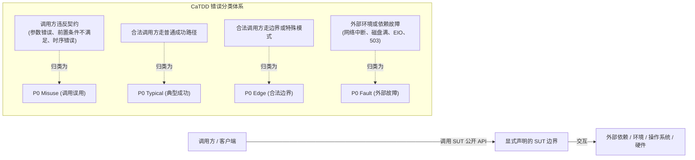
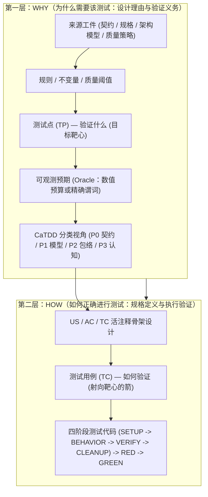
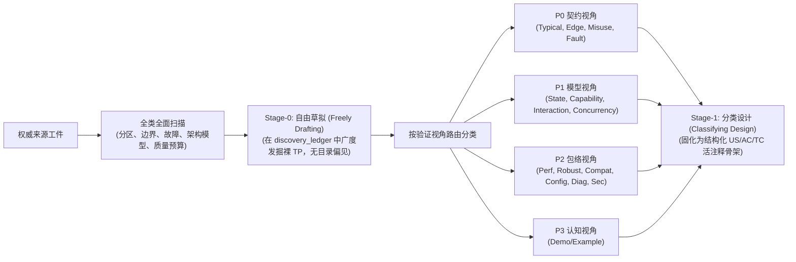

# CaTDD 通用语言（Ubiquitous Language）

本文件定义了 CaTDD 安装器会分发到目标项目根目录的词汇体系。
它是统一语义契约，用于保证方法提示词、slash 命令、代码智能体和生成适配器中的关键术语保持一致。

## Who

- 维护 `methodPrompts/` 的方法维护者。
- 维护 `slashCommands/` 的流程维护者。
- 维护 `codeAgents/` 与 `agentSkills/` 的代码智能体维护者。
- 将 CaTDD 安装到自身仓库的项目团队。

## What

这是 CaTDD 执行环境的共享术语表。

### Core Concepts

| 术语 | 含义 |
| --- | --- |
| CaTDD | Comment-alive Test-Driven Development（注释存活测试驱动开发）。 |
| Comment-alive | 在代码生成前，以结构化注释显式表达验证意图。 |
| US / AC / TC | User Story / Acceptance Criteria / Test Case 的可追溯链路。 |
| Skeleton | 仅注释的测试设计骨架，包含追溯标记和计划测试意图。 |
| RED | 产品代码修改前，处于可执行且预期失败的测试状态。 |
| GREEN | 产品代码修改后，测试通过状态。 |
| SpecCoding | 将验证设计工件作为可执行规格生命周期的 CaTDD 工作流。 |
| VibeCoding | 快速创意/原型模式；结果仍应回收并对齐到 CaTDD 追溯体系。 |
| Source-First | 源头在先：先审视权威来源工件（契约、架构模型、质量策略）并独立推导预期验证义务，再查阅已有骨架或测试代码，消除作者自身盲区。 |
| TestEvidenceChain | 测试证据链：回答“为什么需要这个测试（WHY）”与“如何正确进行测试（HOW）”的完整无断裂证据链：从来源工件 -> 规则/不变量 -> 测试点（TP） -> 可观测预期（Oracle） -> CaTDD 分类（WHY 层面） -> US/AC/TC -> 测试用例（TC） -> RED/GREEN 实现（HOW 层面）。 |
| SUT | 被测系统 / 被测目标（System Under Test）：在测试中显式声明的被测软件边界（如 `SUT: utCodeAgentCLI`）。它确立了调用方（调用者违反契约属于 `P0 Misuse`）与外部依赖/环境（依赖故障属于 `P0 Fault`）之间的严格分界线。 |
| UT | 单元测试（Unit Testing）：聚焦于单个显式声明的 SUT 的验证活动，遵循项目约定的 `sut_unit_convention`（如模块接口、子模块接口、类、头文件接口、函数或组件）。在编码前通过 CaTDD 验证其公开契约、内部模型与质量属性。 |
| TP | 测试点（Test Point）：从来源规则、模型、边界或故障模式中发掘出的具体验证义务或条件，记录在 `discovery_ledger` 中。从开发者/防御性视角表达“必须验证什么”（目标靶心），通常采用具体的 `GIVEN 技术状态/分区, WHEN 动作/交织时序, THEN 可观测预期` 描述。 |
| TC | 测试用例（Test Case）：具有结构化元数据（`@[Name]`、`@[Expect]`、`SETUP -> BEHAVIOR -> VERIFY -> CLEANUP`）并链接到 `[@AC-n, US-n]` 的可执行规格工件。从执行视角表达“如何具体验证”（射向靶心的箭）。 |
| AC vs TP | AC 出自用户/调用方视角（定义外部业务验收规则：`GIVEN 业务上下文, WHEN 触发操作, THEN 业务结果`）；TP 出自开发者/防御性视角（定义深入边界、异常路径、并发交织的技术探针，用于验证 AC 是否坚挺成立）。一条 AC 通常分解为多个具体 TP（$1:N$ 关系）。将 $TP == AC$ 画等号会导致边界和故障模式遗漏。 |
| TP vs TC | 概念与基数并非绝对 1:1。TP 可以独立存在而尚未编写 TC（`1:0` -> GAP，从而暴露遗漏测试点）；复杂义务可能需要多个用例（`1:N`）；一个用例也可以在断言明确区分时覆盖多个测试点（`N:1`）。过早假设 `TC == TP` 会掩盖测试点遗漏。 |
| Discovery to Categorization | 发现到归类的两阶段桥梁：在 Stage-0（自由草拟）阶段，基于来源和全面扫描广度优先发掘 TP，避免过早陷入分类偏见；在 Stage-1（分类设计）阶段，依据验证视角将各 TP 路由到正确的 CaTDD 类别（契约 -> P0，模型 -> P1，包络 -> P2，认知表面 -> P3），随后形式化为 US/AC/TC 骨架。 |
| manualMode | 默认交互执行模式，适用于所有 SpecFlow 工作导向。助手逐步推进，在意图、验收标准或安全性模糊时暂停并提出针对性问题，等待开发者明确确认。 |
| autonomousMode | 无人值守/命令行自治执行模式。通过入口命令（如 `SPEC_importIssue`、`SPEC_openUserStory`）携带 `execution_mode: autonomousMode` 触发。**严格仅支持实现导向（implementation-oriented）的用户故事**。在该模式下，智能体自动执行并推进 Part 2.b 的测试先行实现与评审步骤，直至最终状态（`closeUserStory`、`abortUserStory` 或 `suspendUserStory`）。需求与架构导向的工作必须保留人类意图，强制处于 `manualMode`。 |
| analysis_mode | 分析命令内部（`SPEC_analyzeIssue`、`SPEC_analyzeFeature`）在 `manualMode` 流程下的命令级执行模式。`BRAINSTORM`（头脑风暴，默认）与开发者进行交互式逐步对话探讨；`AUTONOMOUS`（自主分析）单次执行多技能分析流水线草拟 `todoUS` 而不逐步打断，但会显式记录假设与疑问并在存在阻塞性问题时将故事标记为未就绪（NOT ready）。 |
| ONE-MORE-THING | 跨 CaTDD 全局通用安全不变量：无论在 `manualMode` 还是 `autonomousMode` 下，只要遇到不确定、来源缺失、冲突或未明确的事项，智能体都必须暂停并向开发者提问以获取明确答案。自主模式绝非猜测或臆造需求的许可；在 `autonomousMode` 下遇到 ONE-MORE-THING 时立即暂停自主推进并输出结构化 `manual_required` 提问。 |
| Semantic Falsification Gate | 语义证伪门禁：严格区分合法 `🔴 RED` 与 `⚠️ BROKEN_TEST` 的验证门禁。测试只有在编译/加载正常、完整执行 SETUP 与 BEHAVIOR 并**在 VERIFY 阶段严格触发预期的领域语义断言失败**（如 `AssertionError`、`Expected X but got Y`）时，才被认定为合法的 RED。若因语法错误、缺少依赖/导入、Fixture 崩溃或环境异常而失败，则标记为 `⚠️ BROKEN_TEST`，严禁借此进入生产代码编写，必须先修复测试底座。 |
| Anti-Test-Theater | 反测试演戏机制：杜绝大模型生成空洞、伪装或自我证实的虚假测试工程纪律。严禁“Mock 测试 Mock”（未经 SUT 业务逻辑直接断言 Mock 自身的返回值），严禁空洞的真假/非空断言（如 `assert != null` 或 `assert True`），强制要求断言必须验证 SUT 真实的状态流转、计算产物或领域不变量。 |

### Category Vocabulary

| 层级 | 分类 |
| --- | --- |
| P0 Functional | Typical, Edge, Misuse, Fault |
| P1 Design | State, Capability, Interaction, Concurrency |
| P2 Quality | Performance, Robust, Compatibility, Configuration, Diagnosis, Security |
| P3 Addons | Demo/Example |

### Ownership Vocabulary

| 层 | 职责 |
| --- | --- |
| `methodPrompts/` | 分类语义与 CaTDD 方法约束的真理源。 |
| `slashCommands/` | 对方法语义的可移植命令/流程封装。 |
| `codeAgents/` | 目标驱动编排与执行策略。 |
| `agentSkills/` | 面向非原生代码智能体的技能打包。 |

### 概念图解与实例（Diagrams and Examples）

#### 1. SUT 边界不变量（Misuse 与 Fault 的分界）

显式声明的 **SUT** 确立了契约分界线：



#### 2. 测试证据链（TestEvidenceChain：回答 WHY 与 HOW）

每个测试都必须建立一条从设计意图贯穿到代码实现的完整证据链：



#### 3. AC vs. TP vs. TC（$1 \text{ AC} : N \text{ TPs} : M \text{ TCs}$ 视角与基数）

- **验收准则 (AC)**：用户视角 —— “外部业务期望达成什么规则？”
- **测试点 (TP)**：开发者视角 —— “内部需要探测哪些边界、异常与并发条件？”（目标靶心）
- **测试用例 (TC)**：执行视角 —— “在代码中如何编写确定性的步骤与断言？”（射向靶心的箭）

实例拆解（以批量导出器为例）：

```text
AC-01 (用户业务规则):
  "GIVEN 1 到 100 条有效记录, WHEN 调用 write 时, THEN 持久化所有记录并返回 OK。"

分解为开发者技术探针测试点 (TPs):
  ├── TP-01 (Typical): 写入 2 条记录 (正常代表分区) -> 返回 OK 且数据持久化 (P0 Typical)
  ├── TP-02 (Edge):    写入 1 条记录 (最小合法边界) -> 返回 OK 且数据持久化 (P0 Edge)
  ├── TP-03 (Edge):    写入 100 条记录 (最大合法边界) -> 返回 OK 且数据持久化 (P0 Edge)
  ├── TP-04 (Misuse):  写入 0 条记录 (低于合法范围) -> 返回 INVALID_COUNT 且文件未修改 (P0 Misuse)
  └── TP-05 (Misuse):  写入 101 条记录 (高于合法范围) -> 返回 INVALID_COUNT 且文件未修改 (P0 Misuse)

映射并实现为可执行测试用例 (TCs):
  ├── TC-01: verifyWrite_byNominalBatch_expectSuccess      (覆盖 TP-01)
  ├── TC-02: verifyWrite_byBoundaryBatch_expectSuccess     (覆盖 TP-02 与 TP-03)
  ├── TC-03: verifyWrite_byZeroBatch_expectInvalidCount    (覆盖 TP-04)
  └── TC-04: verifyWrite_byOversizedBatch_expectInvalidCount(覆盖 TP-05)
```

#### 4. 发现到分类（Stage-0 到 Stage-1 的两阶段桥梁）



## When

在以下场景使用本术语表：

- 在 README、prompt、rule、架构文档中定义新术语时；
- 命名新的 UT_*/SPEC_* 命令时；
- 审查 EN/ZH 或不同适配器之间术语漂移时；
- 将 CaTDD 安装到新项目时。

## Where

- 本仓库真理源：`README_UbiLang.md`（项目根目录）。
- 目标项目安装位置：`<target>/README_UbiLang.md` 与 `<target>/README_UbiLang_ZH.md`。
- 被已安装规则/说明引用：`.github/instructions`、`.continue/rules`、`.clinerules`、`.antigravityrules` 以及自定义适配器规则。

## Why

CaTDD 是方法驱动的体系。关键词漂移会直接导致行为漂移。

统一通用语言可确保不同代码智能体运行时下，生成 prompt、命令流程、评审输出与实现决策保持一致。

## How

1. 新增领域术语时，先在这里定义，再扩散到其他文档。
2. 对工具依赖的状态名/分类名保持稳定措辞。
3. 拒绝会改变语义的随意同义词替换（例如不要随意重命名分类）。
4. 更新安装器时，确保两个术语文件都复制到目标项目根目录。

## Usage Example

发布前进行术语一致性检查：

```bash
rg -n "Typical|Edge|Misuse|Fault|State|Capability|Interaction|Concurrency|Performance|Robust|Compatibility|Configuration|Diagnosis|Security|Demo/Example|US/AC/TC|SpecCoding|VibeCoding|Source-First|TestEvidenceChain|SUT|UT|TP|TC|manualMode|autonomousMode|analysis_mode|ONE-MORE-THING" README*.md methodPrompts slashCommands codeAgents agentSkills
```

预期结果：这些术语的含义与本文件定义保持一致。
