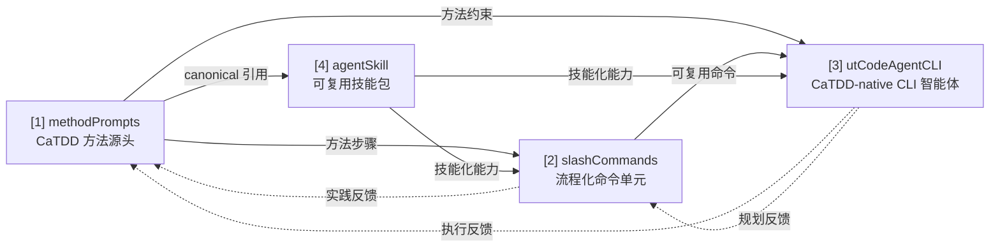

# MyCaTDD

MyCaTDD 是一个把 CaTDD 方法论逐步产品化的仓库，目标是把“方法”从手工使用，演进到可自动化、可智能化执行。

CaTDD 是 EnigmaWU 发明的方法论。IOC 是一个 PlayKata 模块和验证场，帮助 CaTDD 从想法演进为真实可复用的方法论。

核心口号：

> Comments is Verification Design. LLM Generates Code. Iterate Forward Together.

## 你图里的意思（本仓库对应）

你的图表达的是一条四层演进链路：

1. [methodPrompts](methodPrompts/README.md)（方法提示词）
2. [slashCommands](slashCommands/README.md)（提示词命令）
3. [utCodeAgentCLI](utCodeAgentCLI/README.md)（代码智能体）
4. [agentSkill](agentSkill/README.md)（技能包）

并且存在双向改进闭环：

- [1] 应用到 [2]、[3]
- [4] 把 [1] 封装为可复用的智能体能力
- [2] 和 [3] 的实践再反哺改进 [1]
- [3] 的任务规划与反思进一步反哺 [2]

关系图：



这个 README 按这条主线组织。

## 四层资产与职责

### [1] [methodPrompts](methodPrompts/README.md)（方法提示词）

简介：CaTDD 的语言无关方法源头层。它定义 comment-alive 设计骨架、分类方法提示词、用户指南材料和实现模板。它更偏方法本身，也更适合手工阅读与执行。

更多说明：[methodPrompts/README.md](methodPrompts/README.md)。独立方法层用法见 [methodPrompts/README_UserGuide_ZH.md](methodPrompts/README_UserGuide_ZH.md)。

### [2] [slashCommands](slashCommands/README.md)（提示词命令）

简介：与具体 code-agent 无关的流程连接层。它把 `methodPrompts` 中稳定的 CaTDD 方法步骤整理为小型、可触发的提示词命令和执行流程，可被 Copilot、Cline、Continue 或类似助手使用。它更偏自动化流程。它把 CaTDD 适配到现有 CodeAgent，但不自行定义 CaTDD 方法语义。

更多说明：[slashCommands/README.md](slashCommands/README.md)。生成器、安装器、流程和命令用法见 [slashCommands/README_UserGuide_ZH.md](slashCommands/README_UserGuide_ZH.md)。

### [3] [utCodeAgentCLI](utCodeAgentCLI/README.md)（代码智能体）

简介：本仓库自己的 CaTDD-native CLI 智能体层。开发人员定义目标后，智能体基于 [1] 和 [2] 完成规划、执行、追踪与反思。

更多说明：[utCodeAgentCLI/README.md](utCodeAgentCLI/README.md)。

### [4] [agentSkill](agentSkill/README.md)（技能包）

简介：可复用能力封装层。它把 CaTDD 方法知识封装为可触发技能，并保持技能引用与 canonical method files 对齐。

更多说明：[agentSkill/README.md](agentSkill/README.md)。打包和验证步骤见 [agentSkill/README_UserGuide_ZH.md](agentSkill/README_UserGuide_ZH.md)。

## CaTDD 规格驱动流程

`slashCommands` 是 CaTDD 基于 `methodPrompts` 的 Spec-Driven Development 风格流程层。

在本仓库中，spec 不是一套独立的产品规格 DSL。spec 是 comment-alive verification design：US/AC/TC 骨架、CaTDD 分类覆盖、优先级关卡和测试用例状态。`methodPrompts` 定义这套方法/规格语言；`slashCommands` 把它转成可重复执行的 CodeAgent 工作流步骤；原生 prompt 文件只是面向具体智能体的适配器。

CaTDD 术语 **VibeCoding** 和 **SpecCoding** 的定义见 [slashCommands/README.md](slashCommands/README.md)。可执行工作流见 [slashCommands/README_UserGuide_ZH.md](slashCommands/README_UserGuide_ZH.md)。

## 三种协作模式（与图一致）

### 模式 A：开发人员手动模式

- 输入：`methodPrompts`
- 方式：手工阅读并执行方法本身的步骤
- 产出：可验证的测试设计与实现

### 模式 B：开发人员 + 代码助手（GUI）

- 输入：`methodPrompts` +（未来）`slashCommands`
- 方式：按需调用面向流程的命令片段
- 关注点：方法分解、流程自动化应用

### 模式 C：开发人员 + 代码智能体（CLI）

- 输入：`methodPrompts` + `slashCommands` + 目标定义
- 方式：智能体完成任务规划、执行与反思
- 关注点：智能化应用方法、闭环优化

## 迭代闭环（建议执行方式）

1. 先在 [1] 把方法写清楚、写稳定。
2. 在 [2] 把高频步骤命令化，降低调用成本。
3. 在 [3] 把完整任务交给智能体执行。
4. 把 [3] 暴露的问题回写到 [2] 与 [1]，持续改进。

## 安装 / 刷新到 CodeAgent 项目

可以用下面的命令把 CaTDD 安装或刷新到已有的 Copilot 项目：

```bash
scripts/installCaTDD4Copilot.sh --target /path/to/project --clean-prompts
```

如果目标目录还不存在，增加 `--init`：

```bash
scripts/installCaTDD4Copilot.sh --target /path/to/new-project --init --clean-prompts
```

可以用下面的命令把 CaTDD 安装或刷新到 Continue 项目：

```bash
scripts/installCaTDD4Continue.sh --target /path/to/project
```

如果需要在重新生成前删除旧的 `UT_*.prompt` 和 `SPEC_*.prompt` Continue 包装，可增加 `--clean-prompts`。

可以用下面的命令把 CaTDD 安装或刷新到 Cline 项目：

```bash
scripts/installCaTDD4Cline.sh --target /path/to/project
```

安装器会在目标项目中创建或刷新这些资产：

- `.catdd/methodPrompts/`：安装后的 CaTDD 方法源，用于手工阅读与方法真理源。
- `.catdd/slashCommands/`：安装后的可移植流程命令源，用于自动化。
- `.github/prompts/UT_*.prompt.md` 和 `.github/prompts/SPEC_*.prompt.md`：从 `slashCommands` 生成的 Copilot 原生薄适配。
- `.github/instructions/catdd.instructions.md`：指向 `.catdd/` 的 Copilot instruction 文件。
- `.continue/rules/catdd.md`：指向 `.catdd/` 的 Continue 项目规则。
- `.continue/prompts/UT_*.prompt` 和 `.continue/prompts/SPEC_*.prompt`：从 `slashCommands` 生成的 Continue 原生 prompt 薄适配。
- `.clinerules/catdd.md`：指向 `.catdd/` 的 Cline 项目规则。

在本源仓库中，生成的 `.github/prompts/UT_*.prompt.md`、`.github/prompts/SPEC_*.prompt.md`、`.continue/rules/catdd.md`、`.continue/prompts/UT_*.prompt`、`.continue/prompts/SPEC_*.prompt`、`.clinerules/catdd.md` 文件只是临时适配输出，并被刻意忽略。应提交 `methodPrompts`、`slashCommands`、脚本与文档；需要时再为目标项目重新生成原生适配。

## 快速开始

1. 先阅读 `README_UserGuide.md` 了解全貌。
2. 需要方法提示词地图时，阅读 [methodPrompts/README.md](methodPrompts/README.md)。
3. 需要命令层 WHAT/WHY 时，阅读 [slashCommands/README.md](slashCommands/README.md)。
4. 需要生成、安装或运行稳定方法步骤命令时，阅读 [slashCommands/README_UserGuide_ZH.md](slashCommands/README_UserGuide_ZH.md)。
5. 需要 skill package 层 WHAT/WHY 时，阅读 [agentSkill/README.md](agentSkill/README.md)。
6. 需要生成或验证可复用技能包时，阅读 [agentSkill/README_UserGuide_ZH.md](agentSkill/README_UserGuide_ZH.md)。
7. 需要 CLI 智能体执行时，阅读 [utCodeAgentCLI/README.md](utCodeAgentCLI/README.md)。
