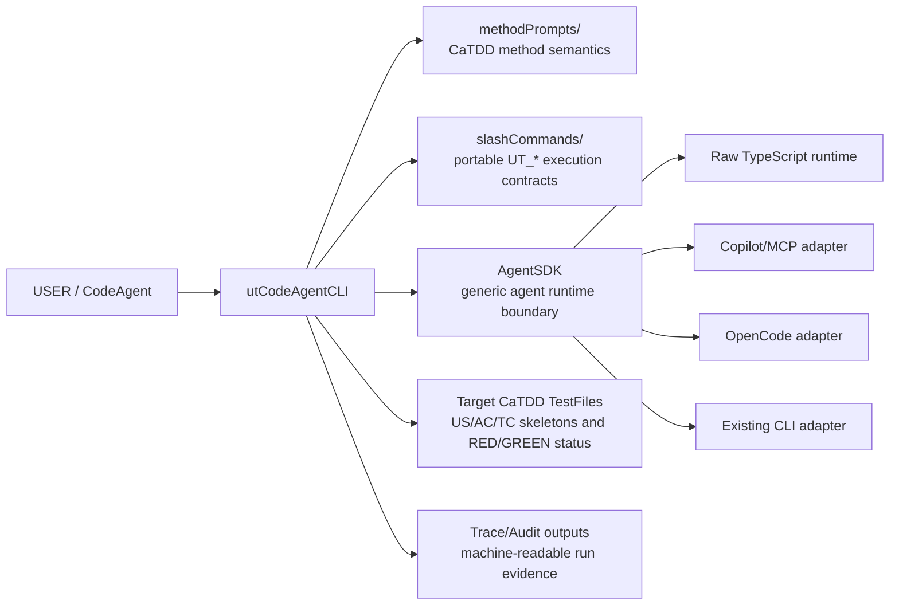
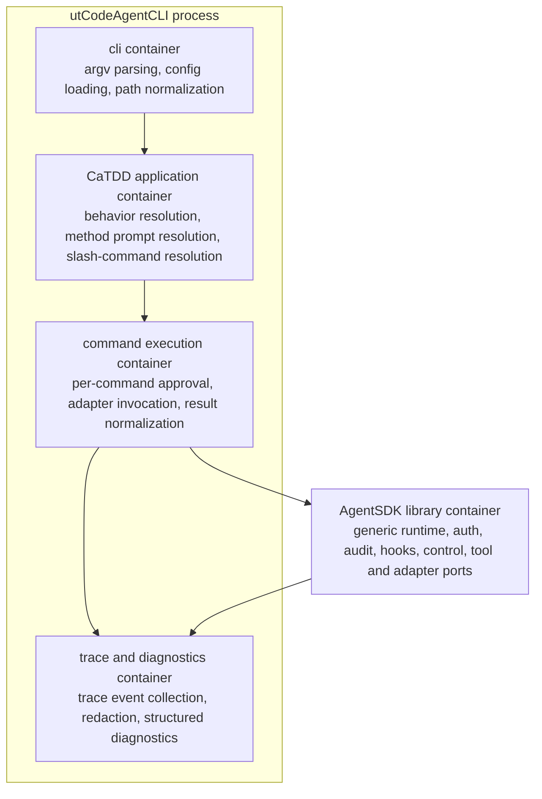
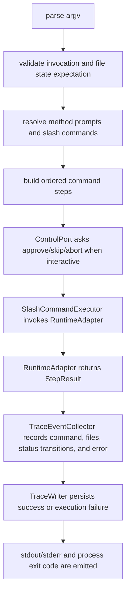
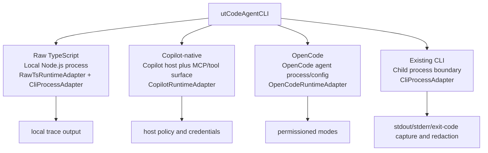

# utCodeAgentCLI Architecture Design

This document defines the high-level architecture for `utCodeAgentCLI`: a CaTDD-native CLI built on top of a generic, CaTDD-independent `AgentSDK` runtime abstraction.

## Context

- Architecture baseline story: [../../.catdd/spec/doingUS/20260530-design-utCodeAgentCLI-architecture-UserStory.md](../../.catdd/spec/doingUS/20260530-design-utCodeAgentCLI-architecture-UserStory.md)
- Architecture-changing update story: [../../.catdd/spec/doingUS/20260604-decide-utCodeAgentCLI-runtime-language-UserStory.md](../../.catdd/spec/doingUS/20260604-decide-utCodeAgentCLI-runtime-language-UserStory.md)
- Requirements index: [README_UserStory.md](README_UserStory.md)
- USER requirements: [README_UserStory4USER.md](README_UserStory4USER.md)
- INVENTOR requirements: [README_UserStory4INVENTOR.md](README_UserStory4INVENTOR.md)
- DEVELOPER requirements: [README_UserStory4DEVELOPER.md](README_UserStory4DEVELOPER.md)
- CLI contract: [README_UsageDesign.md](README_UsageDesign.md)
- Startup guide: [README_UserGuide.md](README_UserGuide.md)
- Method source of truth: [../../methodPrompts/](../../methodPrompts/)
- Portable command source of truth: [../../slashCommands/](../../slashCommands/)

`utCodeAgentCLI` is not yet a runnable binary. This architecture describes the intended production-ready shape before detail design, unit-test design, or runtime implementation begins.

## Architecture Decision: Runtime Language

`utCodeAgentCLI` adopts a staged runtime decision: **TypeScript on Node.js for V1 (PoC)** and **Go pre-selected for V2 (production distribution)**. **Python** was evaluated and not selected.

Reasoning summary:

- The runtime language should fit the current repository’s documentation and adapter model.
- The runtime language should minimize friction for local file orchestration, command routing, and machine-readable trace generation.
- The runtime language should preserve a clean adapter boundary so future Copilot, OpenCode, or other runtime surfaces can be added without changing CaTDD semantics.
- The runtime language should keep the eventual V1 implementation realistic for the team to build, test, and maintain.

See [ADRs/ADR_RuntimeLanguage.md](ADRs/ADR_RuntimeLanguage.md) for the full decision record.

## Who

| Role | Architecture concern |
| --- | --- |
| USER | Receives traceable CaTDD test artifacts from a goal, source context, and User Story without learning every low-level command first. |
| INVENTOR | Verifies the CLI delegates CaTDD semantics to `methodPrompts` and `slashCommands`, never hardcoding method meaning in the CLI. |
| DEVELOPER | Builds and extends the CLI through explicit parser, planner, runtime-adapter, trace, diagnostics, and control contracts. |

## What

The architecture separates two systems:

1. `AgentSDK`: a generic LLM agent runtime library. It knows about goals, messages, tools, sessions, permissions, traces, hooks, adapters, and execution control. It does not know CaTDD.
2. `utCodeAgentCLI`: a CaTDD application on top of `AgentSDK`. It parses CLI arguments, resolves CaTDD behaviors to portable slash commands, injects method prompt references, preserves US/AC/TC traceability, and records CaTDD execution traces.

## When

Use this architecture before creating `src/`, runtime adapters, low-level TypeScript interfaces, or executable CLI tests.

Update it whenever requirements add a new runtime target, trace field, execution-control mode, adapter boundary, or CaTDD delegation rule.

## Where

The design belongs in `codeAgents/utCodeAgentCLI/` because it is module-scoped to the future CLI execution layer.

Future implementation files should live under a structure like:

```text
codeAgents/utCodeAgentCLI/
  src/
    cli/
    catdd/
    agentsdk/
    adapters/
    trace/
    config/
  tests/
  traces/
```

## Why

The main architecture risk is method drift: a convenient CLI could duplicate CaTDD semantics, invent category meanings, or bypass portable slash-command contracts. The design avoids that by making `AgentSDK` generic and making `utCodeAgentCLI` an orchestrator, not a method owner.

The second risk is runtime lock-in. The CLI may need to support raw TypeScript/Node.js, Python, or Go depending on the final decision, then adapt to Copilot-native and OpenCode surfaces, while leaving LangGraph and Google ADK as research-informed optional adapters.

## How

High-level execution:

1. Parse and validate `--goal`, `--target`, `--behave`, optional story/source/config/diagnostic flags.
2. Convert parsed input into a `CatddInvocation` with normalized selectors and state expectations.
3. Resolve `--behave` to one or more portable `UT_*` slash commands.
4. Resolve required method prompts by file path; never inline CaTDD category meaning.
5. Build an `AgentRunPlan` for `AgentSDK`.
6. Execute the plan through a selected runtime adapter.
7. Preserve CaTDD skeletons and status transitions through delegated commands.
8. Write a machine-readable trace for success and execution failure.

## Architecture Goals

- Keep `AgentSDK` CaTDD-independent.
- Keep all CaTDD method semantics delegated to `methodPrompts/` and `slashCommands/`.
- Support a runtime shape that can host raw TypeScript/Node.js, Python, or Go depending on the reviewed tradeoff.
- Provide adapter boundaries for GitHub Copilot/MCP, OpenCode, existing CLIs, and future SDKs.
- Preserve USER traceability from User Story to skeleton to executable RED tests.
- Provide INVENTOR proof through diagnostic prompt/command resolution.
- Provide DEVELOPER extension points for auth, audit, auto modules, hooks, and control.

## Px-SpecFlow Architecture-Oriented Coverage

Px-SpecFlow treats architecture-oriented SPEC docs as a family. This story does not need every companion document yet, but the architecture must state which concerns are covered here, delegated to existing docs, deferred, or not applicable.

| Surface | Current handling | Follow-up trigger |
| --- | --- | --- |
| `README_UsageDesign.md` | Existing CLI contract. This ArchDesign consumes it as parser and behavior-selector input instead of redefining argument syntax. | Update UsageDesign when CLI syntax, aliases, or error cases change. |
| `README_ErrorDesign.md` | Covered at architecture level by failure flow, `DiagnosticReporter`, `ControlPort`, exit codes, and execution-failure traces. | Create a separate ErrorDesign when error taxonomy, recovery policy, or user-facing code tables stabilize. |
| `README_ResourceDesign.md` | Minimal for a local CLI. Current resource boundaries are timeout, cancellation, trace file growth, redaction, and child-process lifecycle. | Create when memory, CPU, concurrency, quota, cache, or filesystem budgets become acceptance criteria. |
| `README_PerfDesign.md` | Captured as runtime/adapter overhead risk; no latency or throughput budget is accepted yet. | Create when command latency, large-repository scaling, or runtime startup budgets become requirements. |
| `README_CompatDesign.md` | Covered by runtime adapter and deployment views for raw TypeScript, Copilot/MCP, OpenCode, and existing CLI processes. | Create when Node.js version, OS matrix, Copilot/OpenCode version, or protocol compatibility must be locked. |
| `README_DiagnosisDesign.md` | Covered by diagnostics, trace schema, audit labels, redaction, and resolved prompt/command reporting. | Create when log levels, telemetry schema, symptom maps, or field-debug workflow become explicit requirements. |
| `README_VerifyDesign.md` | Covered at topology level by method-prompt/slash-command delegation and review checklist expectations. | Create during detail/test design when mock boundaries, CI loops, and US/AC/TC verification matrices are defined. |
| `README_StateDesign.md` or ArchDesign state chapter | Covered by `State And Control Model`, which is enough for P1 state-skeleton consumers at this architecture gate. | Split into `README_StateDesign.md` if lifecycle/state machines become larger than this architecture chapter. |

## Requirements Traceability

| Requirement | Architectural support |
| --- | --- |
| USER flows | `CliParser`, `InvocationValidator`, `BehaviorRegistry`, and `CatddPlanner` validate arguments, resolve behavior, and route skeleton/review/implementation work through delegated slash commands. |
| INVENTOR proof | `MethodPromptResolver`, `SlashCommandResolver`, and diagnostic flags expose the exact source prompt and command files used in execution order. |
| DEVELOPER operation | `RuntimeAdapter`, `ControlPort`, `TraceWriter`, `DiagnosticReporter`, and `LogSink` provide extensible runtime, pause/approval, trace, error, and logging boundaries. |

## External Framework Reference Matrix

| Reference | Goal parsing | Command routing | State execution | Decision for utCodeAgentCLI |
| --- | --- | --- | --- | --- |
| GitHub Copilot with MCP | The host chat surface gathers goals and context; MCP tools expose additional context but do not replace CLI parsing. | Tool calls route through MCP servers and toolsets under host policy. | Host session and tool-call state are external; CaTDD file state remains in the workspace. | Treat Copilot/MCP as an adapter surface. Keep `CliParser`, `CatddPlanner`, and CaTDD state rules local. |
| OpenCode | Agent mode and prompt context shape the goal; project/global config can specialize behavior. | Agent/tool permissions and Plan/Build modes constrain command execution. | Session state lives in OpenCode; file and TC state still belong to the target test files. | Map review behaviors to read-only Plan-like mode and design/implementation behaviors to Build-like mode. |
| LangGraph/LangChain | Graph input state can model normalized invocation and goal context. | Edges route between parse, plan, approve, execute, trace, and recover nodes. | Durable graph state, interrupts, and replay can model long-running execution. | Use as a future reference for checkpoint/resume and visual trace design, not a v1 hard dependency. |
| Google ADK | Runtime config, sessions, and agents can receive normalized goals. | Graph workflows, callbacks, plugins, and tools route work across agents. | Sessions, memory, cancellation, and observability support production execution state. | Use as a reference for `AuthPort`, `AuditPort`, `HookPort`, `AutoPort`, and `ControlPort`. |
| Existing CLIs | argv and environment carry the normalized goal and context. | Process invocation routes to one external command at a time. | Exit codes and stdout/stderr are the observable state boundary. | Provide `CliProcessAdapter` for raw TypeScript execution and external tool integration. |

## Architecture Views

The initial architecture was too list-shaped. This revision adds Mermaid-renderable C4-style views because architecture review needs stable viewpoints: who uses the system, which containers own responsibilities, which components own decisions, and where runtime state moves.

### C4 Level 1: System Context View



`Target CaTDD TestFiles` means the repository test artifact files that delegated `UT_*` commands read or write. They are not a runtime dependency of `AgentSDK`; they are CaTDD work products where US/AC/TC comments and RED/GREEN test status live.

### C4 Level 2: Container View



### C4 Level 3: Component View

```mermaid
flowchart LR
  cliParser["CliParser"] --> invocationValidator["InvocationValidator"]
  invocationValidator --> behaviorRegistry["BehaviorRegistry"]
  behaviorRegistry --> resolvers["MethodPromptResolver + SlashCommandResolver"]
  resolvers --> catddPlanner["CatddPlanner"]
  catddPlanner --> slashExecutor["SlashCommandExecutor"]
  slashExecutor --> runPlanBuilder["AgentRunPlanBuilder"]
  runPlanBuilder --> runtime["AgentRuntime + RuntimeAdapter"]
  runtime --> traceCollector["TraceEventCollector"]
  traceCollector --> outputs["TraceWriter + DiagnosticReporter"]
```



`SlashCommandExecutor` is the explicit bridge between CaTDD planning and generic runtime execution. It owns command-level approval, adapter invocation, result normalization, and command failure boundaries. It does not own CaTDD category meaning.

### Runtime Execution View



### Deployment View



## Execution Context

This section complements the C4 Level 1 view. C4 Level 1 shows the system boundary; this execution context shows the path of one `utCodeAgentCLI` invocation after that boundary is established.

```text
USER / CodeAgent
  -> utCodeAgentCLI CLI parser
  -> CatddInvocation validator
  -> CaTDD planner and behavior resolver
  -> AgentSDK run plan
  -> RuntimeAdapter
  -> slashCommands + methodPrompts
  -> Target CaTDD TestFiles, stdout/stderr, trace files
```

`methodPrompts/` and `slashCommands/` sit beside the CLI, not below `AgentSDK`. They are CaTDD assets consumed by `utCodeAgentCLI` and passed into agent runs as explicit files and commands.

## Module Boundaries

| Module | Responsibility | Public surface |
| --- | --- | --- |
| `cli/` | Parse argv, load config, normalize paths, and produce `CatddInvocation`. | `parseArgv(argv)`, `loadConfig(path)` |
| `catdd/` | Resolve behavior aliases, method prompts, slash commands, selectors, and state contracts. | `planCatddRun(invocation)` |
| `agentsdk/` | Provide generic agent execution contracts independent of CaTDD. | `AgentRuntime`, `RuntimeAdapter`, `ToolPort`, `TracePort`, `ControlPort` |
| `executor/` | Invoke resolved slash-command steps through runtime adapters, enforce per-command control, and normalize command results. | `SlashCommandExecutor`, `StepResult`, `CommandResultNormalizer` |
| `adapters/` | Bridge run plans to raw TypeScript, Copilot/MCP, OpenCode, and process-based CLIs. | `RawTsRuntimeAdapter`, `CopilotRuntimeAdapter`, `OpenCodeRuntimeAdapter`, `CliProcessAdapter` |
| `trace/` | Write machine-readable traces for success and execution failure. | `TraceWriter`, `TraceSchema` |
| `diagnostics/` | Format actionable errors, warnings, diagnostic logs, and suggestions. | `DiagnosticReporter`, `SuggestionEngine` |

## AgentSDK Programming Interface

`AgentSDK` is the generic library boundary. It may be implemented in TypeScript first, but its concepts should stay portable.

### Core Interfaces

```ts
export interface AgentRuntime {
  run(plan: AgentRunPlan, context: AgentRunContext): Promise<AgentRunResult>;
}

export interface RuntimeAdapter {
  prepare(plan: AgentRunPlan, context: AgentRunContext): Promise<PreparedRun>;
  execute(prepared: PreparedRun, control: ControlPort): Promise<AgentRunResult>;
}

export interface AgentRunPlan {
  goal: string;
  steps: AgentRunStep[];
  requiredTools: ToolRef[];
  tracePolicy: TracePolicy;
}
```

Exact TypeScript types, error classes, and module names belong to later detail design.

### Auth/Audit/Auto/Hooks/Control Ports

| Port | Responsibility | CaTDD awareness |
| --- | --- | --- |
| `AuthPort` | Provide runtime credentials, token lookup, inherited context, OAuth/PAT integration, or no-auth local mode. | None. |
| `AuditPort` | Record actor, adapter, command, target, timestamp, policy decision, and trace ID. | None; receives labels from `utCodeAgentCLI`. |
| `AutoPort` | Register enterprise automation modules for policy checks, exports, or organization-specific automation. | None by default. |
| `HookPort` | Register lifecycle callbacks such as `pre-parse`, `post-plan`, `pre-step`, `post-step`, `on-failure`, and `pre-trace-write`. | None. |
| `ControlPort` | Pause, approve, skip, abort, checkpoint, resume, timeout, and cancel execution. | None. |

## Runtime Adaptations

### Runtime Candidate

The V1 implementation target is a Node.js TypeScript CLI that reads local files, executes portable slash-command steps through an internal runner or process adapter, writes deterministic traces, and has no required external agent runtime. This runtime is chosen for V1 because the target adapter ecosystem (Copilot SDK, MCP, OpenCode) is Node/TypeScript-native, giving first-class adapters with no cross-language bridge. Go is pre-selected for V2 to gain single-binary production distribution; the AgentSDK/adapter boundary is kept runtime-portable so the V2 migration stays contained.

### GitHub Copilot And MCP Adapter

The Copilot adapter targets Copilot-native surfaces through prompt wrappers and MCP-compatible tool/context bridges. It must keep prompt wrappers thin, expose toolsets explicitly, respect host policy, and require `ControlPort` approval for sensitive actions unless policy marks them safe.

### OpenCode Adapter

The OpenCode adapter maps `AgentSDK` plans to OpenCode concepts: Plan-like read-only mode for analysis/review, Build-like full-access mode for skeleton/implementation, permission profiles for tool access, optional subagent delegation, and project-level configuration generated from `CatddInvocation`.

### LangGraph Reference Adapter

LangGraph is not required, but its graph model informs future long-running workflow design: parse, plan, resolve, execute, review, trace, and reflect stages can become graph nodes, with persistence and interrupts supporting checkpoint/resume.

### Google ADK Reference Adapter

Google ADK is a research reference for production agent concerns. Its sessions, runtime config, callbacks, plugins, observability, tool authentication, and TypeScript support inform `ControlPort`, `HookPort`, `AutoPort`, `AuditPort`, and `TracePort` design.

### Existing CLI Adapter

`CliProcessAdapter` lets `AgentSDK` call external command-line programs through stdin/stdout/stderr capture, exit-code mapping, timeout, cancellation, environment control, working-directory control, and redaction before trace/audit persistence.

## Data Flow

```text
argv
  -> CliParser
  -> CatddInvocation
  -> InvocationValidator
  -> BehaviorRegistry
  -> MethodPromptResolver + SlashCommandResolver
  -> CatddRunPlan
  -> SlashCommandExecutor
  -> AgentRunPlan
  -> ControlPort approval gate
  -> RuntimeAdapter.execute()
  -> StepResult + FileChangeSet + TcTransitionSet
  -> TraceEventCollector
  -> TraceWriter + stdout/stderr + exit code
```

Failure flow:

```text
command or adapter error
  -> SlashCommandExecutor marks failed step
  -> DiagnosticReporter
  -> TraceEventCollector records failure point and completed steps
  -> ControlPort decides stop/skip/abort when interactive
  -> TraceWriter persists execution-failure trace
  -> process exit code
```

## Embedded And Digital Media Architecture Points

Not applicable for `utCodeAgentCLI` v1 architecture. There is no MCU, RTOS, DMA, power domain, media pipeline, buffer topology, sample format, or A/V sync boundary in scope.

The nearest architectural equivalents are child-process boundaries, filesystem trace outputs, adapter timeouts, cancellation, and command-control checkpoints; those are covered by the runtime, state/control, resource, and trace sections above.

## Execution Trace Model

Each run writes a machine-readable JSON or YAML trace with at least:

| Field | Purpose |
| --- | --- |
| `traceVersion` | Schema version for forward compatibility. |
| `timestamp` | Run start time. |
| `invocation` | Original command string and normalized arguments. |
| `workspace` | Repository root, config file, and working directory. |
| `resolvedMethodPrompts` | Method prompt file paths and the reason each was used. |
| `resolvedSlashCommands` | Slash command names, paths, and execution order. |
| `steps` | Step status, duration, adapter, approval decision, and error if any. |
| `files` | Files read, written, or skipped. |
| `tcTransitions` | TC-ID, category, before status, after status, and owning file. |
| `exit` | Exit code, outcome, duration, and failure point. |

Trace redaction is required. Secrets, tokens, and raw LLM responses must be redacted or separately gated before persistence.

`TraceEventCollector` receives normalized events from `SlashCommandExecutor` and runtime adapters. It compares pre-step and post-step file observations for TC status transitions, records which delegated command produced the change, and passes redacted structured data to `TraceWriter`.

## State And Control Model

`utCodeAgentCLI` observes the CaTDD file-state model from requirements:

```text
EMPTY -> DESIGNED -> PARTIAL -> FULLY_RED -> ALL_GREEN
```

`AgentSDK` controls generic run state:

```text
created -> prepared -> running -> waiting_for_approval -> completed
                              \-> failed
                              \-> aborted
                              \-> skipped
```

The bridge rule is strict: CaTDD statuses (`PLANNED`, `RED`, `GREEN`) belong to test files and delegated commands; generic run states belong to `AgentSDK` and adapters.

Ownership is split deliberately: `catdd/` validates the expected file state before planning, delegated slash commands produce CaTDD artifacts, `executor/` observes before/after command results, and `trace/` records the resulting `tcTransitions`. No `AgentSDK` type should contain CaTDD category definitions or TC status rules.

## Cross-Cutting Concerns

| Concern | Owner | Rule |
| --- | --- | --- |
| Auth | `AgentSDK` + adapter | Use inherited runtime credentials or configured providers; never write raw secrets to traces. |
| Audit | `AgentSDK` | Record actor, adapter, command, target, policy decision, trace ID, and timestamp. |
| Auto | `AgentSDK` extension point | Enterprise automation can add policy checks or exports, but must not mutate CaTDD semantics. |
| Hooks | `HookPort` | Support lifecycle points such as `pre-parse`, `post-plan`, `pre-step`, `post-step`, `on-failure`, and `pre-trace-write`. |
| Control | `ControlPort` | Pause, approve, skip, abort, checkpoint, resume, timeout, and cancel execution. |
| Diagnostics | `utCodeAgentCLI` + `AgentSDK` | Separate user-facing errors from inventor/developer diagnostics such as resolved prompt and command paths. |

## Dependencies

| Dependency | Direction | Reason | Risk |
| --- | --- | --- | --- |
| `utCodeAgentCLI -> methodPrompts` | Read-only file dependency | Resolve CaTDD category and method meaning. | Missing or stale prompt files block execution. |
| `utCodeAgentCLI -> slashCommands` | Read-only/execute dependency | Run portable CaTDD behaviors. | Command contract drift requires resolver diagnostics. |
| `utCodeAgentCLI -> AgentSDK` | Application calls generic runtime. | Keep runtime adapters out of CaTDD logic. | Boundary can blur if CaTDD terms leak into SDK. |
| `AgentSDK -> RuntimeAdapter` | Interface dependency. | Support raw TS, Copilot/MCP, OpenCode, and future runtimes. | Adapter mismatch or incomplete capabilities. |
| `TraceWriter -> filesystem` | Write dependency. | Persist machine-readable run records. | Trace paths and redaction policy need detail design. |

## Key Decisions

| Decision | Rationale | Status |
| --- | --- | --- |
| Introduce `AgentSDK` as a generic layer below `utCodeAgentCLI`. | Keeps LLM runtime concerns reusable and CaTDD-independent. | Accepted. |
| Adopt TypeScript/Node.js for V1 and pre-select Go for V2. | V1 favors adapter-native PoC speed; V2 favors single-binary production distribution. | Accepted. |
| Treat Copilot/MCP and OpenCode as adapter targets. | Meets compatibility goals while preserving CLI core. | Accepted. |
| Treat LangGraph and Google ADK as research references first. | They inform graph, session, callback, and observability design without becoming required dependencies. | Proposed. |
| Keep CaTDD semantics out of `AgentSDK`. | Satisfies INVENTOR method-delegation requirements. | Accepted. |
| Persist traces on success and execution failure. | Satisfies traceability and audit requirements. | Accepted. |

## Runtime Language ADR Summary

The runtime-language decision is recorded as an ADR with a staged outcome: TS/Node for V1, Go pre-selected for V2.

| Candidate | Evaluation summary | Outcome |
| --- | --- | --- |
| TypeScript / Node.js | Adapter-native (Copilot/MCP/OpenCode), strong fit for local file orchestration, trace generation, and adapter-first CLI design; lowest integration cost for a PoC. | Selected for V1 |
| Python | Strong scripting ecosystem and fast orchestration ergonomics, but adapter integration would require cross-language bridging that outweighs scripting velocity for this CLI. | Not selected |
| Go | Strong binary/runtime simplicity and a compact deployment story; best fit for production single-binary distribution. | Pre-selected for V2 |

## Quality Attribute Scenarios (Measured)

| ID | Source | Stimulus | Environment | Response | Response Measure |
| --- | --- | --- | --- | --- | --- |
| QAS-1 Modifiability | Maintainer | Add a new runtime adapter target (for example, new host/runtime surface). | Normal development with existing `AgentSDK` contracts. | Add adapter with no CaTDD semantic changes and no cross-module contract rewrite. | `AgentSDK` core files changed <= 2 files; no `methodPrompts/` or `slashCommands/` semantic edits required. |
| QAS-2 Diagnosability | Developer | A delegated slash-command step fails in CI or local execution. | Runtime failure during command execution. | System emits structured trace and actionable diagnostics with failure point and completed steps. | Trace includes failed step ID, command path, and error summary in <= 10 seconds from failure detection. |
| QAS-3 Runtime Resilience | Operator/Developer | Interactive run receives abort/timeout/cancel during multi-step execution. | Local or hosted adapter execution under control events. | Execution stops safely, preserves completed-step evidence, and avoids invalid TC status mutation. | 100% of interrupted runs persist an execution-failure trace and no illegal TC transition is recorded. |

## Sensitivity And Tradeoff Points

### Sensitivity Points

- Adapter boundary strictness in `AgentSDK` is sensitive for modifiability and migration cost.
- Trace schema completeness is sensitive for diagnosability and post-failure recovery speed.

### Tradeoff Points

- Rich diagnostics and trace detail improve diagnosability, but can increase runtime overhead and redaction complexity.
- Strong adapter decoupling improves portability and long-term evolution, but increases upfront interface design complexity.

## Inter-View Consistency Log

- Context vs Container: external runtime surfaces in Context view (Raw TS, Copilot/MCP, OpenCode, Existing CLI) are represented by adapter/runtime containers.
- Functional/Component vs Development: component responsibilities (`CliParser`, `CatddPlanner`, `SlashCommandExecutor`, `TraceWriter`) map to module boundaries under `src/cli`, `src/catdd`, `src/executor`, and `src/trace`.
- Concurrency/Execution vs Deployment: runtime execution and control/approval flow map to deployment targets and adapter boundaries without changing CaTDD semantic ownership.

## Risks And Constraints

- Adapter drift: Copilot, OpenCode, LangGraph, and ADK APIs can change.
- Method drift: CLI implementation may accidentally hardcode CaTDD semantics.
- Trace leakage: traces may capture sensitive paths, prompts, or tokens.
- Runtime overhead: adapter indirection may add latency.
- Ambiguous source-depth expectations: Copilot SDK and OpenCode compatibility depth still need detail-design decisions.
- Future runtime portability still depends on keeping `AgentSDK` portable even before the final runtime is chosen.

## Non-Goals

- Implement the CLI binary.
- Define exact TypeScript class layout or package names.
- Write unit tests or US/AC/TC test skeletons.
- Redefine CaTDD categories, status discipline, or method prompt content.
- Replace `slashCommands/` with `utCodeAgentCLI` logic.
- Choose final enterprise auth or audit storage infrastructure.

## Usage Example

Run this from the repository root to verify this architecture document and its Chinese mirror have matching heading structure:

```bash
awk '/^#{1,6} /{print length($1), $1}' codeAgents/utCodeAgentCLI/README_ArchDesign.md > /tmp/ut-arch-en.headings
awk '/^#{1,6} /{print length($1), $1}' codeAgents/utCodeAgentCLI/README_ArchDesign_ZH.md > /tmp/ut-arch-zh.headings
diff -u /tmp/ut-arch-en.headings /tmp/ut-arch-zh.headings
```

Expected result: `diff` prints no output and exits with code 0.

## Review Checklist

- Architecture decisions trace to architecture-changing baseline/update stories and role-specific requirements.
- `AgentSDK` has no CaTDD method knowledge.
- `utCodeAgentCLI` delegates CaTDD semantics to `methodPrompts/` and `slashCommands/`.
- Raw TS, Copilot/MCP, OpenCode, existing CLI, LangGraph, and Google ADK positions are explicit.
- Mermaid-renderable C4-style context, container, component, runtime, and deployment views are present.
- Px-SpecFlow architecture-oriented surfaces are covered, delegated, deferred, or marked not applicable.
- Auth, audit, auto, hooks, and control have clear extension points.
- Trace fields cover success, execution failure, command resolution, file writes, and TC status transitions.
- EN/ZH heading structure matches.

## Open Questions

- Should `AgentSDK` live inside `codeAgents/utCodeAgentCLI/src/agentsdk/` first, or become a separate package once the API stabilizes?
- Should trace output default to `codeAgents/utCodeAgentCLI/traces/`, `.catdd/traces/`, or a user-configured path?
- Which Copilot integration depth is required first: prompt-wrapper execution, MCP tools, VS Code extension integration, or GitHub Models usage?
- Which OpenCode surface is required first: command adapter, provider abstraction, workflow compatibility, or shared agent runtime?
- Should LangGraph and Google ADK become optional adapters in v1.x, or remain reference architectures only?

## Next Step

For a story that changes this architecture, run `/SPEC_reviewArchDesign` before `/SPEC_takeDetailDesign`.

For a story that only consumes this architecture, continue with that story's own planned next SPEC step instead of treating it as an architecture trace owner.