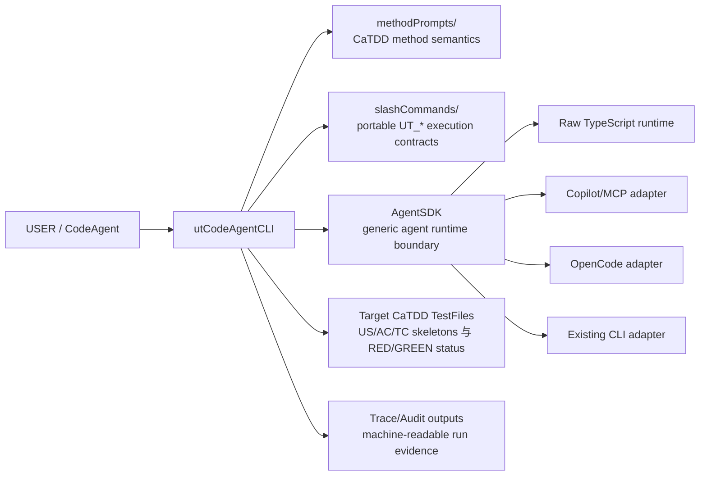
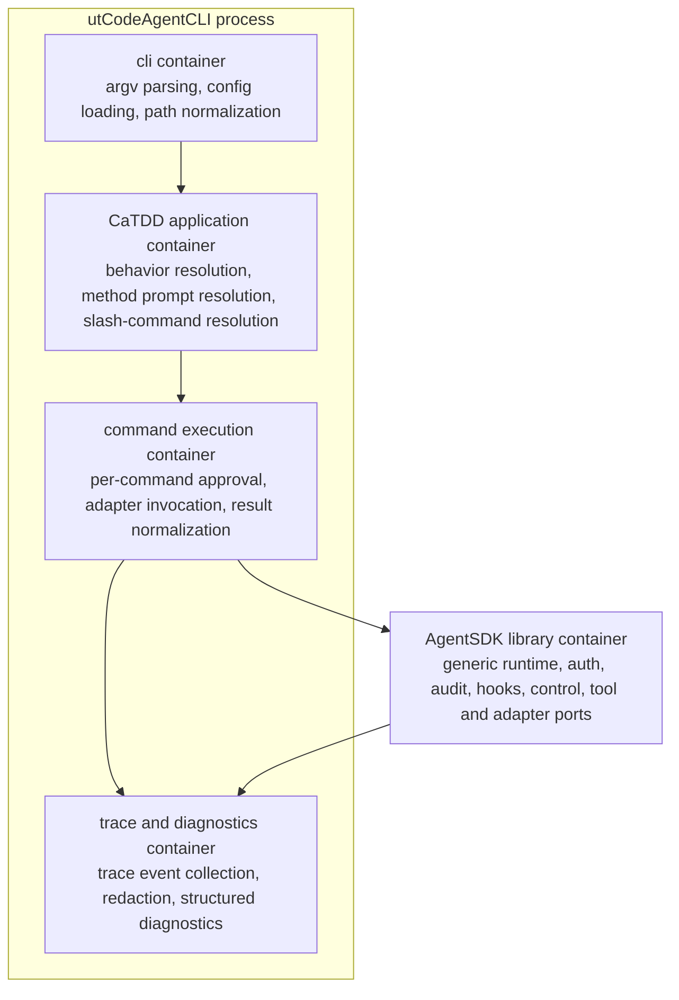
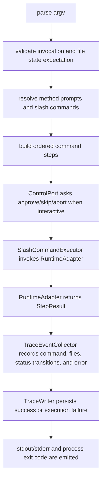
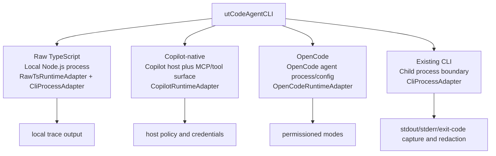

# utCodeAgentCLI 架构设计

本文定义 `utCodeAgentCLI` 的高层架构：它是构建在通用且不依赖 CaTDD 的 `AgentSDK` runtime abstraction 之上的 CaTDD-native CLI。

## Context

- Active story: [../../.catdd/spec/doingUS/20260530-design-utCodeAgentCLI-architecture-UserStory.md](../../.catdd/spec/doingUS/20260530-design-utCodeAgentCLI-architecture-UserStory.md)
- Requirements index: [README_UserStory_ZH.md](README_UserStory_ZH.md)
- USER requirements: [README_UserStory4USER_ZH.md](README_UserStory4USER_ZH.md)
- INVENTOR requirements: [README_UserStory4INVENTOR_ZH.md](README_UserStory4INVENTOR_ZH.md)
- DEVELOPER requirements: [README_UserStory4DEVELOPER_ZH.md](README_UserStory4DEVELOPER_ZH.md)
- CLI contract: [README_UsageDesign_ZH.md](README_UsageDesign_ZH.md)
- Startup guide: [README_UserGuide_ZH.md](README_UserGuide_ZH.md)
- Method source of truth: [../../methodPrompts/](../../methodPrompts/)
- Portable command source of truth: [../../slashCommands/](../../slashCommands/)

`utCodeAgentCLI` 目前还不是可运行 binary。本文描述的是进入 detail design、unit-test design 或 TypeScript 实现之前的 production-ready 架构形态。

## Who

| 角色 | 架构关注点 |
| --- | --- |
| USER | 从 goal、source context 与 User Story 得到可追溯 CaTDD 测试工件，而不需要先理解所有底层命令。 |
| INVENTOR | 验证 CLI 将 CaTDD 语义委托给 `methodPrompts` 与 `slashCommands`，绝不在 CLI 中硬编码方法含义。 |
| DEVELOPER | 通过明确的 parser、planner、runtime-adapter、trace、diagnostics 与 control contract 构建并扩展 CLI。 |

## What

架构分离两个系统：

1. `AgentSDK`：通用 LLM agent runtime library。它理解 goals、messages、tools、sessions、permissions、traces、hooks、adapters 与 execution control，但不理解 CaTDD。
2. `utCodeAgentCLI`：构建在 `AgentSDK` 之上的 CaTDD application。它解析 CLI 参数，将 CaTDD behavior 解析到 portable slash commands，注入 method prompt 引用，保持 US/AC/TC traceability，并记录 CaTDD execution traces。

## When

在创建 `src/`、runtime adapters、底层 TypeScript interfaces 或可执行 CLI tests 之前，先使用本架构。

当 requirements 增加新的 runtime target、trace field、execution-control mode、adapter boundary 或 CaTDD delegation rule 时，更新本文件。

## Where

本设计属于 `codeAgents/utCodeAgentCLI/`，因为它面向未来 CLI execution layer 的模块级架构。

未来实现文件建议采用类似结构：

```text
codeAgents/utCodeAgentCLI/
  src/
    cli/
    catdd/
    agentsdk/
    adapters/
    trace/
    config/
  tests/
  traces/
```

## Why

主要架构风险是 method drift：方便的 CLI 可能复制 CaTDD 语义、发明 category meaning，或绕过 portable slash-command contracts。本设计通过让 `AgentSDK` 保持通用、让 `utCodeAgentCLI` 只做编排而不是方法 owner 来避免这一点。

第二个风险是 runtime lock-in。CLI 必须先能作为 raw TypeScript/Node.js 运行，再适配 Copilot-native 与 OpenCode surfaces，同时将 LangGraph 与 Google ADK 保持为 research-informed optional adapters。

## How

高层执行流程：

1. 解析并验证 `--goal`、`--target`、`--behave`、可选 story/source/config/diagnostic flags。
2. 将解析结果转换成带有 normalized selectors 与 state expectations 的 `CatddInvocation`。
3. 将 `--behave` 解析到一个或多个 portable `UT_*` slash commands。
4. 通过文件路径解析所需 method prompts；绝不内联 CaTDD category meaning。
5. 为 `AgentSDK` 构建 `AgentRunPlan`。
6. 通过选定 runtime adapter 执行 plan。
7. 通过委托命令保持 CaTDD skeleton 与 status transitions。
8. 为成功与 execution failure 写入机器可读 trace。

## Architecture Goals

- 保持 `AgentSDK` 不依赖 CaTDD。
- 将所有 CaTDD 方法语义委托给 `methodPrompts/` 与 `slashCommands/`。
- 将 raw TypeScript/Node.js 作为第一个 runtime target。
- 为 GitHub Copilot/MCP、OpenCode、existing CLIs 与 future SDKs 提供 adapter boundaries。
- 保持 USER 从 User Story 到 skeleton 到 executable RED tests 的 traceability。
- 通过 diagnostic prompt/command resolution 给 INVENTOR 提供证明。
- 为 DEVELOPER 提供 auth、audit、auto modules、hooks 与 control 的 extension points。

## Px-SpecFlow Architecture-Oriented Coverage

Px-SpecFlow 将 architecture-oriented SPEC docs 视为一个文档族。本 story 还不需要每个 companion document，但 architecture 必须说明哪些 concern 已在这里覆盖、委托给已有文档、延后，或不适用。

| Surface | Current handling | Follow-up trigger |
| --- | --- | --- |
| `README_UsageDesign.md` | 已存在的 CLI contract。本 ArchDesign 将其作为 parser 与 behavior-selector input 消费，而不重新定义 argument syntax。 | 当 CLI syntax、aliases 或 error cases 变化时更新 UsageDesign。 |
| `README_ErrorDesign.md` | 通过 failure flow、`DiagnosticReporter`、`ControlPort`、exit codes 与 execution-failure traces 在 architecture level 覆盖。 | 当 error taxonomy、recovery policy 或 user-facing code tables 稳定时创建单独 ErrorDesign。 |
| `README_ResourceDesign.md` | 对 local CLI 而言较轻。当前 resource boundaries 是 timeout、cancellation、trace file growth、redaction 与 child-process lifecycle。 | 当 memory、CPU、concurrency、quota、cache 或 filesystem budgets 成为 acceptance criteria 时创建。 |
| `README_PerfDesign.md` | 作为 runtime/adapter overhead risk 捕获；当前尚未接受 latency 或 throughput budget。 | 当 command latency、large-repository scaling 或 runtime startup budgets 成为 requirements 时创建。 |
| `README_CompatDesign.md` | 通过 raw TypeScript、Copilot/MCP、OpenCode 与 existing CLI processes 的 runtime adapter 与 deployment views 覆盖。 | 当 Node.js version、OS matrix、Copilot/OpenCode version 或 protocol compatibility 必须锁定时创建。 |
| `README_DiagnosisDesign.md` | 通过 diagnostics、trace schema、audit labels、redaction 与 resolved prompt/command reporting 覆盖。 | 当 log levels、telemetry schema、symptom maps 或 field-debug workflow 成为明确 requirements 时创建。 |
| `README_VerifyDesign.md` | 通过 method-prompt/slash-command delegation 与 review checklist expectations 在 topology level 覆盖。 | 在 detail/test design 阶段定义 mock boundaries、CI loops 与 US/AC/TC verification matrices 时创建。 |
| `README_StateDesign.md` or ArchDesign state chapter | 由 `State And Control Model` 覆盖；这足以供 architecture gate 阶段的 P1 state-skeleton consumers 使用。 | 如果 lifecycle/state machines 超出本 architecture chapter 的承载范围，则拆分到 `README_StateDesign.md`。 |

## Requirements Traceability

| Requirement | 架构支持 |
| --- | --- |
| USER flows | `CliParser`、`InvocationValidator`、`BehaviorRegistry` 与 `CatddPlanner` 验证参数、解析 behavior，并通过委托 slash commands 路由 skeleton/review/implementation 工作。 |
| INVENTOR proof | `MethodPromptResolver`、`SlashCommandResolver` 与 diagnostic flags 暴露实际使用的 source prompt 与 command files 及执行顺序。 |
| DEVELOPER operation | `RuntimeAdapter`、`ControlPort`、`TraceWriter`、`DiagnosticReporter` 与 `LogSink` 提供可扩展 runtime、pause/approval、trace、error 与 logging 边界。 |

## External Framework Reference Matrix

| Reference | Goal parsing | Command routing | State execution | Decision for utCodeAgentCLI |
| --- | --- | --- | --- | --- |
| GitHub Copilot with MCP | Host chat surface 收集 goal 与 context；MCP tools 提供额外 context，但不取代 CLI parsing。 | Tool calls 通过 MCP servers 与 toolsets 路由，并受 host policy 约束。 | Host session 与 tool-call state 属于外部；CaTDD file state 仍属于 workspace。 | 将 Copilot/MCP 视为 adapter surface。`CliParser`、`CatddPlanner` 与 CaTDD state rules 保持本地。 |
| OpenCode | Agent mode 与 prompt context 塑造 goal；project/global config 可特化 behavior。 | Agent/tool permissions 与 Plan/Build modes 约束 command execution。 | Session state 位于 OpenCode；file 与 TC state 仍属于目标 test files。 | 将 review behaviors 映射到 read-only Plan-like mode，将 design/implementation behaviors 映射到 Build-like mode。 |
| LangGraph/LangChain | Graph input state 可建模 normalized invocation 与 goal context。 | Edges 在 parse、plan、approve、execute、trace、recover nodes 之间路由。 | Durable graph state、interrupts 与 replay 可建模 long-running execution。 | 作为 checkpoint/resume 与 visual trace design 的未来参考，不作为 v1 hard dependency。 |
| Google ADK | Runtime config、sessions 与 agents 可接收 normalized goals。 | Graph workflows、callbacks、plugins 与 tools 在 agents 间路由工作。 | Sessions、memory、cancellation 与 observability 支持 production execution state。 | 作为 `AuthPort`、`AuditPort`、`HookPort`、`AutoPort` 与 `ControlPort` 的参考。 |
| Existing CLIs | argv 与 environment 承载 normalized goal 与 context。 | Process invocation 一次路由到一个 external command。 | Exit codes 与 stdout/stderr 是可观察 state boundary。 | 为 raw TypeScript execution 与外部工具集成提供 `CliProcessAdapter`。 |

## Architecture Views

初版 architecture 太像模块清单。本次修订增加 Mermaid-renderable C4-style views，因为 architecture review 需要稳定视角：谁使用系统、哪些 containers 拥有哪些职责、哪些 components 拥有决策，以及 runtime state 在哪里流动。

### C4 Level 1: System Context View



`Target CaTDD TestFiles` 指 delegated `UT_*` commands 读写的 repository test artifact files。它们不是 `AgentSDK` 的 runtime dependency；它们是保存 US/AC/TC comments 与 RED/GREEN test status 的 CaTDD work products。

### C4 Level 2: Container View



### C4 Level 3: Component View

```mermaid
flowchart LR
  cliParser["CliParser"] --> invocationValidator["InvocationValidator"]
  invocationValidator --> behaviorRegistry["BehaviorRegistry"]
  behaviorRegistry --> resolvers["MethodPromptResolver + SlashCommandResolver"]
  resolvers --> catddPlanner["CatddPlanner"]
  catddPlanner --> slashExecutor["SlashCommandExecutor"]
  slashExecutor --> runPlanBuilder["AgentRunPlanBuilder"]
  runPlanBuilder --> runtime["AgentRuntime + RuntimeAdapter"]
  runtime --> traceCollector["TraceEventCollector"]
  traceCollector --> outputs["TraceWriter + DiagnosticReporter"]
```



`SlashCommandExecutor` 是 CaTDD planning 与 generic runtime execution 之间的明确桥梁。它负责 command-level approval、adapter invocation、result normalization 与 command failure boundaries，但不拥有 CaTDD category meaning。

### Runtime Execution View



### Deployment View



## Execution Context

本节补充 C4 Level 1 view。C4 Level 1 展示 system boundary；这里的 execution context 展示该边界建立后，一次 `utCodeAgentCLI` invocation 的执行路径。

```text
USER / CodeAgent
  -> utCodeAgentCLI CLI parser
  -> CatddInvocation validator
  -> CaTDD planner and behavior resolver
  -> AgentSDK run plan
  -> RuntimeAdapter
  -> slashCommands + methodPrompts
  -> Target CaTDD TestFiles, stdout/stderr, trace files
```

`methodPrompts/` 与 `slashCommands/` 位于 CLI 旁边，而不是 `AgentSDK` 下面。它们是由 `utCodeAgentCLI` 消费，并作为明确 files 与 commands 传入 agent runs 的 CaTDD assets。

## Module Boundaries

| Module | Responsibility | Public surface |
| --- | --- | --- |
| `cli/` | 解析 argv，加载 config，规范化 paths，并产生 `CatddInvocation`。 | `parseArgv(argv)`, `loadConfig(path)` |
| `catdd/` | 解析 behavior aliases、method prompts、slash commands、selectors 与 state contracts。 | `planCatddRun(invocation)` |
| `agentsdk/` | 提供不依赖 CaTDD 的通用 agent execution contracts。 | `AgentRuntime`, `RuntimeAdapter`, `ToolPort`, `TracePort`, `ControlPort` |
| `executor/` | 通过 runtime adapters 调用 resolved slash-command steps，执行 per-command control，并规范化 command results。 | `SlashCommandExecutor`, `StepResult`, `CommandResultNormalizer` |
| `adapters/` | 将 run plans 连接到 raw TypeScript、Copilot/MCP、OpenCode 与 process-based CLIs。 | `RawTsRuntimeAdapter`, `CopilotRuntimeAdapter`, `OpenCodeRuntimeAdapter`, `CliProcessAdapter` |
| `trace/` | 为成功与 execution failure 写入 machine-readable traces。 | `TraceWriter`, `TraceSchema` |
| `diagnostics/` | 格式化 actionable errors、warnings、diagnostic logs 与 suggestions。 | `DiagnosticReporter`, `SuggestionEngine` |

## AgentSDK Programming Interface

`AgentSDK` 是通用 library boundary。它可以先用 TypeScript 实现，但概念应保持可移植。

### Core Interfaces

```ts
export interface AgentRuntime {
  run(plan: AgentRunPlan, context: AgentRunContext): Promise<AgentRunResult>;
}

export interface RuntimeAdapter {
  prepare(plan: AgentRunPlan, context: AgentRunContext): Promise<PreparedRun>;
  execute(prepared: PreparedRun, control: ControlPort): Promise<AgentRunResult>;
}

export interface AgentRunPlan {
  goal: string;
  steps: AgentRunStep[];
  requiredTools: ToolRef[];
  tracePolicy: TracePolicy;
}
```

精确 TypeScript types、error classes 与 module names 属于后续 detail design。

### Auth/Audit/Auto/Hooks/Control Ports

| Port | Responsibility | CaTDD awareness |
| --- | --- | --- |
| `AuthPort` | 提供 runtime credentials、token lookup、inherited context、OAuth/PAT integration，或 no-auth local mode。 | 无。 |
| `AuditPort` | 记录 actor、adapter、command、target、timestamp、policy decision 与 trace ID。 | 无；从 `utCodeAgentCLI` 接收 labels。 |
| `AutoPort` | 注册 enterprise automation modules，用于 policy checks、exports 或 organization-specific automation。 | 默认无。 |
| `HookPort` | 注册 lifecycle callbacks，例如 `pre-parse`、`post-plan`、`pre-step`、`post-step`、`on-failure`、`pre-trace-write`。 | 无。 |
| `ControlPort` | 暂停、批准、跳过、中止、checkpoint、resume、timeout 与 cancel execution。 | 无。 |

## Runtime Adaptations

### Raw TypeScript Runtime

第一个实现目标是 Node.js TypeScript CLI：读取本地文件，通过 internal runner 或 process adapter 执行 portable slash-command steps，写入确定性 traces，并且不要求外部 agent runtime。

### GitHub Copilot And MCP Adapter

Copilot adapter 通过 prompt wrappers 与 MCP-compatible tool/context bridges 面向 Copilot-native surfaces。它必须保持 prompt wrappers 精简、明确暴露 toolsets、遵守 host policy，并在敏感操作上要求 `ControlPort` approval，除非 policy 标记为 safe。

### OpenCode Adapter

OpenCode adapter 将 `AgentSDK` plans 映射到 OpenCode concepts：用于 analysis/review 的 Plan-like read-only mode、用于 skeleton/implementation 的 Build-like full-access mode、tool access permission profiles、可选 subagent delegation，以及从 `CatddInvocation` 生成的 project-level configuration。

### LangGraph Reference Adapter

LangGraph 不是必需 runtime，但它的 graph model 启发未来 long-running workflow design：parse、plan、resolve、execute、review、trace 与 reflect stages 可以成为 graph nodes，persistence 与 interrupts 支持 checkpoint/resume。

### Google ADK Reference Adapter

Google ADK 是 production agent concerns 的 research reference。它的 sessions、runtime config、callbacks、plugins、observability、tool authentication 与 TypeScript support 启发 `ControlPort`、`HookPort`、`AutoPort`、`AuditPort` 与 `TracePort` 设计。

### Existing CLI Adapter

`CliProcessAdapter` 让 `AgentSDK` 通过 stdin/stdout/stderr capture、exit-code mapping、timeout、cancellation、environment control、working-directory control 以及 trace/audit persistence 前 redaction 来调用外部 command-line programs。

## Data Flow

```text
argv
  -> CliParser
  -> CatddInvocation
  -> InvocationValidator
  -> BehaviorRegistry
  -> MethodPromptResolver + SlashCommandResolver
  -> CatddRunPlan
  -> SlashCommandExecutor
  -> AgentRunPlan
  -> ControlPort approval gate
  -> RuntimeAdapter.execute()
  -> StepResult + FileChangeSet + TcTransitionSet
  -> TraceEventCollector
  -> TraceWriter + stdout/stderr + exit code
```

Failure flow:

```text
command or adapter error
  -> SlashCommandExecutor marks failed step
  -> DiagnosticReporter
  -> TraceEventCollector records failure point and completed steps
  -> ControlPort decides stop/skip/abort when interactive
  -> TraceWriter persists execution-failure trace
  -> process exit code
```

## Embedded And Digital Media Architecture Points

`utCodeAgentCLI` v1 architecture 不适用。当前 scope 内没有 MCU、RTOS、DMA、power domain、media pipeline、buffer topology、sample format 或 A/V sync boundary。

最接近的 architecture equivalents 是 child-process boundaries、filesystem trace outputs、adapter timeouts、cancellation 与 command-control checkpoints；这些已由上面的 runtime、state/control、resource 与 trace sections 覆盖。

## Execution Trace Model

每次 run 至少写入包含以下字段的 machine-readable JSON 或 YAML trace：

| Field | Purpose |
| --- | --- |
| `traceVersion` | 用于 forward compatibility 的 schema version。 |
| `timestamp` | Run start time。 |
| `invocation` | 原始 command string 与 normalized arguments。 |
| `workspace` | Repository root、config file 与 working directory。 |
| `resolvedMethodPrompts` | Method prompt file paths 以及每个 prompt 被使用的原因。 |
| `resolvedSlashCommands` | Slash command names、paths 与 execution order。 |
| `steps` | Step status、duration、adapter、approval decision 与 error if any。 |
| `files` | Files read、written 或 skipped。 |
| `tcTransitions` | TC-ID、category、before status、after status 与 owning file。 |
| `exit` | Exit code、outcome、duration 与 failure point。 |

Trace redaction 是必需项。Secrets、tokens 与 raw LLM responses 必须在持久化前 redacted，或受单独 gate 控制。

`TraceEventCollector` 从 `SlashCommandExecutor` 与 runtime adapters 接收 normalized events。它比较 step 前后的 file observations 来生成 TC status transitions，记录哪个 delegated command 产生了变化，并将 redacted structured data 交给 `TraceWriter`。

## State And Control Model

`utCodeAgentCLI` 遵守 requirements 中的 CaTDD file-state model：

```text
EMPTY -> DESIGNED -> PARTIAL -> FULLY_RED -> ALL_GREEN
```

`AgentSDK` 控制 generic run state：

```text
created -> prepared -> running -> waiting_for_approval -> completed
                              \-> failed
                              \-> aborted
                              \-> skipped
```

桥接规则必须严格：CaTDD statuses（`PLANNED`、`RED`、`GREEN`）属于 test files 与 delegated commands；generic run states 属于 `AgentSDK` 与 adapters。

Ownership 被刻意拆分：`catdd/` 在 planning 前验证 expected file state，delegated slash commands 产生 CaTDD artifacts，`executor/` 观察 command 前后结果，`trace/` 记录得到的 `tcTransitions`。任何 `AgentSDK` type 都不应包含 CaTDD category definitions 或 TC status rules。

## Cross-Cutting Concerns

| Concern | Owner | Rule |
| --- | --- | --- |
| Auth | `AgentSDK` + adapter | 使用 inherited runtime credentials 或 configured providers；绝不将 raw secrets 写入 traces。 |
| Audit | `AgentSDK` | 记录 actor、adapter、command、target、policy decision、trace ID 与 timestamp。 |
| Auto | `AgentSDK` extension point | Enterprise automation 可以添加 policy checks 或 exports，但不得修改 CaTDD semantics。 |
| Hooks | `HookPort` | 支持 `pre-parse`、`post-plan`、`pre-step`、`post-step`、`on-failure` 与 `pre-trace-write` 等 lifecycle points。 |
| Control | `ControlPort` | 暂停、批准、跳过、中止、checkpoint、resume、timeout 与 cancel execution。 |
| Diagnostics | `utCodeAgentCLI` + `AgentSDK` | 区分 user-facing errors 与 inventor/developer diagnostics，例如 resolved prompt 与 command paths。 |

## Dependencies

| Dependency | Direction | Reason | Risk |
| --- | --- | --- | --- |
| `utCodeAgentCLI -> methodPrompts` | Read-only file dependency | 解析 CaTDD category 与 method meaning。 | 缺失或过期 prompt files 会阻塞执行。 |
| `utCodeAgentCLI -> slashCommands` | Read-only/execute dependency | 运行 portable CaTDD behaviors。 | Command contract drift 需要 resolver diagnostics。 |
| `utCodeAgentCLI -> AgentSDK` | Application 调用 generic runtime。 | 将 runtime adapters 排除在 CaTDD logic 之外。 | 如果 CaTDD terms 泄漏到 SDK，boundary 会模糊。 |
| `AgentSDK -> RuntimeAdapter` | Interface dependency。 | 支持 raw TS、Copilot/MCP、OpenCode 与 future runtimes。 | Adapter mismatch 或 capability 不完整。 |
| `TraceWriter -> filesystem` | Write dependency。 | 持久化 machine-readable run records。 | Trace paths 与 redaction policy 需要 detail design。 |

## Key Decisions

| Decision | Rationale | Status |
| --- | --- | --- |
| 在 `utCodeAgentCLI` 下方引入通用 `AgentSDK`。 | 保持 LLM runtime concerns 可复用且不依赖 CaTDD。 | Proposed. |
| 将 raw TypeScript/Node.js 作为第一个 runtime。 | 满足 story assumption，并避免过早 dependency lock-in。 | Proposed. |
| 将 Copilot/MCP 与 OpenCode 作为 adapter targets。 | 满足 compatibility goals，同时保持 CLI core 稳定。 | Proposed. |
| 将 LangGraph 与 Google ADK 先作为 research references。 | 它们启发 graph、session、callback 与 observability design，但不成为必需依赖。 | Proposed. |
| 将 CaTDD semantics 排除在 `AgentSDK` 外。 | 满足 INVENTOR method-delegation requirements。 | Accepted. |
| 成功与 execution failure 都持久化 traces。 | 满足 traceability 与 audit requirements。 | Accepted. |

## Risks And Constraints

- Adapter drift：Copilot、OpenCode、LangGraph 与 ADK APIs 可能变化。
- Method drift：CLI implementation 可能意外硬编码 CaTDD semantics。
- Trace leakage：traces 可能捕获 sensitive paths、prompts 或 tokens。
- Runtime overhead：adapter indirection 可能增加 latency。
- Source-depth expectations 不明确：Copilot SDK 与 OpenCode compatibility depth 仍需 detail-design decisions。

## Non-Goals

- 实现 CLI binary。
- 定义精确 TypeScript class layout 或 package names。
- 编写 unit tests 或 US/AC/TC test skeletons。
- 重新定义 CaTDD categories、status discipline 或 method prompt content。
- 用 `utCodeAgentCLI` logic 取代 `slashCommands/`。
- 选择最终 enterprise auth 或 audit storage infrastructure。

## Usage Example

在 repository root 运行以下命令，验证本架构文档和中文镜像拥有一致的 heading structure：

```bash
awk '/^#{1,6} /{print length($1), $1}' codeAgents/utCodeAgentCLI/README_ArchDesign.md > /tmp/ut-arch-en.headings
awk '/^#{1,6} /{print length($1), $1}' codeAgents/utCodeAgentCLI/README_ArchDesign_ZH.md > /tmp/ut-arch-zh.headings
diff -u /tmp/ut-arch-en.headings /tmp/ut-arch-zh.headings
```

Expected result：`diff` 不输出内容，并以 code 0 退出。

## Review Checklist

- Architecture decisions 可追溯到 active user story 与 role-specific requirements。
- `AgentSDK` 没有 CaTDD method knowledge。
- `utCodeAgentCLI` 将 CaTDD semantics 委托给 `methodPrompts/` 与 `slashCommands/`。
- Raw TS、Copilot/MCP、OpenCode、existing CLI、LangGraph 与 Google ADK 定位明确。
- 存在 Mermaid-renderable C4-style context、container、component、runtime 与 deployment views。
- Px-SpecFlow architecture-oriented surfaces 已覆盖、委托、延后或标记为不适用。
- Auth、audit、auto、hooks 与 control 有清晰 extension points。
- Trace fields 覆盖 success、execution failure、command resolution、file writes 与 TC status transitions。
- EN/ZH heading structure 一致。

## Open Questions

- `AgentSDK` 应先位于 `codeAgents/utCodeAgentCLI/src/agentsdk/`，还是 API 稳定后变成独立 package？
- Trace output 默认应写入 `codeAgents/utCodeAgentCLI/traces/`、`.catdd/traces/`，还是 user-configured path？
- Copilot integration depth 首先需要哪一种：prompt-wrapper execution、MCP tools、VS Code extension integration，还是 GitHub Models usage？
- OpenCode surface 首先需要哪一种：command adapter、provider abstraction、workflow compatibility，还是 shared agent runtime？
- LangGraph 与 Google ADK 是否应在 v1.x 成为 optional adapters，还是保持为 reference architectures？

## Next Step

现在 [README_DetailDesign_ZH.md](README_DetailDesign_ZH.md) 已通过 detail-design review，下一步是在活动 story 上运行 `/SPEC_reviewUserStory`。