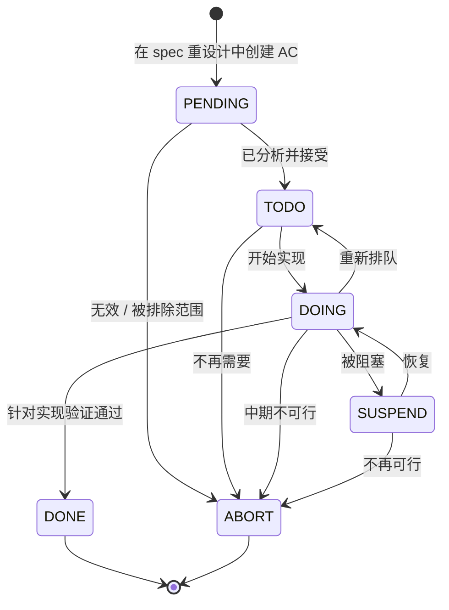

# utCodeAgentCLI 需求规格

utCodeAgentCLI 是 CaTDD-native CLI，将自然语言目标、源代码和 User Story 转化为可追溯的测试工件。核心承诺：**设计 → 审查 → 实现 CaTDD 测试用例，从 story 到 skeleton 到可执行代码，全程可追溯，且永不重新定义 CaTDD 方法语义。**

本文是需求主索引。各角色故事见配套文件：

| 角色 | 文件 | 内容 |
| --- | --- | --- |
| **USER** | [README_UserStory4USER_ZH.md](README_UserStory4USER_ZH.md) | 10 个需求 —— 引导式发现（NEW-USER）与精确控制（EXPERIENCED-USER） |
| **INVENTOR** | [README_UserStory4INVENTOR_ZH.md](README_UserStory4INVENTOR_ZH.md) | 3 个需求 —— 方法委托、可追溯性与诊断证明 |
| **DEVELOPER** | [README_UserStory4DEVELOPER_ZH.md](README_UserStory4DEVELOPER_ZH.md) | 5 个需求 —— 错误信息、日志、交互模式、adapter 接口、可靠性与安全策略执行 |

> **实现状态**：`utCodeAgentCLI` 尚无可运行的 binary。[UsageDesign](README_UsageDesign_ZH.md) 定义 CLI 接口契约。[UserGuide](README_UserGuide_ZH.md) 记录 invocation plan 模式。

---

## USER 旅程

```
NEW-USER（引导式发现）：
  验证 → designAllSkeleton → 审查所有层级 → 选择下一个 → designAndImplTest
  US-USER-01   US-USER-02       US-USER-03    US-USER-04    US-USER-08

EXPERIENCED-USER（精确控制）：
  验证 → 单 category 设计 → 按层级审查 → 实现一个 TC → 审查实现
  US-USER-01   US-USER-02    US-USER-03   US-USER-05   US-USER-09
  → 选择下一个 → 实现所有 → 审查所有实现 / 批量多文件
    US-USER-04   US-USER-06   US-USER-10       US-USER-07
```

所有路径都生成机器可读 trace（US-INVENTOR-02）并验证 CaTDD 方法委托（US-INVENTOR-01）。

---

## AC 状态模型（每个验收准则）

每个 Story 子文档中的 AC 都带有状态标记。以下状态转换定义 AC 如何在工作生命周期中移动。

### 状态转换图



### 转换规则

| 从 | → | 到 | 触发条件 |
|---|---|---|---|
| PENDING | → | TODO | 已分析并接受为工作项 |
| PENDING | → | ABORT | 无效 / 被排除范围 |
| TODO | → | DOING | 开始实现 |
| TODO | → | ABORT | 不再需要 |
| DOING | → | DONE | 针对实现验证通过 |
| DOING | → | SUSPEND | 被阻塞 / 需要重新讨论 |
| DOING | → | TODO | 重新排队 |
| DOING | → | ABORT | 中期不可行 |
| SUSPEND | → | DOING | 解除阻塞 / 恢复 |
| SUSPEND | → | ABORT | 不再可行 |
| ABORT | → | PENDING | ❌ 不允许（终态） |
| TODO/ABORT | → | PENDING | ❌ 不允许 |

> **不变式**：一旦 AC 离开 `PENDING`，就永远不能回到 `PENDING`。

### 状态值

| 状态 | 含义 | 控制者 |
|---|---|---|
| `PENDING` | AC 已设计但尚未被拾取 | 队列 |
| `TODO` | AC 被选入当前工作周期 | 开发者 |
| `DOING` | AC 正在实现 / 测试中 | 开发者 |
| `DONE` | AC 已针对实现验证通过 | 审查者 / CI |
| `SUSPEND` | AC 被阻塞或降级 | 开发者 |
| `ABORT` | AC 不再有效 | 开发者 / 审查 |

---

## 测试文件状态模型

```
@[Status:PLANNED]  ──(implTestCase)──►  @[Status:RED]  ──(用户修复产品代码)──►  @[Status:GREEN]
```

CLI 负责 `PLANNED → RED`。`RED → GREEN` 由用户负责 —— CLI 可读取 GREEN 但永不写入。

| 文件状态 | 描述 |
| --- | --- |
| **EMPTY** | 无 CaTDD skeleton TC |
| **DESIGNED** | 所有 TC 均为 `@[Status:PLANNED]` |
| **PARTIAL** | PLANNED、RED、GREEN 混合 |
| **FULLY_RED** | 所有 TC 为 RED 或 GREEN，无 PLANNED |
| **ALL_GREEN** | 所有 TC 为 GREEN |

### 行为状态契约

| `--behave` | 要求文件状态 | 产生 TC 状态 | 产生文件状态 |
| --- | --- | --- | --- |
| `design*Skeleton` | 任意 | 新 TC → PLANNED | DESIGNED 或 PARTIAL |
| `reviewFuncTestsSkeleton` | DESIGNED, PARTIAL, FULLY_RED | 不变 | 不变 |
| `reviewDesignTestsSkeleton` | DESIGNED 或 PARTIAL | 不变 | 不变 |
| `reviewQualityTestsSkeleton` | DESIGNED 或 PARTIAL | 不变 | 不变 |
| `reviewImplTestCase` | 目标 TC 为 RED 或 GREEN | 不变 | 不变 |
| `reviewImplTestFile` | DESIGNED, PARTIAL, FULLY_RED 或 ALL_GREEN | 不变 | 不变 |
| `tellMeNextImplTest` | 存在 ≥1 个 PLANNED TC | 不变 | 不变 |
| `implTestCase` | 目标 TC 为 PLANNED | 目标 TC → RED | PARTIAL 或 FULLY_RED |
| `implTestFile` | 存在 ≥1 个 PLANNED TC | 所有 PLANNED → RED | FULLY_RED |
| `designAndImplTest` | 任意 | 所有 TC → RED | FULLY_RED |

**状态保持保证**
1. 绝不降级状态（RED → PLANNED 永不允许）。
2. 绝不无明确意图覆盖已实现的 TC。
3. 状态不匹配的行为清晰报错退出。
4. 每次状态变迁记录在 trace 中（US-INVENTOR-02）。

---

### 优先级定义

| 优先级 | 含义 |
| --- | --- |
| **P0 关键** | v0.1 不能没有此需求。 |
| **P1 重要** | v1.0 需要完整的 CaTDD 工作流。 |
| **P2 有价值** | v1.x+ 扩展能力。 |


> 完整 AC 详情见各角色子文件。状态追踪见 [README_UserStoryStatus_ZH.md](README_UserStoryStatus_ZH.md)。

> AC 状态追踪：[README_UserStoryStatus_ZH.md](README_UserStoryStatus_ZH.md)

---

## 需求依赖图

```
US-USER-01（解析与验证）
  ├──► US-DEV-01（错误信息）
  ├──► US-DEV-02（日志）
  ├──► US-DEV-03（交互式）
  ├──► US-INVENTOR-02（执行 trace）
  │
  ├──► US-USER-02（设计 skeleton）← US-INVENTOR-01
  │       ├──► US-USER-03（审查设计，所有层级）
  │       ├──► US-USER-04（选择下一个）
  │       └──► US-USER-07（批量设计）
  │
  ├──► US-USER-05（实现一个 TC）← US-INVENTOR-01
  │       ├──► US-USER-09（审查一个实现）
  │       └──► US-USER-06（实现所有）
  │               └──► US-USER-10（审查所有实现）
  │
  └──► US-USER-08（设计+实现）← US-INVENTOR-01
          事后审查通过 US-USER-03 + US-USER-10

US-INVENTOR-01 → U02, U05, U06, U08, U09, U10 所需
US-INVENTOR-03 → US-INVENTOR-01 的运行时证明
US-DEV-04 → P2, 独立
US-DEV-05 → ASR-R1..R6 的可执行可靠性/安全契约覆盖
```

---

## 非需求

| 能力 | 归属 |
| --- | --- |
| 定义 CaTDD category、discipline 规则或方法含义 | `methodPrompts/` |
| 定义可移植 slash-command 执行逻辑 | `slashCommands/` |
| 将 CaTDD 封装为通用 CodeAgent skill | `agentSkills/` |
| 编译、运行或验证测试代码 | 用户的构建系统 |
| 生成产品/源代码 | CLI 仅生成测试代码 |
| 管理 git 分支、提交或版本控制 | 用户的工作流 |
| 解析或验证用户源代码语言 | 委托给 slash command |
| 将 TC 从 RED 变为 GREEN | 用户的 TDD 工作流 |

---

## 可追溯性

| 工件 | 关系 |
| --- | --- |
| [README_UsageDesign_ZH.md](README_UsageDesign_ZH.md) | CLI 参数契约。`--behave` alias，含 `review*Skeleton` 和 `reviewImpl*`。错误处理。 |
| [README_UserGuide_ZH.md](README_UserGuide_ZH.md) | Invocation plan 工作流。Behavior Selection Guide 映射意图到所有 USER 需求。 |
| [README_ZH.md](README_ZH.md) | CLI 层的 WHAT/WHY。 |
| `methodPrompts/` | Category 语义（US-INVENTOR-01）。所有设计/实现所需。 |
| `slashCommands/` | 可移植命令执行（US-INVENTOR-01）。每个 `--behave` 解析至此。 |
| [ASRs/ASR_AgenticReliabilityContracts.md](ASRs/ASR_AgenticReliabilityContracts.md) | 架构关键可靠性/安全需求，通过 US-DEV-05 以可执行 US/AC 形式落地。 |
| [ADRs/ADR_AgenticReliabilityPolicy.md](ADRs/ADR_AgenticReliabilityPolicy.md) | ASR-R1..R6 的决策默认值，约束 US-DEV-05 的运行时行为与验收检查。 |
| [../../.catdd/spec/analyzedNews/20260529-assemble-utCodeAgentCLI-user-stories-Issue.md](../../.catdd/spec/analyzedNews/20260529-assemble-utCodeAgentCLI-user-stories-Issue.md) | 原始请求。 |

---

## 开放问题

- Trace 文件输出目录和命名规范？
- `--log-level trace` 原始 prompt/response 日志？
- 首个 adapter runtime 目标：TypeScript CLI、Copilot-native 还是 OpenCode？
- `--target-file` 替代逗号分隔内联路径？
- `--interactive-slash-commands` CI 超时支持？

---

## 维护规则

当新的用户需求无法追溯至任何现有 US-* ID 时，新增一个需求。下游文档实现这些需求 —— 它们不驱动需求。
