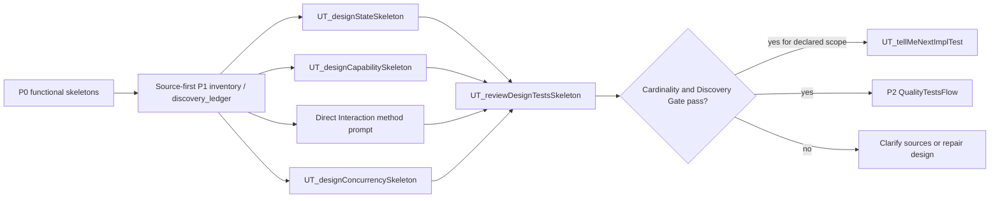

# P1 DesignTestsFlow

`P1 DesignTestsFlow` is the second slash-command flow priority. It starts after core functional behavior is stable enough to reason about design properties.

## Method Alignment

Slash flow `P1 DesignTestsFlow` uses the same priority as CaTDD method category `P1 Design`:

- State
- Capability
- Interaction
- Concurrency

The flow commands orchestrate execution; category meaning remains in `methodPrompts`.

## Entry Conditions

- P0 functional skeletons exist, especially Typical and Edge.
- The component has meaningful lifecycle, capability, interaction, or concurrency behavior.
- The developer wants to design behavior beyond input/output correctness.
- A P1 design source is confirmed for each category being drafted; P1 MUST have DESIGN before skeleton drafting starts.

## Design Source Gate

P1 is design-gated. Before drafting any P1 skeleton, confirm the category design source and read it as the authority for design decisions. If the design source is missing, ask the developer where the design lives or stop before drafting.

- State: project-root `README_StateDesign.md` or a `State Design` chapter in project-root `README_ArchDesign.md`.
- Capability: project-root `README_DetailDesign.md`.
- Interaction: sequence, interaction, or collaboration sections in project-root `README_ArchDesign.md`.
- Concurrency: project-root `README_ResourceDesign.md`.

## Discovery Handoff

Before any drafting route, declare the SUT, P1 category scope, domain profile(s), test level, and execution environment. Read confirmed design sources before existing skeletons, apply the [P1 discovery sweep](../../methodPrompts/CaTDD_methodPrompt-testPointDiscovery.md#p1-design-discovery-sweep), and keep the source-derived obligations, questions, and dispositions in one `discovery_ledger` in living comments.

Each route consumes that inventory and links its source-backed US/AC/TC design back to the ledger. An in-scope obligation without a TC stays GAP even when another test level will own execution; routing metadata is not coverage. Hand the sources, scope, ledger, and proposed skeletons to a source-first independent review. If review is self-review, label it and record shared-blind-spot risk.

## Developer Stories

- As a Developer, when functional behavior is stable, I want to design State skeletons so lifecycle and transition behavior become explicit before implementation.
- As a Developer, when a feature exposes modes or support boundaries, I want to design Capability skeletons so supported, limited, and unsupported behavior is testable.
- As a Developer, when behavior depends on collaborator sequence or handoff protocols, I want to design Interaction skeletons so orchestration contracts are verified.
- As a Developer, when behavior depends on ordering, async work, or shared ownership, I want to design Concurrency skeletons so race and reentrancy risks are visible before implementation.

## Flow Diagram

## Command Sequence

1. Use [UT_designStateSkeleton](../commands/P1-DesignTestsFlow/UT_designStateSkeleton.md) when project-root `README_StateDesign.md` exists, or project-root `README_ArchDesign.md` contains a `State Design` chapter, and lifecycle, transition, ownership, persistence, or recovery behavior matters. If neither source exists, the command asks the developer where the state design lives or stops before drafting the State skeleton.
2. Use [UT_designCapabilitySkeleton](../commands/P1-DesignTestsFlow/UT_designCapabilitySkeleton.md) when project-root `README_DetailDesign.md` exists and supported, limited, conditional, or unsupported capability boundaries matter. If `README_DetailDesign.md` is missing, the command warns and stops before drafting the Capability skeleton.
3. For Interaction, use [CaTDD_methodPrompt4Cat-Interaction](../../methodPrompts/CaTDD_methodPrompt4Cat-Interaction.md) directly with the confirmed sequence/collaboration source. There is no dedicated Interaction slash command in this flow. Apply the discovery handoff, draft source-linked US/AC/TC in the canonical `designInteraction` category file, and link it to the ledger. If the source is missing, ask where the design lives or stop before drafting; do not invent collaborator order or rollback.
4. Use [UT_designConcurrencySkeleton](../commands/P1-DesignTestsFlow/UT_designConcurrencySkeleton.md) when project-root `README_ResourceDesign.md` exists and ordering, interleaving, reentrancy, cancellation, or shared ownership matters. If `README_ResourceDesign.md` is missing, the command warns and stops before drafting the Concurrency skeleton.
5. Use [UT_reviewDesignTestsSkeleton](../commands/P1-DesignTestsFlow/UT_reviewDesignTestsSkeleton.md) for the independent source-first P1 Discovery Gate. Require confirmed sources, reconciled ledger evidence, both gates passing, and `ready_for_implementation: yes` for the declared scope before selecting a TC for implementation. Non-PASS returns clarification/design-repair findings, not implementation approval.

## Conflict Guard

DesignTestsFlow uses the canonical [State](../../methodPrompts/CaTDD_methodPrompt4Cat-State.md), [Capability](../../methodPrompts/CaTDD_methodPrompt4Cat-Capability.md), [Interaction](../../methodPrompts/CaTDD_methodPrompt4Cat-Interaction.md), and [Concurrency](../../methodPrompts/CaTDD_methodPrompt4Cat-Concurrency.md) prompts instead of redefining their category meanings. Direct-method routes use the same source and Discovery Gate contracts as slash-command routes.
