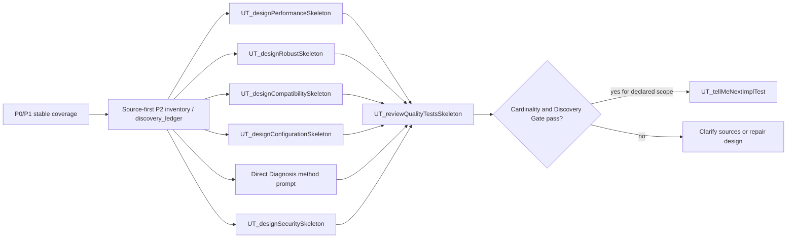

# P2 QualityTestsFlow

`P2 QualityTestsFlow` is the third slash-command flow priority. It starts when functional and design behavior are stable enough to test quality attributes.

## Method Alignment

Slash flow `P2 QualityTestsFlow` uses the same priority as CaTDD method category `P2 Quality`:

- Performance
- Robust
- Compatibility
- Configuration
- Diagnosis
- Security

The flow commands orchestrate execution; category meaning remains in `methodPrompts`.

## Entry Conditions

- P0 functional coverage exists.
- P1 design coverage exists when relevant.
- The component has quality risks, service-level goals, compatibility requirements, configuration variations, diagnostic needs, or security policies.

## Discovery Handoff

Before any drafting route, declare the SUT, P2 category scope, domain profile(s), test level, and execution environment. Read quality sources before existing skeletons and apply the [P2 discovery sweep](../../methodPrompts/CaTDD_methodPrompt-testPointDiscovery.md#p2-quality-discovery-sweep). Keep candidate obligations, source references, verification methods, and dispositions in one `discovery_ledger` in living comments.

Use the source-defined six-part quality scenario: numeric budgets need units, targets, and workloads; exact matrix, configuration, diagnostic, or protection predicates need specified observable evidence. Manual/hybrid procedures are valid; missing automation is not missing intent. Missing sources or oracles are QUESTION, not invented targets. An in-scope handoff cannot replace adequate design. Give sources, scope, ledger, and skeletons to an independent source-first review; label self-review and its residual risk when applicable.

## Developer Stories

- As a Developer, when behavior has measurable timing, throughput, memory, CPU, power, or resource goals, I want to design Performance skeletons so quality expectations are explicit.
- As a Developer, when behavior must survive stress, partial failure, or environmental instability, I want to design Robust skeletons so resilience and recovery are testable.
- As a Developer, when behavior spans versions, platforms, protocols, formats, or integrations, I want to design Compatibility skeletons so support boundaries are clear.
- As a Developer, when behavior varies by runtime, build-time, deployment, environment, or feature-flag setting, I want to design Configuration skeletons so configuration combinations are intentional.
- As a Developer, when failure triage requires actionable logs, traces, or metrics, I want to design Diagnosis skeletons so operating evidence is verified.
- As a Developer, when protected assets, trust boundaries, or threat models apply, I want to design Security skeletons so defenses and safe denials are verified.

## Flow Diagram

## Command Sequence

1. Use [UT_designPerformanceSkeleton](../commands/P2-QualityTestsFlow/UT_designPerformanceSkeleton.md) when project-root `README_PerfDesign.md` exists and latency, throughput, jitter, memory, CPU, power, or other measurable quality targets matter. If `README_PerfDesign.md` is missing, the command warns and stops before drafting the Performance skeleton.
2. Use [UT_designRobustSkeleton](../commands/P2-QualityTestsFlow/UT_designRobustSkeleton.md) when project-root `README_ErrorDesign.md` exists and stress, degradation, recovery, retry, timeout, or stable failure behavior matters. If `README_ErrorDesign.md` is missing, the command warns and stops before drafting the Robust skeleton.
3. Use [UT_designCompatibilitySkeleton](../commands/P2-QualityTestsFlow/UT_designCompatibilitySkeleton.md) when project-root `README_CompatDesign.md` exists and version, platform, protocol, format, toolchain, or integration compatibility matters. If `README_CompatDesign.md` is missing, the command warns and stops before drafting the Compatibility skeleton.
4. Use [UT_designConfigurationSkeleton](../commands/P2-QualityTestsFlow/UT_designConfigurationSkeleton.md) when project-root `README_DetailDesign.md` exists and runtime, build-time, deployment, environment, or feature-flag configuration matters. If `README_DetailDesign.md` is missing, the command warns and stops before drafting the Configuration skeleton.
5. For Diagnosis, use [CaTDD_methodPrompt4Cat-Diagnosis](../../methodPrompts/CaTDD_methodPrompt4Cat-Diagnosis.md) directly with confirmed DiagnosisDesign/VerifyDesign evidence requirements. There is no dedicated Diagnosis slash command in this flow. Apply the discovery handoff, draft source-linked US/AC/TC in the canonical `qualityDiagnosis` category file, and link it to the ledger. Missing evidence requirements require a question, not an assumed logging framework.
6. Use [UT_designSecuritySkeleton](../commands/P2-QualityTestsFlow/UT_designSecuritySkeleton.md) (referencing method specification [CaTDD_methodPrompt4Cat-Security](../../methodPrompts/CaTDD_methodPrompt4Cat-Security.md)) when project-root `README_SecurityDesign.md` exists and threat models, trust boundaries, credentials, permissions, tenant isolation, sandboxing, or constitutional invariants ($K$) matter. If `README_SecurityDesign.md` is missing, the command warns and stops before drafting the Security skeleton. If the policy is missing, ask before drafting expectations; do not invent permissions, cryptography, or containment rules.
7. Use [UT_reviewQualityTestsSkeleton](../commands/P2-QualityTestsFlow/UT_reviewQualityTestsSkeleton.md) for the independent source-first P2 Discovery Gate. Require confirmed sources, reconciled ledger evidence, both gates passing, and `ready_for_implementation: yes` for the declared scope before selecting a TC. Report non-PASS as clarification/design repair, and keep design approval separate from execution or release readiness.

## Conflict Guard

QualityTestsFlow must reference `methodPrompts/CaTDD_methodPrompt4Cat-Performance.md`, `methodPrompts/CaTDD_methodPrompt4Cat-Robust.md`, `methodPrompts/CaTDD_methodPrompt4Cat-Compatibility.md`, `methodPrompts/CaTDD_methodPrompt4Cat-Configuration.md`, `methodPrompts/CaTDD_methodPrompt4Cat-Diagnosis.md`, and `methodPrompts/CaTDD_methodPrompt4Cat-Security.md` instead of redefining those category meanings here.
