# Px SpecFlow

`Px SpecFlow` is the cross-priority SpecCoding flow for moving from incoming work to reviewed, tested, committed implementation.

`Px` means this flow is not a CaTDD category priority like `P0 Functional`, `P1 Design`, or `P2 Quality`. It is a process flow that orchestrates those method layers.

## Method Alignment

SpecFlow is based on `methodPrompts`, but it works above individual test categories.

```text
methodPrompts = CaTDD method and verification-design language
Px SpecFlow = repeatable SpecCoding lifecycle over that method
P0/P1/P2 flows = category-specific test design and implementation flows
```

The governing spec is comment-alive verification design: project context, user stories, acceptance criteria, detailed design, US/AC/TC skeletons, test status, product code status, and review decisions.

## Developer Stories

- As a Developer, when I receive an issue or feature request, I want to import and analyze it into a user story so that work starts from a traceable spec artifact.
- As a Developer, when I open a user story, I want to drive detail design, acceptance criteria, tests, implementation, review, CI, and closure through explicit commands so that no lifecycle step is hidden in chat.
- As a Developer, when quality is not met, I want the flow to route back to design, tests, product code, or refactoring so that SpecCoding remains iterative.

## Artifacts

- `.catdd/spec/projectContext.md`: project facts, constraints, conventions, and current operating context.
- `.catdd/spec/pendingNews/YYYYMMDD-*.md`: imported issues or feature requests waiting for analysis.
- `.catdd/spec/todoUS/YYYYMMDD-UserStory.md`: analyzed user stories waiting to be opened.
- `.catdd/spec/doingUS/YYYYMMDD-UserStory.md`: active user stories under design, test, implementation, or review.
- `.catdd/spec/doneUS/YYYYMMDD-UserStory.md`: completed user stories after review, commit, and CI.
- `README.md` or module design docs: detail design and acceptance criteria for the active module or feature.
- `.catdd/spec/WorkingProcessLog.md`: optional trace log for decisions, command transitions, and unresolved questions.

## Artifact Persistence Policy

SpecCoding separates team knowledge from personal work-in-progress state.

All SpecFlow-managed artifacts live under `.catdd/spec/` in the target project.

| Artifact | Scope | Git policy |
| --- | --- | --- |
| `.catdd/spec/projectContext.md` | Team-shared | Commit stable project context so teammates and CodeAgents use the same facts. |
| `.catdd/spec/pendingNews/` | Team-shared | Commit imported work items that should be visible to the team. |
| `.catdd/spec/todoUS/` | Team-shared | Commit analyzed user stories that are ready to be picked up. |
| `.catdd/spec/doingUS/` | Local work state | Gitignore active user stories because they represent one developer's current progress. |
| `.catdd/spec/doneUS/` | Team-shared | Commit completed story records after review, verification, and close. |
| `README.md` or module design docs | Team-shared | Commit stable design and acceptance criteria with the feature or module. |
| `.catdd/spec/WorkingProcessLog.md` | Local work state | Gitignore personal command traces, temporary decisions, and unresolved local notes. |

Recommended target-project `.gitignore` rules:

```gitignore
/.catdd/spec/doingUS/
/.catdd/spec/WorkingProcessLog.md
```

## Flow Diagram

```mermaid
flowchart LR
    Init["SPEC_initProjectContext"] --> Context[".catdd/spec/projectContext.md"]
    UpdateContext["SPEC_updateProjectContext"] --> Context
    Context --> ImportIssue["SPEC_importIssue"]
    Context --> ImportFeature["SPEC_importFeature"]

    ImportIssue --> Pending[".catdd/spec/pendingNews/*.md"]
    ImportFeature --> Pending
    Pending --> AnalyzeIssue["SPEC_analyzeIssue"]
    Pending --> AnalyzeFeature["SPEC_analyzeFeature"]
    AnalyzeIssue --> Todo[".catdd/spec/todoUS/*-UserStory.md"]
    AnalyzeFeature --> Todo

    Todo --> Open["SPEC_openUserStory"]
    Open --> Doing[".catdd/spec/doingUS/*-UserStory.md"]

    Doing --> Detail["SPEC_takeDetailDesign"]
    Detail --> ReviewStory["SPEC_reviewUserStory"]
    ReviewStory --> QualityStory{"story quality?"}
    QualityStory -- "NO" --> UpdateDetail["SPEC_updateDetailDesign"]
    UpdateDetail --> Detail

    QualityStory -- "YES" --> DesignTests["SPEC_designUnitTests"]
    DesignTests --> ImplTests["SPEC_implUnitTests"]
    ImplTests --> ImplCode["SPEC_implProductCodes"]
    ImplCode --> ReviewCode["SPEC_reviewProductCodes"]
    ReviewCode --> QualityCode{"code quality?"}

    QualityCode -- "NO" --> Refactor["SPEC_refactorIssue"]
    Refactor --> UpdateDetail
    QualityCode -- "YES" --> Commit["SPEC_commitWorks"]
    Commit --> CI["SPEC_triggerCI"]
    CI --> Close["SPEC_closeUserStory"]
    Close --> Done[".catdd/spec/doneUS/*-UserStory.md"]
```



## Command Sequence

1. Use [../commands/Px-SpecFlow/SPEC_initProjectContext.md](../commands/Px-SpecFlow/SPEC_initProjectContext.md) to create the first project context.
2. Use [../commands/Px-SpecFlow/SPEC_updateProjectContext.md](../commands/Px-SpecFlow/SPEC_updateProjectContext.md) whenever project facts, constraints, or conventions change.
3. Use [../commands/Px-SpecFlow/SPEC_importIssue.md](../commands/Px-SpecFlow/SPEC_importIssue.md) or [../commands/Px-SpecFlow/SPEC_importFeature.md](../commands/Px-SpecFlow/SPEC_importFeature.md) to import issue or feature input into `.catdd/spec/pendingNews/`.
4. Use [../commands/Px-SpecFlow/SPEC_analyzeIssue.md](../commands/Px-SpecFlow/SPEC_analyzeIssue.md) or [../commands/Px-SpecFlow/SPEC_analyzeFeature.md](../commands/Px-SpecFlow/SPEC_analyzeFeature.md) to convert pending input into a user story in `.catdd/spec/todoUS/`.
5. Use [../commands/Px-SpecFlow/SPEC_openUserStory.md](../commands/Px-SpecFlow/SPEC_openUserStory.md) to move a selected user story into `.catdd/spec/doingUS/`.
6. Use [../commands/Px-SpecFlow/SPEC_takeDetailDesign.md](../commands/Px-SpecFlow/SPEC_takeDetailDesign.md) to produce detailed design and acceptance criteria.
7. Use [../commands/Px-SpecFlow/SPEC_reviewUserStory.md](../commands/Px-SpecFlow/SPEC_reviewUserStory.md) to gate story and design quality.
8. Use [../commands/Px-SpecFlow/SPEC_updateDetailDesign.md](../commands/Px-SpecFlow/SPEC_updateDetailDesign.md) when the review finds missing or weak design.
9. Use [../commands/Px-SpecFlow/SPEC_designUnitTests.md](../commands/Px-SpecFlow/SPEC_designUnitTests.md) to enter CaTDD test design, usually through P0/P1/P2 flows.
10. Use [../commands/Px-SpecFlow/SPEC_implUnitTests.md](../commands/Px-SpecFlow/SPEC_implUnitTests.md), [../commands/Px-SpecFlow/SPEC_implProductCodes.md](../commands/Px-SpecFlow/SPEC_implProductCodes.md), and [../commands/Px-SpecFlow/SPEC_reviewProductCodes.md](../commands/Px-SpecFlow/SPEC_reviewProductCodes.md) for test-first execution and review.
11. Use [../commands/Px-SpecFlow/SPEC_refactorIssue.md](../commands/Px-SpecFlow/SPEC_refactorIssue.md) when implementation quality fails or design needs to be reworked.
12. Use [../commands/Px-SpecFlow/SPEC_commitWorks.md](../commands/Px-SpecFlow/SPEC_commitWorks.md), [../commands/Px-SpecFlow/SPEC_triggerCI.md](../commands/Px-SpecFlow/SPEC_triggerCI.md), and [../commands/Px-SpecFlow/SPEC_closeUserStory.md](../commands/Px-SpecFlow/SPEC_closeUserStory.md) to finish the lifecycle.

## Conflict Guard

- `Px SpecFlow` defines lifecycle orchestration only; CaTDD method semantics remain in `methodPrompts`.
- `SPEC_*` commands may call `UT_*` commands, but they must not replace P0/P1/P2 category rules.
- If product intent is unclear, keep the user story open and ask the developer instead of inventing requirements.
