# Px SpecFlow

`Px SpecFlow` is the cross-priority SpecCoding flow for moving from incoming work to reviewed, tested, committed implementation.

`Px` means this flow is not a CaTDD category priority like `P0 Functional`, `P1 Design`, or `P2 Quality`. It is a process flow that orchestrates those method layers.

## Method Alignment

SpecFlow is based on `methodPrompts`, but it works above individual test categories.

```text
methodPrompts = CaTDD method and verification-design language
Px SpecFlow = repeatable SpecCoding lifecycle over that method
P0/P1/P2 flows = category-specific test design and implementation flows
```

The governing spec is comment-alive verification design: project context, user stories, acceptance criteria, detailed design, US/AC/TC skeletons, test status, product code status, and review decisions.

## Refinements from OpenSpec

Use this list first when explaining or adopting `Px SpecFlow` refinements from [OpenSpec](https://github.com/Fission-AI/OpenSpec).

| Refinement | WHY | HOW in `Px SpecFlow` |
| --- | --- | --- |
| Govern work with constitution-level project context. | OpenSpec starts with project principles so later spec, plan, and task decisions do not drift. | Treat `.catdd/spec/projectContext.md` as the shared constitution-like guardrail. `SPEC_initProjectContext` and `SPEC_updateProjectContext` should record stable principles, constraints, quality gates, and team conventions before story work continues. |
| Analyze work into independently testable story slices. | OpenSpec's spec template asks for prioritized user stories plus an independent test, which makes MVP scope and user value explicit. | `SPEC_analyzeIssue` and `SPEC_analyzeFeature` should produce `.catdd/spec/todoUS/` stories that include actor, value, priority, independent-test intent, acceptance scenarios, edge cases, risks, and open questions instead of only a loose summary. |
| Separate `WHAT`/`WHY` from `HOW` with a lightweight plan step. | OpenSpec keeps product intent in `spec.md` and delays technical choices to `plan.md`, reducing premature design decisions. | Keep user-story intent in the story artifact, then let `SPEC_takeDetailDesign` translate approved intent into project-root `README*` SPEC docs that capture technical context, constraints, structure decisions, and verification strategy before implementation starts. |
| Run a clarify/analyze/checklist gate before implementation. | OpenSpec surfaces ambiguity, inconsistency, and missing coverage before coding so rework happens early. | Use `SPEC_reviewUserStory` as a mandatory pre-implementation gate that checks ambiguity, completeness, traceability, testability, edge cases, and measurable outcomes. Route failures to `SPEC_updateDetailDesign` instead of skipping ahead. |
| Make execution slices explicit, ordered, and parallel-aware. | OpenSpec's tasks template turns plans into visible tasks with dependencies, parallel markers, and validation checkpoints. | Before `SPEC_implUnitTests` or `SPEC_implProductCodes`, break the active story into explicit US/AC/TC slices and validation checkpoints in the doing story, verification design, and test files. Preserve P0-first order, but mark independent work that can run in parallel. |

## Developer Stories

- As a Developer, when I receive an issue or feature request, I want to import and analyze it into a user story so that work starts from a traceable spec artifact.
- As a Developer, when I open a user story, I want to drive detail design, acceptance criteria, tests, implementation, review, CI, and closure through explicit commands so that no lifecycle step is hidden in chat.
- As a Developer, when quality is not met, I want the flow to route back to design, tests, product code, or refactoring so that SpecCoding remains iterative.
- As a Developer, when I forget where I paused or I am new to SpecFlow, I want a command that tells me the next task from current artifacts so I can continue without guessing.

## Artifacts

- `.catdd/spec/projectContext.md`: project facts, constraints, conventions, and current operating context.
- `.catdd/spec/pendingNews/YYYYMMDD-*.md`: imported issues or feature requests waiting for analysis.
- `.catdd/spec/todoUS/YYYYMMDD-UserStory.md`: analyzed user stories waiting to be opened.
- `.catdd/spec/doingUS/YYYYMMDD-UserStory.md`: active user stories under design, test, implementation, or review.
- `.catdd/spec/doneUS/YYYYMMDD-UserStory.md`: completed user stories after review, commit, and CI.
- `README*.md`: project-root SPEC docs created as needed for overview, architecture, stories, guide, detail design, and verification design.
- `.catdd/spec/WorkingProcessLog.md`: optional trace log for decisions, command transitions, and unresolved questions.

## Project-Root README SPEC Docs

Create project-root README SPEC docs only when the project needs that SPEC surface. Keep all `README*` SPEC docs in the target project root so developers and CodeAgents can find shared project and module knowledge quickly.

| File | Purpose |
| --- | --- |
| `README.md` | Project or module overview, ownership, public behavior, and links to deeper SPEC docs. Most manual contents such as "WHAT I HAVE/WANT,WHAT TO MEET/SOLVE" in natural language."|
| `README_ArchDesign.md` | Architecture design, module boundaries, dependencies, data flow, and key decisions. |
| `README_UserStories.md` | Project or module-scoped user stories and trace links to `.catdd/spec/todoUS/` or `.catdd/spec/doneUS/`. |
| `README_UserGuide.md` | User-facing or developer-facing usage guidance. |
| `README_DetailDesign.md` | Detailed design, acceptance criteria, interfaces, state, and behavior decisions. |
| `README_ErrorDesign.md` | Error taxonomy, fault handling, recovery policy, degradation, and user-visible failure semantics. |
| `README_ResourceDesign.md` | Resource ownership, budgets, allocation policy, finite handles, memory, CPU, power, and contention decisions. |
| `README_StateDesign.md` | State model, lifecycle, ownership, concurrency, and transition decisions. |
| `README_PerfDesign.md` | Performance budgets, latency, throughput, memory, CPU, power, and quality-of-service decisions. |
| `README_DiagnosisDesign.md` | Diagnostic evidence, runtime symptoms, logs, counters, traces, debug hooks, and root-cause routing. |
| `README_VerifyDesign.md` | Verification design, CaTDD category coverage, US/AC/TC traceability, and test strategy. |

Use matching templates from `slashCommands/templates/` when creating a README SPEC doc for the first time.
For embedded software and digital video/audio domain work, use `README_ErrorDesign.md`, `README_ResourceDesign.md`, `README_StateDesign.md`, `README_PerfDesign.md`, and `README_DiagnosisDesign.md` when hardware faults, finite resources, hardware state, real-time behavior, buffering, media pipeline timing, A/V sync constraints, or field-debug evidence matter.

## Artifact Persistence Policy

SpecCoding separates team knowledge from personal work-in-progress state.

SpecFlow lifecycle state lives under `.catdd/spec/`. Shared `README*` SPEC docs live in the target project root.

| Artifact | Scope | Git policy |
| --- | --- | --- |
| `.catdd/spec/projectContext.md` | Team-shared | Commit stable project context so teammates and CodeAgents use the same facts. |
| `.catdd/spec/pendingNews/` | Team-shared | Commit imported work items that should be visible to the team. |
| `.catdd/spec/todoUS/` | Team-shared | Commit analyzed user stories that are ready to be picked up. |
| `.catdd/spec/doingUS/` | Local work state | Gitignore active user stories because they represent one developer's current progress. |
| `.catdd/spec/doneUS/` | Team-shared | Commit completed story records after review, verification, and close. |
| `README*.md` | Team-shared | Commit project-root SPEC docs such as README, architecture design, user stories, user guide, detail design, error design, resource design, state design, performance design, diagnosis design, and verify design as needed. |
| `.catdd/spec/WorkingProcessLog.md` | Local work state | Gitignore personal command traces, temporary decisions, and unresolved local notes. |

Recommended target-project `.gitignore` rules:

```gitignore
/.catdd/spec/doingUS/
/.catdd/spec/WorkingProcessLog.md
```

## Flow Diagram

```mermaid
flowchart LR
    Init["SPEC_initProjectContext"] --> Context[".catdd/spec/projectContext.md"]
    UpdateContext["SPEC_updateProjectContext"] --> Context
    Context --> ImportIssue["SPEC_importIssue"]
    Context --> ImportFeature["SPEC_importFeature"]

    ImportIssue --> Pending[".catdd/spec/pendingNews/*.md"]
    ImportFeature --> Pending
    Pending --> AnalyzeIssue["SPEC_analyzeIssue"]
    Pending --> AnalyzeFeature["SPEC_analyzeFeature"]
    AnalyzeIssue --> Todo[".catdd/spec/todoUS/*-UserStory.md"]
    AnalyzeFeature --> Todo

    Todo --> Open["SPEC_openUserStory"]
    Open --> Doing[".catdd/spec/doingUS/*-UserStory.md"]

    Doing --> Detail["SPEC_takeDetailDesign"]
    Detail --> ReadmeDocs["project-root README*.md"]
    Detail --> ReviewStory["SPEC_reviewUserStory"]
    ReviewStory --> QualityStory{"story quality?"}
    QualityStory -- "NO" --> UpdateDetail["SPEC_updateDetailDesign"]
    UpdateDetail --> Detail

    QualityStory -- "YES" --> DesignTests["SPEC_designUnitTests"]
    DesignTests --> ImplTests["SPEC_implUnitTests"]
    ImplTests --> ImplCode["SPEC_implProductCodes"]
    ImplCode --> ReviewCode["SPEC_reviewProductCodes"]
    ReviewCode --> QualityCode{"code quality?"}

    QualityCode -- "NO" --> Refactor["SPEC_refactorIssue"]
    Refactor --> UpdateDetail
    QualityCode -- "YES" --> Commit["SPEC_commitWorks"]
    Commit --> CI["SPEC_triggerCI"]
    CI --> Close["SPEC_closeUserStory"]
    Close --> Done[".catdd/spec/doneUS/*-UserStory.md"]
```



## Command Sequence

1. Use [../commands/Px-SpecFlow/SPEC_initProjectContext.md](../commands/Px-SpecFlow/SPEC_initProjectContext.md) to create the first project context.
2. Use [../commands/Px-SpecFlow/SPEC_updateProjectContext.md](../commands/Px-SpecFlow/SPEC_updateProjectContext.md) whenever project facts, constraints, or conventions change.
3. Use [../commands/Px-SpecFlow/SPEC_importIssue.md](../commands/Px-SpecFlow/SPEC_importIssue.md) or [../commands/Px-SpecFlow/SPEC_importFeature.md](../commands/Px-SpecFlow/SPEC_importFeature.md) to import issue or feature input into `.catdd/spec/pendingNews/`.
4. Use [../commands/Px-SpecFlow/SPEC_analyzeIssue.md](../commands/Px-SpecFlow/SPEC_analyzeIssue.md) or [../commands/Px-SpecFlow/SPEC_analyzeFeature.md](../commands/Px-SpecFlow/SPEC_analyzeFeature.md) to convert pending input into a user story in `.catdd/spec/todoUS/`.
5. Use [../commands/Px-SpecFlow/SPEC_openUserStory.md](../commands/Px-SpecFlow/SPEC_openUserStory.md) to move a selected user story into `.catdd/spec/doingUS/`.
6. Use [../commands/Px-SpecFlow/SPEC_whatsNextTask.md](../commands/Px-SpecFlow/SPEC_whatsNextTask.md) whenever you need a single next-step recommendation from current state.
7. Use [../commands/Px-SpecFlow/SPEC_takeDetailDesign.md](../commands/Px-SpecFlow/SPEC_takeDetailDesign.md) to produce detailed design and acceptance criteria, including project-root `README*` SPEC docs as needed.
8. Use [../commands/Px-SpecFlow/SPEC_reviewUserStory.md](../commands/Px-SpecFlow/SPEC_reviewUserStory.md) to gate story and design quality.
9. Use [../commands/Px-SpecFlow/SPEC_updateDetailDesign.md](../commands/Px-SpecFlow/SPEC_updateDetailDesign.md) when the review finds missing or weak design.
10. Use [../commands/Px-SpecFlow/SPEC_designUnitTests.md](../commands/Px-SpecFlow/SPEC_designUnitTests.md) to enter CaTDD test design, usually through P0/P1/P2 flows.
11. Use [../commands/Px-SpecFlow/SPEC_implUnitTests.md](../commands/Px-SpecFlow/SPEC_implUnitTests.md), [../commands/Px-SpecFlow/SPEC_implProductCodes.md](../commands/Px-SpecFlow/SPEC_implProductCodes.md), and [../commands/Px-SpecFlow/SPEC_reviewProductCodes.md](../commands/Px-SpecFlow/SPEC_reviewProductCodes.md) for test-first execution and review.
12. Use [../commands/Px-SpecFlow/SPEC_refactorIssue.md](../commands/Px-SpecFlow/SPEC_refactorIssue.md) when implementation quality fails or design needs to be reworked.
13. Use [../commands/Px-SpecFlow/SPEC_commitWorks.md](../commands/Px-SpecFlow/SPEC_commitWorks.md), [../commands/Px-SpecFlow/SPEC_triggerCI.md](../commands/Px-SpecFlow/SPEC_triggerCI.md), and [../commands/Px-SpecFlow/SPEC_closeUserStory.md](../commands/Px-SpecFlow/SPEC_closeUserStory.md) to finish the lifecycle.

## Conflict Guard

- `Px SpecFlow` defines lifecycle orchestration only; CaTDD method semantics remain in `methodPrompts`.
- `SPEC_*` commands may call `UT_*` commands, but they must not replace P0/P1/P2 category rules.
- If product intent is unclear, keep the user story open and ask the developer instead of inventing requirements.
