# Px SpecFlow

`Px SpecFlow` is the cross-priority SpecCoding flow for moving from incoming work to reviewed, tested, committed implementation.

`Px` means this flow is not a CaTDD category priority like `P0 Functional`, `P1 Design`, or `P2 Quality`. It is a process flow that orchestrates those method layers.

## Method Alignment

SpecFlow is based on `methodPrompts`, but it works above individual test categories.

```text
methodPrompts = CaTDD method and verification-design language
Px SpecFlow = repeatable SpecCoding lifecycle over that method
P0/P1/P2 flows = category-specific test design and implementation flows
```

The governing spec is comment-alive verification design: project context, user stories, acceptance criteria, detailed design, US/AC/TC skeletons, test status, product code status, and review decisions.

## Refinements from GitHub Spec Kit

Use this list first when explaining or adopting `Px SpecFlow` refinements from GitHub's Spec Kit.

| Refinement | WHY | HOW in `Px SpecFlow` |
| --- | --- | --- |
| Govern work with constitution-level project context. | Spec Kit starts with project principles so later spec, plan, and task decisions do not drift. | Treat `.catdd/spec/projectContext.md` as the shared constitution-like guardrail. `SPEC_initProjectContext` and `SPEC_updateProjectContext` should record stable principles, constraints, quality gates, and team conventions before story work continues. |
| Analyze work into independently testable story slices. | Spec Kit's spec template asks for prioritized user stories plus an independent test, which makes MVP scope and user value explicit. | `SPEC_analyzeIssue` and `SPEC_analyzeFeature` should produce `.catdd/spec/todoUS/` stories that include actor, value, priority, independent-test intent, acceptance scenarios, edge cases, risks, and open questions instead of only a loose summary. They should move the raw input from `.catdd/spec/pendingNews/` to `.catdd/spec/analyzedNews/` so traceability is preserved without leaving analyzed work in the pending inbox. |
| Clear developer and CodeAgent story intent before design. | A story can look complete while the developer and CodeAgent still infer different scope, non-goals, or success evidence. Clearing both sides before design prevents expensive architecture and detail-design drift. | Use `SPEC_clearStoryIntent` after `SPEC_openUserStory` and before design to record a `Mutual Intent Contract` in the active story. The contract states developer intent, CodeAgent intent, in-scope work, out-of-scope work, success signal, assumptions, and open questions. If intent is not aligned, ask or revise the active story before design begins. |
| Separate `WHAT`/`WHY` from `HOW` with a lightweight plan step. | Spec Kit keeps product intent in `spec.md` and delays technical choices to `plan.md`, reducing premature design decisions. | Keep user-story intent in the story artifact, then let `SPEC_takeDetailDesign` translate approved intent into project-root `README*` SPEC docs that capture technical context, constraints, structure decisions, and verification strategy before implementation starts. |
| Run a clarify/analyze/checklist gate before implementation. | Spec Kit surfaces ambiguity, inconsistency, and missing coverage before coding so rework happens early. | Use `SPEC_reviewArchDesign` after architecture design, `SPEC_reviewDetailDesign` after detail design, and `SPEC_reviewUserStory` as the final pre-test readiness gate. Route failed architecture reviews back to `SPEC_takeArchDesign`; route failed detail/story reviews to `SPEC_updateDetailDesign` instead of skipping ahead. |
| Make execution slices explicit, ordered, and parallel-aware. | Spec Kit's tasks template turns plans into visible tasks with dependencies, parallel markers, and validation checkpoints. | Before `SPEC_implUnitTests` or `SPEC_implProductCodes`, break the active story into explicit US/AC/TC slices and validation checkpoints in the doing story, verification design, and test files. Preserve P0-first order, but mark independent work that can run in parallel. |

## Developer Stories

- As a Developer, when I receive an issue or feature request, I want to import and analyze it into a user story so that work starts from a traceable spec artifact.
- As a Developer, when I open a user story, I want to drive detail design, acceptance criteria, tests, implementation, review, CI, and closure through explicit commands so that no lifecycle step is hidden in chat.
- As a Developer, when a CodeAgent starts active story work, I want both sides to clear intent before design so that the agent does not optimize for the wrong scope or success signal.
- As a Developer, when quality is not met, I want the flow to route back to design, tests, product code, or refactoring so that SpecCoding remains iterative.
- As a Developer, when I forget where I paused or I am new to SpecFlow, I want a command that tells me the next task from current artifacts so I can continue without guessing.

## Artifacts

- `.catdd/spec/projectContext.md`: project facts, constraints, conventions, and current operating context.
- `.catdd/spec/pendingNews/YYYYMMDD-*.md`: imported issues or feature requests waiting for analysis.
- `.catdd/spec/analyzedNews/YYYYMMDD-*.md`: raw issue or feature inputs already analyzed and preserved as source trace.
- `.catdd/spec/todoUS/YYYYMMDD-UserStory.md`: analyzed user stories waiting to be opened.
- `.catdd/spec/doingUS/YYYYMMDD-UserStory.md`: active user stories under design, test, implementation, or review.
- `Mutual Intent Contract`: a section inside the active doing story that records developer intent, CodeAgent intent, scope, non-goals, success signal, assumptions, and open questions before design begins.
- `.catdd/spec/doneUS/YYYYMMDD-UserStory.md`: completed user stories after review, commit, and CI.
- `README*.md`: project-root SPEC docs created as needed for overview, architecture, stories, guide, detail design, and verification design.
- `.catdd/spec/WorkingProcessLog.md`: optional trace log for decisions, command transitions, and unresolved questions.

## Project-Root README SPEC Docs

Create project-root README SPEC docs only when the project needs that SPEC surface. Keep all `README*` SPEC docs in the target project root so developers and CodeAgents can find shared project and module knowledge quickly.

### 1. Architecture-Oriented (Managed by `SPEC_takeArchDesign`)
These document global strategies, system-wide boundaries, reliability frameworks, and observability topologies.

| File | Purpose |
| --- | --- |
| `README_ArchDesign.md` | High-level architecture, module decomposition, dependencies, data flow, and key trade-offs. |
| `README_UsageDesign.md` | Public boundaries, CLI/API contracts, argument parsing rules, and run examples. |
| `README_ErrorDesign.md` | Fault-tolerance architecture, fail-safe states, watchdogs, and global error taxonomies. |
| `README_ResourceDesign.md` | Finite resource allocations, memory/CPU/power budgets, DMA, and watchdogs. |
| `README_PerfDesign.md` | Performance budgets, latency limits, and real-time media scheduling. |
| `README_CompatDesign.md` | Compatibility boundaries, platform matrices, toolchains, and protocol versions. |
| `README_DiagnosisDesign.md` | Observability architecture, logging levels, telemetry, and symptom trace maps. |
| `README_VerifyDesign.md` | Verification and testing topologies, mocking boundaries, and CI test loops. |

### 2. DetailDesign-Oriented (Managed by `SPEC_takeDetailDesign`)
These document local implementation details, code tactics, and class/API behavior for the active user story.

| File | Purpose |
| --- | --- |
| `README_DetailDesign.md` | Detailed class design, API signatures, and data structures for the story. |
| `README_StateDesign.md` | Local state machines, lifecycle transitions, lock synchronization, and thread concurrency. |

### 3. General & Requirements (Managed by other SPEC steps)

| File | Purpose |
| --- | --- |
| `README.md` | Project overview, ownership, manual user statements, and master SPEC directories. |
| `README_UserStories.md` | Project-scoped user stories and trace links to SpecFlow story directories. |
| `README_UserGuide.md` | User-facing or developer-facing runtime usage guidance. |

Use matching templates from `slashCommands/templates/` when creating a README SPEC doc for the first time.
For embedded software and digital video/audio domain work, use `README_ErrorDesign.md`, `README_ResourceDesign.md`, `README_StateDesign.md`, `README_PerfDesign.md`, `README_CompatDesign.md`, and `README_DiagnosisDesign.md` when hardware faults, finite resources, hardware state, real-time behavior, compatibility matrices, buffering, media pipeline timing, A/V sync constraints, or field-debug evidence matter.

## Artifact Persistence Policy

SpecCoding separates team knowledge from personal work-in-progress state.

SpecFlow lifecycle state lives under `.catdd/spec/`. Shared `README*` SPEC docs live in the target project root.

| Artifact | Scope | Git policy |
| --- | --- | --- |
| `.catdd/spec/projectContext.md` | Team-shared | Commit stable project context so teammates and CodeAgents use the same facts. |
| `.catdd/spec/pendingNews/` | Team-shared | Commit imported work items that should be visible to the team. |
| `.catdd/spec/analyzedNews/` | Team-shared | Commit raw imported issues or features after analysis so `pendingNews/` stays only for waiting input. |
| `.catdd/spec/todoUS/` | Team-shared | Commit analyzed user stories that are ready to be picked up. |
| `.catdd/spec/doingUS/` | Team-shared | Commit active user stories so in-progress work can move across machines and stay visible to teammates. |
| `.catdd/spec/doneUS/` | Team-shared | Commit completed story records after review, verification, and close. |
| `README*.md` | Team-shared | Commit project-root SPEC docs such as README, architecture design, user stories, user guide, detail design, error design, resource design, state design, performance design, compatibility design, diagnosis design, and verify design as needed. |
| `.catdd/spec/WorkingProcessLog.md` | Local work state | Gitignore personal command traces, temporary decisions, and unresolved local notes. |

Recommended target-project `.gitignore` rules:

```gitignore
/.catdd/spec/WorkingProcessLog.md
```

## Flow Diagram

```mermaid
flowchart LR
    Init["SPEC_initProjectContext"] --> Context[".catdd/spec/projectContext.md"]
    UpdateContext["SPEC_updateProjectContext"] --> Context
    Context --> ImportIssue["SPEC_importIssue"]
    Context --> ImportFeature["SPEC_importFeature"]

    ImportIssue --> Pending[".catdd/spec/pendingNews/*.md"]
    ImportFeature --> Pending
    Pending --> AnalyzeIssue["SPEC_analyzeIssue"]
    Pending --> AnalyzeFeature["SPEC_analyzeFeature"]
    AnalyzeIssue --> Todo[".catdd/spec/todoUS/*-UserStory.md"]
    AnalyzeFeature --> Todo
    AnalyzeIssue --> Analyzed[".catdd/spec/analyzedNews/*.md"]
    AnalyzeFeature --> Analyzed

    Todo --> Open["SPEC_openUserStory"]
    Open --> Doing[".catdd/spec/doingUS/*-UserStory.md"]

    Doing --> ClearIntent["SPEC_clearStoryIntent"]
    ClearIntent --> QualityIntent{"intent aligned?"}
    QualityIntent -- "NO" --> ClearIntent
    QualityIntent -- "YES" --> Arch["SPEC_takeArchDesign"]
    Arch --> ReviewArch["SPEC_reviewArchDesign"]
    ReviewArch --> QualityArch{"architecture quality?"}
    QualityArch -- "NO" --> Arch
    QualityArch -- "YES" --> Detail["SPEC_takeDetailDesign"]
    Detail --> ReadmeDocs["project-root README*.md"]
    Detail --> ReviewDetail["SPEC_reviewDetailDesign"]
    ReviewDetail --> QualityDetail{"detail quality?"}
    QualityDetail -- "NO" --> UpdateDetail["SPEC_updateDetailDesign"]
    QualityDetail -- "YES" --> ReviewStory["SPEC_reviewUserStory"]
    ReviewStory --> QualityStory{"story quality?"}
    QualityStory -- "NO" --> UpdateDetail["SPEC_updateDetailDesign"]
    UpdateDetail --> Detail

    QualityStory -- "YES" --> DesignTests["SPEC_designUnitTests"]
    DesignTests --> ImplTests["SPEC_implUnitTests"]
    ImplTests --> ImplCode["SPEC_implProductCodes"]
    ImplCode --> ReviewCode["SPEC_reviewProductCodes"]
    ReviewCode --> QualityCode{"code quality?"}

    QualityCode -- "NO" --> Refactor["SPEC_refactorIssue"]
    Refactor --> UpdateDetail
    QualityCode -- "YES" --> Commit["SPEC_commitWorks"]
    Commit --> CI["SPEC_triggerCI"]
    CI --> Close["SPEC_closeUserStory"]
    Close --> Done[".catdd/spec/doneUS/*-UserStory.md"]
```



## Command Sequence

1. Use [../commands/Px-SpecFlow/SPEC_initProjectContext.md](../commands/Px-SpecFlow/SPEC_initProjectContext.md) to create the first project context.
2. Use [../commands/Px-SpecFlow/SPEC_updateProjectContext.md](../commands/Px-SpecFlow/SPEC_updateProjectContext.md) whenever project facts, constraints, or conventions change.
3. Use [../commands/Px-SpecFlow/SPEC_importIssue.md](../commands/Px-SpecFlow/SPEC_importIssue.md) or [../commands/Px-SpecFlow/SPEC_importFeature.md](../commands/Px-SpecFlow/SPEC_importFeature.md) to import issue or feature input into `.catdd/spec/pendingNews/`.
4. Use [../commands/Px-SpecFlow/SPEC_analyzeIssue.md](../commands/Px-SpecFlow/SPEC_analyzeIssue.md) or [../commands/Px-SpecFlow/SPEC_analyzeFeature.md](../commands/Px-SpecFlow/SPEC_analyzeFeature.md) to convert pending input into a user story in `.catdd/spec/todoUS/` and move the raw input to `.catdd/spec/analyzedNews/`.
5. Use [../commands/Px-SpecFlow/SPEC_openUserStory.md](../commands/Px-SpecFlow/SPEC_openUserStory.md) to move a selected user story into `.catdd/spec/doingUS/`.
6. Use [../commands/Px-SpecFlow/SPEC_clearStoryIntent.md](../commands/Px-SpecFlow/SPEC_clearStoryIntent.md) to clear developer intent and CodeAgent intent before design starts.
7. Use [../commands/Px-SpecFlow/SPEC_whatsNextTask.md](../commands/Px-SpecFlow/SPEC_whatsNextTask.md) whenever you need a single next-step recommendation from current state.
8. Use [../commands/Px-SpecFlow/SPEC_takeArchDesign.md](../commands/Px-SpecFlow/SPEC_takeArchDesign.md) to produce high-level architecture design and module boundaries in `README_ArchDesign.md`.
9. Use [../commands/Px-SpecFlow/SPEC_reviewArchDesign.md](../commands/Px-SpecFlow/SPEC_reviewArchDesign.md) to gate architecture quality before detailed design begins.
10. Use [../commands/Px-SpecFlow/SPEC_takeDetailDesign.md](../commands/Px-SpecFlow/SPEC_takeDetailDesign.md) to produce detailed design and acceptance criteria, including other project-root `README*` SPEC docs as needed.
11. Use [../commands/Px-SpecFlow/SPEC_reviewDetailDesign.md](../commands/Px-SpecFlow/SPEC_reviewDetailDesign.md) to gate detailed design quality before final story readiness review.
12. Use [../commands/Px-SpecFlow/SPEC_reviewUserStory.md](../commands/Px-SpecFlow/SPEC_reviewUserStory.md) to gate final story and design readiness before test design.
13. Use [../commands/Px-SpecFlow/SPEC_updateDetailDesign.md](../commands/Px-SpecFlow/SPEC_updateDetailDesign.md) when detail or story review finds missing or weak design.
14. Use [../commands/Px-SpecFlow/SPEC_designUnitTests.md](../commands/Px-SpecFlow/SPEC_designUnitTests.md) to enter CaTDD test design, usually through P0/P1/P2 flows.
15. Use [../commands/Px-SpecFlow/SPEC_implUnitTests.md](../commands/Px-SpecFlow/SPEC_implUnitTests.md), [../commands/Px-SpecFlow/SPEC_implProductCodes.md](../commands/Px-SpecFlow/SPEC_implProductCodes.md), and [../commands/Px-SpecFlow/SPEC_reviewProductCodes.md](../commands/Px-SpecFlow/SPEC_reviewProductCodes.md) for test-first execution and review.
16. Use [../commands/Px-SpecFlow/SPEC_refactorIssue.md](../commands/Px-SpecFlow/SPEC_refactorIssue.md) when implementation quality fails or design needs to be reworked.
17. Use [../commands/Px-SpecFlow/SPEC_commitWorks.md](../commands/Px-SpecFlow/SPEC_commitWorks.md), [../commands/Px-SpecFlow/SPEC_triggerCI.md](../commands/Px-SpecFlow/SPEC_triggerCI.md), and [../commands/Px-SpecFlow/SPEC_closeUserStory.md](../commands/Px-SpecFlow/SPEC_closeUserStory.md) to finish the lifecycle.

## Conflict Guard

- `Px SpecFlow` defines lifecycle orchestration only; CaTDD method semantics remain in `methodPrompts`.
- `SPEC_*` commands may call `UT_*` commands, but they must not replace P0/P1/P2 category rules.
- Do not start design when developer intent and CodeAgent intent are not cleared for the active story.
- If product intent is unclear, keep the user story open and ask the developer instead of inventing requirements.
