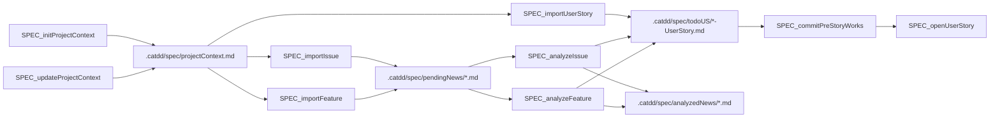
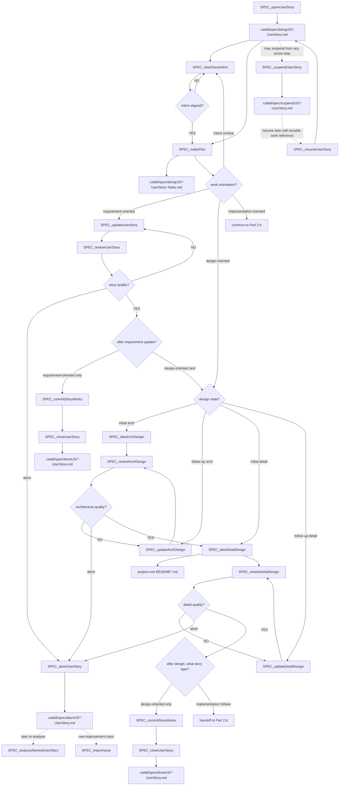
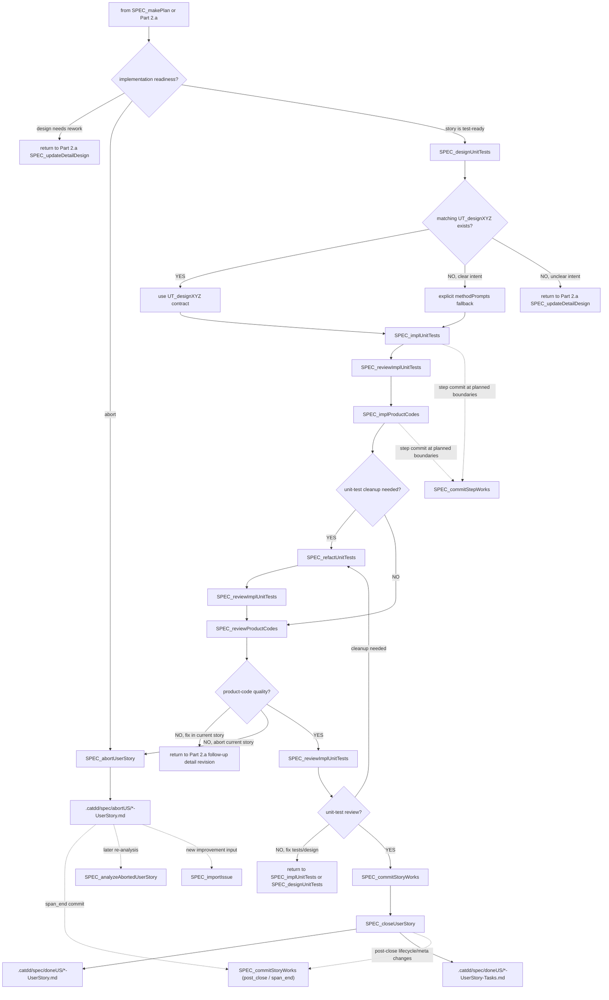

# Px SpecFlow

`Px SpecFlow` is the cross-priority SpecCoding flow for moving from incoming work to reviewed, tested, committed implementation.

`Px` means this flow is not a CaTDD category priority like `P0 Functional`, `P1 Design`, or `P2 Quality`. It is a process flow that orchestrates those method layers.

## Method Alignment

SpecFlow is based on `methodPrompts`, but it works above individual test categories.

```text
methodPrompts = CaTDD method and verification-design language
Px SpecFlow = repeatable SpecCoding lifecycle over that method
P0/P1/P2 flows = category-specific test design and implementation flows
```

`SPEC_*` commands own lifecycle orchestration: story state, readiness gates, cross-category coverage selection, traceability, review, commit, and closure. `UT_*` commands own category-level test mechanics: Typical, Edge, Misuse, Fault, State, Capability, Concurrency, Performance, Robust, Compatibility, and Configuration skeleton design or implementation steps. When a `SPEC_*` command such as `SPEC_designUnitTests` needs category skeletons, it should use matching `UT_designXYZ` command contracts when they exist and record that provenance instead of silently drafting category shapes from memory.

The governing spec is comment-alive verification design: project context, user stories, acceptance criteria, detailed design, US/AC/TC skeletons, test status, product code status, and review decisions.

## Model Tier Guidance

Use the smallest model tier that preserves decision quality for the current command. Developers and CodeAgents should reserve SOTA reasoning models for system-level architecture decisions, use high-performance models for multi-artifact reasoning and design/review work, and use flash-speed models for deterministic lifecycle movement or narrow implementation tasks.

| Default tier | Use for | Px-SpecFlow commands |
| --- | --- | --- |
| SOTA reasoning, such as GPT-5.5-xHigh | Architecture work that decides or approves system boundaries, dependency direction, runtime placement, quality trade-offs, and cross-module constraints. | `SPEC_takeArchDesign`, `SPEC_reviewArchDesign` |
| High Performance | Requirements analysis, intent alignment, planning, requirement updates, local design, review gates, test design, code review, correction routing, and controlled upstream patch-back where quality depends on reasoning across several artifacts. | `SPEC_initProjectContext`, `SPEC_updateProjectContext`, `SPEC_analyzeIssue`, `SPEC_analyzeFeature`, `SPEC_analyzeAbortedUserStory`, `SPEC_clearStoryIntent`, `SPEC_makePlan`, `SPEC_updateUserStory`, `SPEC_whatsNextTask`, `SPEC_whatsWrong`, `SPEC_takeArchDesign`, `SPEC_reviewArchDesign`, `SPEC_updateArchDesign`, `SPEC_takeDetailDesign`, `SPEC_reviewDetailDesign`, `SPEC_updateDetailDesign`, `SPEC_reviewUserStory`, `SPEC_designUnitTests`, `SPEC_reviewImplUnitTests`, `SPEC_reviewProductCodes`, `SPEC_patchOriginalCaTDD` |
| Flash Speed | Deterministic import, move, suspend, resume, partial-close, abort, commit, close, or small test-driven implementation/refactor steps when the required input artifacts are already clear. | `SPEC_importIssue`, `SPEC_importFeature`, `SPEC_importUserStory`, `SPEC_openUserStory`, `SPEC_suspendUserStory`, `SPEC_resumeUserStory`, `SPEC_partialCloseUserStory`, `SPEC_abortUserStory`, `SPEC_implUnitTests`, `SPEC_implProductCodes`, `SPEC_refactUnitTests`, `SPEC_commitPreStoryWorks`, `SPEC_commitStepWorks`, `SPEC_commitStoryWorks`, `SPEC_commitWorks`, `SPEC_closeUserStory` |

Escalate from High Performance or Flash Speed to SOTA when the command exposes architecture-significant uncertainty: competing non-functional requirements, safety/security risk, real-time or embedded constraints, concurrency boundaries, data migration, compatibility matrices, or irreversible module/API ownership decisions.

## Usage Example

For architecture work, choose a SOTA reasoning model before running:

```text
/SPEC_takeArchDesign
/SPEC_reviewArchDesign
```

For deterministic lifecycle movement, flash-speed models are usually enough:

```text
/SPEC_importIssue
/SPEC_importUserStory
/SPEC_openUserStory
/SPEC_partialCloseUserStory
/SPEC_abortUserStory
/SPEC_closeUserStory
```

## Execution Mode Guidance

`Px-SpecFlow` executes the exact same flow whether running in interactive `manualMode` or CLI `autonomousMode`.

### Mode Definition

- `manualMode` (default): Interactive step-by-step collaboration in chat. The assistant moves one slash command at a time, asks focused questions when intent, criteria, or safety is unclear, and pauses for developer confirmation before proceeding.
- `autonomousMode` (opt-in): Continuous headless / CLI execution (e.g. via `specCodeAgentCLI` or entry commands with `execution_mode: autonomousMode`). The agent automatically executes and advances through the next safe steps using explicit file artifacts, recording assumptions and questions without stopping at every turn.

Both modes are SpecCoding: the difference is who issues the `SPEC_doXYZ` command. In `manualMode` the developer types each command; in `autonomousMode` the Flow calls the next command itself.

**Driver defaults**: a human chat session defaults to `manualMode`. A code agent or CLI runner that drives the Flow (for example `specCodeAgentCLI`) defaults to `autonomousMode` inside the orientation boundary below. The driver declares the mode explicitly, either by passing `execution_mode` or by applying its documented default; the mode is never inferred from the absence of a chat window.

### Entry Trigger

- By default, entry slash commands (`SPEC_importIssue`, `SPEC_importFeature`, `SPEC_importUserStory`, or `SPEC_openUserStory`) accept `execution_mode: manualMode | autonomousMode` (default: `manualMode`).
- When triggered with `execution_mode: autonomousMode`, the mode decision is recorded in `*-UserStory-Tasks.md` and flows down to subsequent steps.
- A code agent driver states its default up front and re-declares the mode whenever it hands control back to a human, so the recorded mode always matches who is actually driving.

### Orientation Boundary: ONLY Implementation-Oriented Supports Autonomous Mode

- In `Px-SpecFlow`, `SPEC_makePlan` classifies the active story into one of four orientations: `intent-clearing`, `requirement-oriented`, `design-oriented`, or `implementation-oriented`.
- **Safety Boundary**: Requirements analysis and system architecture require human intent, trade-offs, and verification; they **CANNOT** run autonomously.
  - If `execution_mode: autonomousMode` is triggered on an `intent-clearing`, `requirement-oriented`, or `design-oriented` story, the flow **MUST halt**, force `manualMode`, and require developer interactive review and confirmation.
  - **ONLY `implementation-oriented` stories support `autonomousMode`**: Once requirements and architectural designs are locked and the story enters Part 2.b (`SPEC_designUnitTests` -> `SPEC_implUnitTests` -> `SPEC_implProductCodes` -> `SPEC_reviewProductCodes` & `SPEC_reviewImplUnitTests` -> `SPEC_commitStoryWorks` -> `SPEC_closeUserStory`), the execution is governed by deterministic rules and tests, and the agent auto-advances through these steps to completion, taking `SPEC_commitStepWorks` at the step boundaries `SPEC_makePlan` planned.

### Analysis Mode vs. Flow Execution Mode

- Flow-level `execution_mode` (`manualMode | autonomousMode`) governs the overarching SpecCoding lifecycle across story transitions.
- Command-level `analysis_mode` (`BRAINSTORM | AUTONOMOUS`) operates locally within `SPEC_analyzeIssue` and `SPEC_analyzeFeature` under `manualMode`.
  - In `BRAINSTORM` mode (default), the assistant discusses requirements interactively with the developer step by step.
  - In `AUTONOMOUS` mode, the assistant executes the composed SKILL analysis pipeline in one shot to draft `todoUS` without interrupting on every step, but records assumptions and questions and marks the story NOT ready if blocking questions remain.
- Using `analysis_mode: AUTONOMOUS` inside an analysis command does NOT switch the flow to `autonomousMode`; the story lifecycle remains in interactive `manualMode`.

### The ONE-MORE-THING Universal Stop Rule

Every slash command in CaTDD enforces the universal safety invariant: `ONE-MORE-THING: ask developer if something not sure`.

- **In `manualMode`**: When encountering an ambiguous requirement, missing source contract, unconfirmed risk, or decision point, the assistant stops and asks the developer immediately.
- **In `autonomousMode`**: Autonomy is **never** a license to guess, invent requirements, fabricate thresholds, or bypass human decisions.
  - Whenever an agent encounters a condition matching `ONE-MORE-THING`, autonomous progression **MUST HALT IMMEDIATELY**.
  - The agent preserves observed evidence, outputs a structured `status: manual_required: ONE-MORE-THING: <question>`, and waits for developer clarification before proceeding.

### Autonomous Terminal Handling

In `autonomousMode`, the runner automatically terminates on:
1. **Completion (`SPEC_closeUserStory`)**: All tasks checked, all tests GREEN, reviews pass; takes `SPEC_commitStepWorks` at the planned step boundaries, makes the final `SPEC_commitStoryWorks` commit (`pre_close`, then `post_close` when close generated changes), moves the story to `doneUS/`, and exits with code 0.
2. **Abort (`SPEC_abortUserStory`)**: Unrecoverable contract violation, invalid assumptions, or Loop Guard budget exhausted (`maxStepRetry = 2`, `maxRunCorrectionLoop = 3`); preserves diagnostics, moves story/tasks to `abortUS/`, commits the lane move through `SPEC_commitStoryWorks` with `commit_checkpoint = span_end`, and exits with non-zero code.
3. **Suspend (`SPEC_suspendUserStory`)**: Missing external dependency or offline hardware environment; preserves the durable git reference (branch/worktree), moves story/tasks to `suspendUS/`, records the WIP checkpoint through `SPEC_commitStoryWorks` with `commit_checkpoint = span_end` or the equivalent resume-branch commit, and cleanly exits.

A headless run also halts when it would need a discipline switch: VibeCoding requires a human intent source, so the Flow stops and the developer chooses `ASK`, abort, or [SPEC_whatsWrong](../commands/Px-SpecFlow/SPEC_whatsWrong.md).

### Discipline Mode: SpecCoding vs VibeCoding

- `SpecCoding` is command-driven: `SPEC_doXYZ` decides what happens next, either typed by the developer in `manualMode` or auto-called by the Flow in `autonomousMode`.
- `VibeCoding` is intent-driven: the developer states intent in natural language and the agent generates, with no `SPEC_doXYZ` sequencing. It is a deliberate, `manualMode`-only excursion entered through [SPEC_whatsWrong](../commands/Px-SpecFlow/SPEC_whatsWrong.md) from any active post-open and pre-close point.
- Because VibeCoding needs a human intent source, a headless `autonomousMode` run can never enter it: the Flow halts and the developer chooses `ASK`, abort, or the switch.
- Escalation ladder: bounded rework inside the failing gate -> `ONE-MORE-THING` halt when the problem can be stated as a question -> `SPEC_whatsWrong` when it cannot yet be stated as a question.
- While VibeCoding runs, the Flow is frozen by artifact class. Frozen: `.catdd/spec/**` except `WorkingProcessLog.md`, `README_UserStories.md`, `projectContext.md`, and the paired `*-UserStory-Tasks.md`; the active story keeps its current step. Allowed but unadopted: product code, tests, and design docs. Local always: `.catdd/spec/WorkingProcessLog.md`.
- `ONE-MORE-THING` remains binding inside VibeCoding; the switch never suspends the universal stop rule.
- Exploratory edits are allowed but stay `unadopted` until a `SPEC_*` step re-adopts them, and no story-span commit covers an excursion.
- Exit sequence: reconcile each finding into its owning command, run [HARNESS_evolveHarness](../commands/Px-HarnessKits/HARNESS_evolveHarness.md) with `evolution_mode=auto` to keep reusable tactics, then resume SpecCoding with any `SPEC_doXYZ`, including `SPEC_whatsNextTask`.
- VibeCoding is never available in `autonomousMode`: the agent may propose the switch, but a headless run halts and forces `manualMode` instead.

## Refinements from GitHub Spec Kit

Use this list first when explaining or adopting `Px SpecFlow` refinements from GitHub's Spec Kit.

| Refinement | WHY | HOW in `Px SpecFlow` |
| --- | --- | --- |
| Govern work with constitution-level project context. | Spec Kit starts with project principles so later spec, plan, and task decisions do not drift. | Treat `.catdd/spec/projectContext.md` as the shared constitution-like guardrail. `SPEC_initProjectContext` and `SPEC_updateProjectContext` should record stable principles, constraints, quality gates, and team conventions before story work continues. |
| Analyze work into independently testable story slices. | Spec Kit's spec template asks for prioritized user stories plus an independent test, which makes MVP scope and user value explicit. | `SPEC_analyzeIssue` and `SPEC_analyzeFeature` should produce `.catdd/spec/todoUS/` stories that include actor, value, priority, independent-test intent, acceptance scenarios, edge cases, risks, and open questions instead of only a loose summary. `SPEC_importUserStory` is a direct queue for already structured US/AC input and writes `.catdd/spec/todoUS/` without analysis. Analysis should move issue/feature raw input from `.catdd/spec/pendingNews/` to `.catdd/spec/analyzedNews/` so traceability is preserved without leaving analyzed work in the pending inbox. |
| Clear developer and CodeAgent story intent before design. | A story can look complete while the developer and CodeAgent still infer different scope, non-goals, or success evidence. Clearing both sides before design prevents expensive architecture and detail-design drift. | Use `SPEC_clearStoryIntent` after `SPEC_openUserStory` when the active story still needs scope alignment. Record a `Mutual Intent Contract` in the active story before planning starts. The contract states developer intent, CodeAgent intent, in-scope work, out-of-scope work, success signal, assumptions, and open questions. If intent is not aligned, ask or revise the active story before `SPEC_makePlan` begins. |
| Separate `WHAT`/`WHY` from `HOW` with a lightweight plan step. | Spec Kit keeps product intent in `spec.md` and delays technical choices to `plan.md`, reducing premature design decisions. | Keep user-story intent in the story artifact, then use `SPEC_makePlan` to create a paired `.catdd/spec/doingUS/*-UserStory-Tasks.md` artifact that expresses next work as Markdown checkbox tasks and decides whether the active story is intent-clearing, design-oriented, or implementation-oriented. For design-oriented work, distinguish initial architecture/detail design (`SPEC_take*Design`) from follow-up design revision (`SPEC_update*Design`). Detailed technical choices still land in project-root `README*` SPEC docs when later commands require them. |
| Run a clarify/analyze/checklist gate before implementation. | Spec Kit surfaces ambiguity, inconsistency, and missing coverage before coding so rework happens early. | Use `SPEC_reviewArchDesign` after architecture design and `SPEC_reviewDetailDesign` after detail design. Route failed architecture reviews to `SPEC_updateArchDesign`; route failed detail reviews to `SPEC_updateDetailDesign` instead of skipping ahead. |
| Make execution slices explicit, ordered, and parallel-aware. | Spec Kit's tasks template turns plans into visible tasks with dependencies, parallel markers, and validation checkpoints. | Before `SPEC_implUnitTests` or `SPEC_implProductCodes`, break the active story into explicit US/AC/TC slices and validation checkpoints in the doing story, verification design, and test files. Preserve P0-first order, but mark independent work that can run in parallel. |

## Developer Stories

- As a Developer, when I receive an issue or feature request, I want to import and analyze it into a user story so that work starts from a traceable spec artifact.
- As a Developer, when I receive an already structured user story, I want to queue it directly into todo stories so that I can open and execute it without redundant analysis.
- As a Developer, when I open a user story, I want to update requirement docs first when the plan is requirement-oriented, then either close after story review or hand off to design-oriented work.
- As a Developer, when I open a user story, I want to drive detail design, acceptance criteria, tests, implementation, review, CI, and closure through explicit commands so that no lifecycle step is hidden in chat.
- As a Developer, when a CodeAgent starts active story work, I want both sides to clear intent before design so that the agent does not optimize for the wrong scope or success signal.
- As a Developer, when an active story exposes a wrong scope, invalid assumptions, or quality problem that should not be patched in place, I want to abort the story into preserved history so the next improvement round can be analyzed deliberately.
- As a Developer, when I forget where I paused or I am new to SpecFlow, I want a command that tells me the next task from current artifacts so I can continue without guessing.
- As a Developer, when working interactively in chat, I want `manualMode` by default so I can inspect each step, answer questions, and control every lifecycle gate.
- As a Developer, when requirements and design are locked for an implementation-oriented story, I want to trigger `autonomousMode` at entry so the agent can execute the test-first implementation loop to completion without pausing for conversational confirmations.

## Artifacts

- `.catdd/spec/projectContext.md`: project facts, constraints, conventions, and current operating context.
- `.catdd/spec/pendingNews/YYYYMMDD-*.md`: imported issues or feature requests waiting for analysis.
- `.catdd/spec/analyzedNews/YYYYMMDD-*.md`: raw issue or feature inputs already analyzed and preserved as source trace.
- `.catdd/spec/todoUS/YYYYMMDD-UserStory.md`: analyzed user stories and directly imported structured user stories waiting to be opened.
- `.catdd/spec/doingUS/YYYYMMDD-UserStory.md`: active user stories under design, test, implementation, or review.
- `.catdd/spec/doingUS/YYYYMMDD-<StorySlug>-UserStory-Tasks.md`: team-shared task artifact paired with the active story, recording the next required `SPEC_*` steps and rationale as Markdown checkbox tasks.
- `.catdd/spec/suspendUS/YYYYMMDD-UserStory.md`: suspended active user stories preserved with a durable resume reference, such as a git branch or worktree, when the work is paused instead of continued in place.
- `.catdd/spec/suspendUS/YYYYMMDD-<StorySlug>-UserStory-Tasks.md`: suspended task artifact preserved beside the suspended story when the story was planned through `SPEC_makePlan`.
- `Mutual Intent Contract`: a section inside the active doing story that records developer intent, CodeAgent intent, scope, non-goals, success signal, assumptions, and open questions before design begins.
- `.catdd/spec/abortUS/YYYYMMDD-UserStory.md`: aborted active user stories preserved for later analysis, re-import, or next-round improvement planning.
- `.catdd/spec/abortUS/YYYYMMDD-<StorySlug>-UserStory-Tasks.md`: aborted task artifact preserved beside the aborted story when the story was planned through `SPEC_makePlan`.
- `.catdd/spec/doneUS/YYYYMMDD-UserStory.md`: completed user stories after review, commit, and CI.
- `.catdd/spec/doneUS/YYYYMMDD-<StorySlug>-UserStory-Tasks.md`: completed task artifact preserved beside the closed story for later diagnosis.
- `<module-or-submodule>/README_UserStory.md`: canonical formalized requirement source for that module scope.
- `<module-or-submodule>/README_UserGuide.md`: paired usage context for the same module scope.
- `<module-or-submodule>/README_ArchDesign.md` and `<module-or-submodule>/README_DetailDesign.md`: design artifacts derived from and traceable to the module `README_UserStory.md` IDs.
- `README_UserStories.md`: mandatory project-level story ledger containing TODO and DONE story state plus acceptance-criteria trace summaries.
- `README*.md`: project-root SPEC docs created as needed for overview, architecture, stories, guide, detail design, and verification design.
- `.catdd/spec/WorkingProcessLog.md`: optional trace log for decisions, command transitions, and unresolved questions.
- `AGENTS.md` and `AGENTS.override.md` (root and nested): the repository files that tell a code agent how to work here. `SPEC_initProjectContext` records them, and `SPEC_updateProjectContext` keeps their CaTDD-owned region in step with project context. The installer-generated adapters (`.github/instructions/catdd.instructions.md`, `.clinerules/catdd.md`, `.continue/rules/catdd.md`, `.antigravityrules/catdd.md`) and generated trees such as `.agents/skills/` and `.codex/prompts/` are rewritten wholesale on refresh and stay out of scope.

## Project-Root README SPEC Docs

Create project-root README SPEC docs only when the project needs that SPEC surface. Keep all `README*` SPEC docs in the target project root so developers and CodeAgents can find shared project and module knowledge quickly.

### 1. Architecture-Oriented (Managed by `SPEC_takeArchDesign`)

These document module-context architecture plus consuming-system context, along with global strategies, boundaries, reliability frameworks, and observability topologies.

| File | Purpose |
| --- | --- |
| `README_ArchDesign.md` | Module-context architecture, consuming-system context, module decomposition, dependencies, data flow, and key trade-offs. |
| `README_UsageDesign.md` | Public boundaries, CLI/API contracts, argument parsing rules, and run examples. |
| `README_ErrorDesign.md` | Fault-tolerance architecture, fail-safe states, watchdogs, and global error taxonomies. |
| `README_ResourceDesign.md` | Finite resource allocations, memory/CPU/power budgets, DMA, and watchdogs. |
| `README_PerfDesign.md` | Performance budgets, latency limits, and real-time media scheduling. |
| `README_CompatDesign.md` | Compatibility boundaries, platform matrices, toolchains, and protocol versions. |
| `README_DiagnosisDesign.md` | Observability architecture, logging levels, telemetry, and symptom trace maps. |
| `README_SecurityDesign.md` | Security architecture, threat models, constitutional invariants (K), trust boundaries, and credential protection. |
| `README_VerifyDesign.md` | Verification and testing topologies, mocking boundaries, and CI test loops. |

### 2. DetailDesign-Oriented (Managed by `SPEC_takeDetailDesign`)

These document local implementation details, code tactics, and class/API behavior for the active user story.

| File | Purpose |
| --- | --- |
| `README_DetailDesign.md` | Detailed class design, API signatures, and data structures for the story. |
| `README_StateDesign.md` | Local state machines, lifecycle transitions, lock synchronization, and thread concurrency. |

### 3. General & Requirements (Created by DEVELOPER first, later updated by `SPEC_updateUserStory` and `SPEC_reviewUserStory`)

| File | Purpose |
| --- | --- |
| `README.md` | Project overview, ownership, manual user statements, and master SPEC directories. |
| `README_UserStories.md` | Mandatory project-scoped ledger of TODO/DONE user stories with acceptance-criteria trace/status and links to SpecFlow story directories. |
| `README_UserGuide.md` | User-facing or developer-facing runtime usage guidance. |

Use matching templates from `slashCommands/templates/` when creating a README SPEC doc for the first time.

- `SpecTodoUserStoryTemplate.md` — reusable template for `.catdd/spec/todoUS/*-UserStory.md` artifacts, composed from `.github/skills/` requirements-analysis SKILLs.
  - `SPEC_analyzeFeature` and `SPEC_analyzeIssue` use a full 9-step SKILL pipeline and produce output following this template.
  - `SPEC_analyzeAbortedUserStory` uses this template for output format but follows a **selective re-analysis** pipeline (audit → diagnose → preserve → reject → selectively correct) since the input is already a structured user story.
For embedded software and digital video/audio domain work, use `README_ErrorDesign.md`, `README_ResourceDesign.md`, `README_StateDesign.md`, `README_PerfDesign.md`, `README_CompatDesign.md`, `README_DiagnosisDesign.md`, and `README_SecurityDesign.md` when hardware faults, finite resources, hardware state, real-time behavior, compatibility matrices, buffering, media pipeline timing, A/V sync constraints, hardware protection, or field-debug evidence matter.

## Artifact Persistence Policy

SpecCoding separates team knowledge from personal work-in-progress state.

SpecFlow lifecycle state lives under `.catdd/spec/`. Shared `README*` SPEC docs live in the target project root.

| Artifact | Scope | Git policy |
| --- | --- | --- |
| `.catdd/spec/projectContext.md` | Team-shared | Commit stable project context so teammates and CodeAgents use the same facts. |
| `.catdd/spec/pendingNews/` | Team-shared | Commit imported work items that should be visible to the team. |
| `.catdd/spec/analyzedNews/` | Team-shared | Commit raw imported issues or features after analysis so `pendingNews/` stays only for waiting input. |
| `.catdd/spec/todoUS/` | Team-shared | Commit analyzed user stories and directly imported structured user stories that are ready to be picked up. |
| `.catdd/spec/doingUS/` | Team-shared | Commit active user stories so in-progress work can move across machines and stay visible to teammates. |
| `.catdd/spec/doingUS/*-UserStory-Tasks.md` | Team-shared | Commit the active task artifact paired with the opened user story so the next SPEC steps stay explicit, checkable, and diagnosable. |
| `.catdd/spec/suspendUS/` | Team-shared | Commit suspended active stories together with a durable resume reference when work is paused instead of continued in place. |
| `.catdd/spec/suspendUS/*-UserStory-Tasks.md` | Team-shared | Commit the suspended task artifact beside the suspended story so the next resume step stays explicit and traceable. |
| `.catdd/spec/abortUS/` | Team-shared | Commit aborted active stories when the current scope or assumptions are no longer safe to continue in place. |
| `.catdd/spec/abortUS/*-UserStory-Tasks.md` | Team-shared | Commit the aborted task artifact beside the aborted story for later analysis or next-round improvement planning. |
| `.catdd/spec/doneUS/` | Team-shared | Commit completed story records after review, verification, and close. |
| `.catdd/spec/doneUS/*-UserStory-Tasks.md` | Team-shared | Commit the completed task artifact beside the closed user story for later diagnosis. |
| `README_UserStories.md` | Team-shared | Commit as the project-level source of truth for TODO/DONE story state and AC traceability status. |
| `README*.md` | Team-shared | Commit project-root SPEC docs such as README, architecture design, user stories, user guide, detail design, error design, resource design, state design, performance design, compatibility design, diagnosis design, and verify design as needed. |
| `slashCommands/templates/SpecTodoUserStoryTemplate.md` | Team-shared | Commit reusable per-story template for `.catdd/spec/todoUS/*-UserStory.md`. |
| `.catdd/spec/WorkingProcessLog.md` | Local work state | Gitignore personal command traces, temporary decisions, and unresolved local notes. |
| `AGENTS.md` / `AGENTS.override.md` (root and nested) | Team-shared | Commit the file. It is the one agent surface the installer patches in place: the region between the `CaTDD Codex instructions` markers is regenerable and CaTDD-owned, and every other line is project-owned and never rewritten. Installer-generated adapters such as `.clinerules/catdd.md` are rewritten wholesale and are not tracked here. |

Recommended target-project `.gitignore` rules:

```gitignore
/.catdd/spec/WorkingProcessLog.md
```

## Commit Spans

Px-SpecFlow splits commits by span, not by file set, so every commit states which part of the lifecycle it closes. `SPEC_makePlan` decides the granularity for each story and records it in the paired `*-UserStory-Tasks.md`.

| Commit command | Span it covers | `manualMode` | `autonomousMode` |
| --- | --- | --- | --- |
| `SPEC_commitPreStoryWorks` | Intake, analysis, and planning-input artifacts produced before `SPEC_openUserStory`, such as `pendingNews/` moves, `analyzedNews/` archives, `todoUS/` stories, and the `README_UserStories.md` ledger. | Option | Not applicable: pre-story work always stays in `manualMode`. The checkpoint defaults when the intake ran headless with `analysis_mode: AUTONOMOUS`, which is a command-level flag, not `execution_mode`. |
| `SPEC_commitStepWorks` | Exactly one verified lifecycle step inside the story span, only at boundaries `SPEC_makePlan` marked `commit_step = yes`. | Option | Default at each planned step boundary |
| `SPEC_commitStoryWorks` | The whole `SPEC_openUserStory -> SPEC_closeUserStory` span, including terminal lifecycle/meta changes; serves the `pre_close`, `post_close`, and `span_end` checkpoints. | Option | Default at story completion |
| `SPEC_commitWorks` | Any staged or recently modified change; story-agnostic, staged files first, most recently modified second. | Always available on demand | Still available, never automatic |

```text
pre-story span                          story span: SPEC_openUserStory -> SPEC_closeUserStory
import / analyze / queue                open -> makePlan -> design -> impl -> review -> close
SPEC_commitPreStoryWorks                SPEC_commitStepWorks   at planned step boundaries
                                        SPEC_commitStoryWorks  as the final just-done commit
```

### Commit Plan Decision Rules

- `SPEC_makePlan` records `commit_step = yes` only for steps that change files and have an explicit `PASS`/`GREEN` gate, and `commit_step = no` for no-op review or planning gates.
- `manualMode` default: the story span closes through `SPEC_commitStoryWorks`, and step commits remain available options recorded as `commit_step = optional`.
- `autonomousMode` default: `SPEC_commitStepWorks` runs at every planned step boundary, and `SPEC_commitStoryWorks` makes the final just-done story commit.
- `single_story_commit = yes` squashes step commits into one story commit at the end; `SPEC_commitStoryWorks` must confirm with the developer in `manualMode` before rewriting history.
- `SPEC_commitPreStoryWorks` is planned only when the story was queued through import or analysis in the same working session.
- Every terminal transition ends the span and routes to `SPEC_commitStoryWorks`: `commit_checkpoint = post_close` after `SPEC_closeUserStory`, and `commit_checkpoint = span_end` after `SPEC_partialCloseUserStory`, `SPEC_abortUserStory`, or `SPEC_suspendUserStory`, so no lane move is left uncommitted.
- `SPEC_commitWorks` remains the general command for changes that belong to no span, such as documentation or tooling fixes; it never advances lifecycle state.

## Flow Diagram

### Part 1: Pre-Story (up to SPEC_openUserStory)


```mermaid
flowchart LR
    Init["SPEC_initProjectContext"] --> Context[".catdd/spec/projectContext.md"]
    UpdateContext["SPEC_updateProjectContext"] --> Context
    Context --> ImportIssue["SPEC_importIssue"]
    Context --> ImportFeature["SPEC_importFeature"]
    Context --> ImportUserStory["SPEC_importUserStory"]

    ImportIssue --> Pending[".catdd/spec/pendingNews/*.md"]
    ImportFeature --> Pending
    ImportUserStory --> Todo
    Pending --> AnalyzeIssue["SPEC_analyzeIssue"]
    Pending --> AnalyzeFeature["SPEC_analyzeFeature"]
    AnalyzeIssue --> Todo[".catdd/spec/todoUS/*-UserStory.md"]
    AnalyzeFeature --> Todo
    AnalyzeIssue --> Analyzed[".catdd/spec/analyzedNews/*.md"]
    AnalyzeFeature --> Analyzed

    Todo --> PreStoryCommit["SPEC_commitPreStoryWorks"]
    PreStoryCommit --> Open["SPEC_openUserStory"]
```

### Part 2.a: Post-Plan Requirement and Design Lanes

This diagram covers post-open planning, requirement-oriented updates, and design-oriented work. Requirement-oriented work updates project-level `README_UserStories.md` ledger and paired `README_UserGuide.md` (plus module `README_UserStory.md` when module-local requirement docs are used), then either closes after review or transfers to design-oriented next steps.

`SPEC_suspendUserStory` is a global interrupt in Part 2.a and Part 2.b: from any active post-open and pre-close step, you may suspend the story and later resume with `SPEC_resumeUserStory`. To keep the diagram readable, this interrupt is drawn once instead of repeating arrows from every node.


```mermaid
flowchart TB
    Open["SPEC_openUserStory"] --> Doing[".catdd/spec/doingUS/*-UserStory.md"]
    Doing --> ClearIntent["SPEC_clearStoryIntent"]
    Doing --> Plan["SPEC_makePlan"]
    ClearIntent --> QualityIntent{"intent aligned?"}
    QualityIntent -- "NO" --> ClearIntent
    QualityIntent -- "YES" --> Plan
    Plan --> Tasks[".catdd/spec/doingUS/*-UserStory-Tasks.md"]
    Plan --> PlanChoice{"work orientation?"}
    PlanChoice -- "intent unclear" --> ClearIntent
    PlanChoice -- "requirement-oriented" --> UpdateStory["SPEC_updateUserStory"]
    UpdateStory --> ReviewReqStory["SPEC_reviewUserStory"]
    ReviewReqStory --> ReqQuality{"story quality?"}
    ReqQuality -- "NO" --> UpdateStory
    ReqQuality -- "abort" --> Abort2a["SPEC_abortUserStory"]
    ReqQuality -- "YES" --> ReqTail{"after requirement update?"}
    ReqTail -- "requirement-oriented only" --> CommitReq["SPEC_commitStoryWorks"]
    CommitReq --> CloseReq["SPEC_closeUserStory"]
    CloseReq --> DoneReq[".catdd/spec/doneUS/*-UserStory.md"]
    ReqTail -- "design-oriented next" --> DesignChoice
    Doing -. "may suspend from any active step" .-> Suspend["SPEC_suspendUserStory"]
    Suspend --> SuspendUS[".catdd/spec/suspendUS/*-UserStory.md"]
    SuspendUS -. "resume later with durable work reference" .-> Resume["SPEC_resumeUserStory"]
    Resume --> Doing
    PlanChoice -- "design-oriented" --> DesignChoice{"design state?"}
    PlanChoice -- "implementation-oriented" --> Part2b["continue to Part 2.b"]
    DesignChoice -- "initial arch" --> Arch["SPEC_takeArchDesign"]
    DesignChoice -- "follow-up arch" --> UpdateArch["SPEC_updateArchDesign"]
    DesignChoice -- "initial detail" --> Detail["SPEC_takeDetailDesign"]
    DesignChoice -- "follow-up detail" --> UpdateDetail["SPEC_updateDetailDesign"]
    Arch --> ReviewArch["SPEC_reviewArchDesign"]
    ReviewArch --> QualityArch{"architecture quality?"}
    QualityArch -- "NO" --> UpdateArch["SPEC_updateArchDesign"]
    QualityArch -- "abort" --> Abort2a
    UpdateArch --> ReviewArch
    QualityArch -- "YES" --> Detail
    Detail --> ReadmeDocs["project-root README*.md"]
    Detail --> ReviewDetail["SPEC_reviewDetailDesign"]
    ReviewDetail --> QualityDetail{"detail quality?"}
    QualityDetail -- "NO" --> UpdateDetail["SPEC_updateDetailDesign"]
    QualityDetail -- "abort" --> Abort2a
    QualityDetail -- "YES" --> TailChoice{"after design, what story type?"}
    UpdateDetail --> ReviewDetail
    TailChoice -- "design-oriented only" --> CommitDesign["SPEC_commitStoryWorks"]
    CommitDesign --> CloseDesign["SPEC_closeUserStory"]
    CloseDesign --> DoneDesign[".catdd/spec/doneUS/*-UserStory.md"]
    TailChoice -- "implementation follows" --> DesignReady["handoff to Part 2.b"]
    Abort2a --> AbortUS2a[".catdd/spec/abortUS/*-UserStory.md"]
    AbortUS2a -. "later re-analysis" .-> AnalyzeAbort2a["SPEC_analyzeAbortedUserStory"]
    AbortUS2a -. "new improvement input" .-> ImportIssue2a["SPEC_importIssue"]
```

### Part 2.b: Implementation-Oriented Active Story Lifecycle

This diagram starts only after `SPEC_makePlan` classifies the story as implementation-oriented or Part 2.a marks `implementation follows`. If requirement readiness is uncertain, route back to Part 2.a for `SPEC_updateUserStory`; if design readiness is uncertain, route back to Part 2.a detail-design updates before test design.
After `SPEC_closeUserStory`, if the work was done on a dedicated story branch, run the repository merge step (for example `SPEC_mergeWorks`). If no dedicated branch was used, skip merge/integration.

Suspend remains available here as the same global interrupt rule defined in Part 2.a and is not re-drawn from every implementation node.


```mermaid
flowchart TB
    Part2b["from SPEC_makePlan or Part 2.a"] --> ImplementationChoice{"implementation readiness?"}
    ImplementationChoice -- "design needs rework" --> ReviewStoryRef["return to Part 2.a SPEC_updateDetailDesign"]
    ImplementationChoice -- "abort" --> Abort2b["SPEC_abortUserStory"]
    ImplementationChoice -- "story is test-ready" --> DesignTests["SPEC_designUnitTests"]

    DesignTests --> UTDesign{"matching UT_designXYZ exists?"}
    UTDesign -- "YES" --> CategoryDesign["use UT_designXYZ contract"]
    UTDesign -- "NO, clear intent" --> MethodFallback["explicit methodPrompts fallback"]
    UTDesign -- "NO, unclear intent" --> DetailGap["return to Part 2.a SPEC_updateDetailDesign"]
    CategoryDesign --> ImplTests["SPEC_implUnitTests"]
    MethodFallback --> ImplTests
    ImplTests --> ReviewImplTests["SPEC_reviewImplUnitTests"]
    ReviewImplTests --> ImplCode["SPEC_implProductCodes"]
    ImplCode --> RefactTests{"unit-test cleanup needed?"}
    RefactTests -- "YES" --> RefactUnitTests["SPEC_refactUnitTests"]
    RefactUnitTests --> ReviewImplTestsAfterRefactor["SPEC_reviewImplUnitTests"]
    ReviewImplTestsAfterRefactor --> ReviewCode["SPEC_reviewProductCodes"]
    RefactTests -- "NO" --> ReviewCode
    ReviewCode --> QualityCode{"product-code quality?"}

    QualityCode -- "NO, fix in current story" --> DesignRework["return to Part 2.a follow-up detail revision"]
    QualityCode -- "NO, abort current story" --> Abort2b
    QualityCode -- "YES" --> ReviewImplTestsAfterProductCode["SPEC_reviewImplUnitTests"]
    ReviewImplTestsAfterProductCode --> UnitTestQuality{"unit-test review?"}
    UnitTestQuality -- "NO, fix tests/design" --> TestRework["return to SPEC_implUnitTests or SPEC_designUnitTests"]
    UnitTestQuality -- "cleanup needed" --> RefactUnitTests
    UnitTestQuality -- "YES" --> Commit["SPEC_commitStoryWorks"]
    Commit --> Close["SPEC_closeUserStory"]
    ImplTests -. "step commit at planned boundaries" .-> StepCommit["SPEC_commitStepWorks"]
    ImplCode -. "step commit at planned boundaries" .-> StepCommit
    Close --> Done[".catdd/spec/doneUS/*-UserStory.md"]
    Close --> DoneTasks[".catdd/spec/doneUS/*-UserStory-Tasks.md"]
    Close -. "post-close lifecycle/meta changes" .-> CommitFinalize["SPEC_commitStoryWorks (post_close / span_end)"]
    Abort2b --> AbortUS2b[".catdd/spec/abortUS/*-UserStory.md"]
    AbortUS2b -. "span_end commit" .-> CommitFinalize
    AbortUS2b -. "later re-analysis" .-> AnalyzeAbort2b["SPEC_analyzeAbortedUserStory"]
    AbortUS2b -. "new improvement input" .-> ImportIssue2b["SPEC_importIssue"]
```

## Command Sequence

1. Use [SPEC_initProjectContext](../commands/Px-SpecFlow/SPEC_initProjectContext.md) to create the first project context.
2. Use [SPEC_updateProjectContext](../commands/Px-SpecFlow/SPEC_updateProjectContext.md) whenever project facts, constraints, or conventions change.
3. Use [SPEC_importIssue](../commands/Px-SpecFlow/SPEC_importIssue.md) or [SPEC_importFeature](../commands/Px-SpecFlow/SPEC_importFeature.md) to import issue or feature input into `.catdd/spec/pendingNews/`.
4. Use [SPEC_importUserStory](../commands/Px-SpecFlow/SPEC_importUserStory.md) to queue existing structured user-story input directly into `.catdd/spec/todoUS/`; prefer each module or submodule `README_UserStory.md` paired with `README_UserGuide.md` as the source.
5. Use [SPEC_analyzeIssue](../commands/Px-SpecFlow/SPEC_analyzeIssue.md) or [SPEC_analyzeFeature](../commands/Px-SpecFlow/SPEC_analyzeFeature.md) to convert pending issue/feature input into a user story in `.catdd/spec/todoUS/` and move the raw input to `.catdd/spec/analyzedNews/`.
   - These analysis commands use a composed pipeline of `.github/skills/` requirements-analysis SKILLs: `write-user-story`, `build-feature-tree`, `elicit-requirements-models`, `extract-business-rules`, `facilitate-example-mapping`, `validate-requirements-criteria`, `prioritize-requirements`.
   - Output follows `SpecTodoUserStoryTemplate.md`.
   - Use `SPEC_analyzeAbortedUserStory.md` for re-analyzing an aborted story that needs selective correction rather than full-scope analysis.
   - After analysis queues the story, use [SPEC_commitPreStoryWorks](../commands/Px-SpecFlow/SPEC_commitPreStoryWorks.md) to commit the pre-story intake/analysis span before opening; when the intake ran headless with `analysis_mode: AUTONOMOUS`, this checkpoint is the default, and the pre-story span otherwise stays in `manualMode`.
6. Use [SPEC_openUserStory](../commands/Px-SpecFlow/SPEC_openUserStory.md) to move a selected user story into `.catdd/spec/doingUS/`, and ask whether a dedicated story branch should be created/switched before planning.
7. Optionally use [SPEC_clearStoryIntent](../commands/Px-SpecFlow/SPEC_clearStoryIntent.md) when developer intent and CodeAgent intent still need to be aligned before planning.
8. Use [SPEC_makePlan](../commands/Px-SpecFlow/SPEC_makePlan.md) to create the paired `.catdd/spec/doingUS/*-UserStory-Tasks.md` artifact, express the work as Markdown checkbox tasks, distinguish intent-clearing, requirement-oriented, design-oriented, and implementation-oriented work, distinguish initial design from follow-up design revision, and choose the next required `SPEC_*` step for the opened story.
9. Use [SPEC_updateUserStory](../commands/Px-SpecFlow/SPEC_updateUserStory.md) when the plan is requirement-oriented and project-level `README_UserStories.md` plus paired `README_UserGuide.md` (and module surfaces when used) must be updated before downstream work.
10. Use [SPEC_reviewUserStory](../commands/Px-SpecFlow/SPEC_reviewUserStory.md) after requirement updates, and then either close requirement-oriented-only work (`SPEC_commitStoryWorks`, then `SPEC_closeUserStory`, then optional merge step such as `SPEC_mergeWorks` when branch integration is still required, followed by an immediate `post_close` checkpoint of `SPEC_commitStoryWorks` if close generated file changes) or transfer to design-oriented next steps. `SPEC_reviewUserStory` must verify that `README_UserStories.md` TODO/DONE and AC trace status are consistent with active lifecycle artifacts.
11. Use [SPEC_whatsNextTask](../commands/Px-SpecFlow/SPEC_whatsNextTask.md) whenever you need a single next-step recommendation from current state.
12. Use [SPEC_whatsWrong](../commands/Px-SpecFlow/SPEC_whatsWrong.md) when something is wrong but no gate or owning command can name it yet: it freezes the Flow, switches the session from SpecCoding into VibeCoding in `manualMode`, records the excursion in local work state, and later reconciles findings through their owning commands, `HARNESS_evolveHarness` (`evolution_mode=auto`), and any `SPEC_doXYZ` resume command.
13. Use [SPEC_takeArchDesign](../commands/Px-SpecFlow/SPEC_takeArchDesign.md) to produce initial high-level architecture design and module boundaries in `README_ArchDesign.md` when the plan says initial architecture work is needed (applying architecture and security skills `design-architecture-viewpoints`, `apply-architectural-tactics`, `document-architectural-decisions`, and `design-tool-use-sandboxing`).
14. Use [SPEC_reviewArchDesign](../commands/Px-SpecFlow/SPEC_reviewArchDesign.md) to gate architecture quality before detailed design begins.
15. Use [SPEC_updateArchDesign](../commands/Px-SpecFlow/SPEC_updateArchDesign.md) for follow-up architecture revision when architecture review, story-level feedback, or an opened update story identifies missing or weak architecture design.
16. Use [SPEC_takeDetailDesign](../commands/Px-SpecFlow/SPEC_takeDetailDesign.md) to produce initial detailed design and acceptance criteria, including other project-root `README*` SPEC docs as needed (such as `README_DetailDesign.md`, `README_StateDesign.md`, `README_SecurityDesign.md`, applying `design-architecture-viewpoints`, `apply-architectural-tactics`, and `design-tool-use-sandboxing`).
17. Use [SPEC_reviewDetailDesign](../commands/Px-SpecFlow/SPEC_reviewDetailDesign.md) to gate detailed design quality before implementation-oriented steps.
18. Use [SPEC_updateDetailDesign](../commands/Px-SpecFlow/SPEC_updateDetailDesign.md) for follow-up detail revision when detail review finds missing or weak design.
19. Use [SPEC_designUnitTests](../commands/Px-SpecFlow/SPEC_designUnitTests.md) to enter CaTDD test design, usually through P0/P1/P2 flows, when the plan says the story is test-ready.
20. Use [SPEC_implUnitTests](../commands/Px-SpecFlow/SPEC_implUnitTests.md), [SPEC_reviewImplUnitTests](../commands/Px-SpecFlow/SPEC_reviewImplUnitTests.md), [SPEC_implProductCodes](../commands/Px-SpecFlow/SPEC_implProductCodes.md), and [SPEC_reviewProductCodes](../commands/Px-SpecFlow/SPEC_reviewProductCodes.md) for test-first execution and review, then run `SPEC_reviewImplUnitTests` again after product-code review before the story-span commit. Use optional [SPEC_refactUnitTests](../commands/Px-SpecFlow/SPEC_refactUnitTests.md) for GREEN no-behavior-change unit-test cleanup; after refactor, run `SPEC_reviewImplUnitTests`, rerun `SPEC_reviewProductCodes` when review scope changed, and run `SPEC_reviewImplUnitTests` again before the story-span commit. At step boundaries the plan marked `commit_step = yes`, use [SPEC_commitStepWorks](../commands/Px-SpecFlow/SPEC_commitStepWorks.md) once that step's gate passed.
21. Use [SPEC_suspendUserStory](../commands/Px-SpecFlow/SPEC_suspendUserStory.md) at any active post-open and pre-close point when work must pause without losing traceability and a durable resume reference, such as a git branch or worktree, already exists or can be created; then commit the `suspendUS/` lane move through `SPEC_commitStoryWorks` with `commit_checkpoint = span_end` or the equivalent resume-branch WIP commit.
22. Use [SPEC_resumeUserStory](../commands/Px-SpecFlow/SPEC_resumeUserStory.md) to move a suspended story back into active work and continue from the preserved reference.
23. Use [SPEC_abortUserStory](../commands/Px-SpecFlow/SPEC_abortUserStory.md) from Part 2.a or Part 2.b when the active story has a blocking scope, assumption, design, test, or product-quality problem that should be preserved rather than continued in place; then commit the `abortUS/` lane move through `SPEC_commitStoryWorks` with `commit_checkpoint = span_end`. After aborting, either use `SPEC_analyzeAbortedUserStory` to analyze the aborted story for a later story round or use `SPEC_importIssue` to create a new improvement/refinement input.
24. Use [SPEC_commitStoryWorks](../commands/Px-SpecFlow/SPEC_commitStoryWorks.md) with `commit_checkpoint = pre_close` to commit the whole `SPEC_openUserStory -> SPEC_closeUserStory` span, then use [SPEC_closeUserStory](../commands/Px-SpecFlow/SPEC_closeUserStory.md), then use `SPEC_commitStoryWorks` again with `commit_checkpoint = post_close` when close-generated lifecycle/meta files changed, then run merge/integration when required (for example [SPEC_mergeWorks](../commands/Px-SpecFlow/SPEC_mergeWorks.md)); if no dedicated story branch was used, merge is auto-skipped. Use [SPEC_commitStepWorks](../commands/Px-SpecFlow/SPEC_commitStepWorks.md) for planned step commits inside the span, and [SPEC_commitWorks](../commands/Px-SpecFlow/SPEC_commitWorks.md) for general changes that belong to no span.
25. Use [SPEC_patchOriginalCaTDD](../commands/Px-SpecFlow/SPEC_patchOriginalCaTDD.md) when an installed project has effective CaTDD meta-file improvements that should be patched back to the original CaTDD repository on a non-default branch.

## Loop Guard (DeadLoop Prevention)

A DeadLoop is repeating the same lifecycle step, or oscillating between two `SPEC_*` commands, with no observable progress toward the story goal. Every rework loop in Px-SpecFlow must be bounded and converge-or-abort: never loop "until it works." Loop until `PASS`/`GREEN`, a bounded rework count, or a no-progress/ownership/abort signal, then route or abort instead of silently re-running.

### Governing Defaults

Loop bounds are set by the agentic reliability policy and contracts in `codeAgents/utCodeAgentCLI/`, formally aligned with the **Closed-Loop Regeneration Budget ($B$)** of SGRM (Algorithm 1 in arXiv:2607.16680):

- `maxStepRetry = 2`: maximum retries of the same failed lifecycle step.
- `maxRunCorrectionLoop = 3`: maximum correction-loop iterations for one run ($B \le 3$).
- `max_correction_attempts` default `3`: per-command local-bound input (for example `SPEC_implProductCodes`, `UT_implTestCase`).
- SGRM Budget Protocol ($B$): Rejection-sampling retry loops must be strictly bounded ($B \le 3$). Upon budget exhaustion, the agent must not loop indefinitely or silently lower acceptance criteria; it must restore the clean baseline, emit a structured failure diagnostic report, mark the TC as `🚫 BLOCKED`, and escalate to human governance.
- ASR-R1: retry and correction loops shall be bounded and deterministic at budget exhaustion.

### Universal Stop Conditions

Every rework loop (`review -> update -> review`, `impl -> review -> impl`, and their test/design variants) stops on the first of:

1. `PASS`/`GREEN` — the gate's exit condition is met.
2. Bounded retry/correction budget exhausted (`maxStepRetry`, `maxRunCorrectionLoop`, or `max_correction_attempts` $B \le 3$).
3. Repeated no-progress evidence — the same failure persists with nothing changed toward the goal.
4. Scope expansion beyond the reviewed design or active story.
5. Conflicting evidence or unclear owner — `ASK` the developer.
6. Abort — the problem changes story intent or invalidates assumptions; use `SPEC_abortUserStory`.
7. Ownership boundary reached — route to the canonical `SPEC_*`/`UT_*`/`HARNESS_*` owner.

A no-progress stop must preserve the latest observed evidence, restore the working directory to the last clean state (preventing partial/dirty code contamination), emit a structured failure diagnostic report (`failure_type`, `attempt_count`, `sut_snapshot`, `assertion_diff`), mark the TC as `🚫 BLOCKED`, and route or ask; it must not claim success.

### Route Instead of Reloop

- Failed architecture review -> `SPEC_updateArchDesign`, then re-gate via `SPEC_reviewArchDesign`, bounded.
- Failed detail review -> `SPEC_updateDetailDesign`, then re-gate via `SPEC_reviewDetailDesign`, bounded.
- Failed requirement review -> `SPEC_updateUserStory`, then re-gate via `SPEC_reviewUserStory`, bounded.
- Test-implementation defect -> `SPEC_implUnitTests`; test-design/coverage defect -> `SPEC_designUnitTests`; product-code defect -> bounded local correction in `SPEC_implProductCodes` or design routing per its Conflict Guard.
- Exhausted no-progress bound -> `ASK` for a decision, [SPEC_whatsWrong](../commands/Px-SpecFlow/SPEC_whatsWrong.md) in `manualMode` when the problem is still unproven, or `SPEC_abortUserStory` when the problem changed the story intent or invalidated its assumptions.

Failure classification follows ASR-R3: retry only transient failures; route permanent failures deterministically. If no-progress persists after the bound, do not continue patching in place: a `manualMode` session may escalate to `SPEC_whatsWrong` while the problem is still unproven, an `autonomousMode` run must halt and hand the choice to the developer because it cannot switch discipline, and `SPEC_abortUserStory` into `.catdd/spec/abortUS/` is required when the problem changed the story intent or invalidated its assumptions.

## Conflict Guard

- `Px SpecFlow` defines lifecycle orchestration only; CaTDD method semantics remain in `methodPrompts`.
- `SPEC_*` commands may call `UT_*` commands, but they must not replace P0/P1/P2 category rules.
- Do not execute `autonomousMode` on `intent-clearing`, `requirement-oriented`, or `design-oriented` stories; only `implementation-oriented` stories support autonomous execution. If autonomous execution is triggered on non-implementation stories, halt and force interactive `manualMode`.
- Do not skip `SPEC_reviewUserStory` after `SPEC_updateUserStory` in requirement-oriented work.
- Do not treat story lifecycle as complete when `README_UserStories.md` TODO/DONE or AC trace status is stale.
- `SPEC_takeArchDesign` and `SPEC_reviewArchDesign` must keep architecture module-context focused and explicitly document consuming-system context.
- Do not start design when developer intent and CodeAgent intent are not cleared for the active story.
- Do not suspend a story without preserving a durable resume reference, such as a git branch or worktree, when the active work has changes that must be resumed later.
- After `SPEC_makePlan`, use `SPEC_take*Design` only for initial design work and `SPEC_update*Design` only for follow-up design revision against existing design evidence, review feedback, or story-level design gaps.
- Every design-producing step (`SPEC_takeArchDesign`, `SPEC_updateArchDesign`, `SPEC_takeDetailDesign`, `SPEC_updateDetailDesign`) must be followed by its review gate before downstream lifecycle steps.
- Every implemented-unit-test step (`SPEC_implUnitTests`, `SPEC_refactUnitTests`) must be followed by `SPEC_reviewImplUnitTests` before product-code implementation, product-code review handoff, or any commit checkpoint (`SPEC_commitStoryWorks` or a planned `SPEC_commitStepWorks` boundary).
- Every product-code implementation/review pass (`SPEC_implProductCodes`, `SPEC_reviewProductCodes`) must be followed by `SPEC_reviewImplUnitTests` before the story-span commit (`SPEC_commitStoryWorks`) or any planned `SPEC_commitStepWorks` boundary that covers product code.
- `SPEC_refactUnitTests` must only clean GREEN implemented tests; it must route missing behavior, new coverage, wrong category, or acceptance ambiguity back to the appropriate design or implementation command.
- Use `SPEC_abortUserStory` instead of continuing an active story when the discovered problem changes the story's intent, invalidates its assumptions, or needs a new analysis/improvement round.
- Do not run `SPEC_closeUserStory` until required branch integration/merge work is complete.
- The `pre_close` checkpoint of `SPEC_commitStoryWorks` covers implementation and design artifacts for the story span; close-generated lifecycle/meta changes require the immediate `post_close` checkpoint of `SPEC_commitStoryWorks` before closure is complete.
- Do not treat `SPEC_commitWorks` as a span commit: it never advances lifecycle state, and a story span is never closed by a general commit.
- Do not run `SPEC_commitPreStoryWorks` after the story moved to `.catdd/spec/doingUS/`, and do not run `SPEC_commitStepWorks` at a boundary `SPEC_makePlan` did not mark committable.
- `SPEC_patchOriginalCaTDD` is downstream-to-upstream only (installed project to original CaTDD) and must not be used as an upstream-to-installed sync command.
- If product intent is unclear, keep the user story open and ask the developer instead of inventing requirements.
- Every review -> update -> review rework cycle is bounded: the update command carries a rework bound (`max_rework_attempts`, default `3`) and must stop on no-progress or exhausted attempts and route or abort.
- Do not allow a review gate to loop back to the same update command indefinitely; a repeated failing pass with no-progress must route to `SPEC_abortUserStory` or `ASK`, not a third silent retry.
- Do not retry permanent failures; retry only transient failures per ASR-R3, and keep every retry inside the governing loop bounds.
- On no-progress evidence or exhausted loop bounds, preserve the latest evidence and route or abort; do not claim success.
- Do not use `SPEC_whatsWrong` to avoid a gate, a missing requirement, an acceptance criterion, or write verification; when an owning command exists, route there instead of switching.
- Do not run `SPEC_whatsWrong` in `autonomousMode`; the agent may propose the switch, but a headless run halts and forces `manualMode`.
- Do not suspend `ONE-MORE-THING` inside VibeCoding, and do not treat exploratory edits as adopted story work before a `SPEC_*` step re-adopts them or as part of a story-span commit.
- Do not infer `execution_mode` from the environment: the human chat driver and the code agent driver each declare their mode, and the declared mode is what the recorded artifacts carry.
- Do not let a code agent driver escape the orientation boundary: an `autonomousMode` default is still limited to `implementation-oriented` work and must halt to `manualMode` for intent-clearing, requirement-oriented, or design-oriented stories.
- Do not let `AGENTS.md` override method semantics, category meaning, gate rules, traceability, or project facts; it owns operating conventions only, and conflicts are reported rather than obeyed.
- Do not rewrite the hand-written region of a `pre-existing` or `mixed` `AGENTS.md`; only the CaTDD-managed region between its markers is CaTDD-owned and regenerable. The installer-generated adapters carry no such region and are out of scope.
