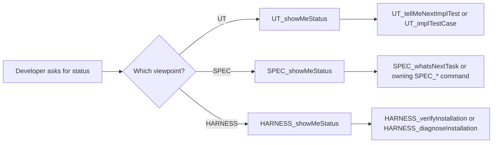

# Px StatusKits

`Px StatusKits` is the cross-priority command kit for CaTDD status reporting.

`Px` means this command kit is not a CaTDD category priority like `P0 Functional`, `P1 Design`, or `P2 Quality`. `StatusKits` means the commands are read-only reporting tool points, not a strict story lifecycle state machine.

## Method Alignment

StatusKits sits beside SpecFlow, the UT category flows, and HarnessKits:

```text
methodPrompts = CaTDD method and verification-design language
Px SpecFlow = repeatable SpecCoding lifecycle over product/story work
P0/P1/P2 flows = category-specific test design and implementation flows
Px HarnessKits = operational tool-point commands for CaTDD harness maintenance
Px StatusKits = read-only status reporting across the UT, SPEC, and HARNESS viewpoints
```

StatusKits commands report; they do not act. Each command reads one viewpoint's existing evidence and names the command that owns any follow-up. This keeps a status answer cheap, repeatable, and safe to run at any point in a session.

The three commands deliberately share one outer report shape — `viewpoint`, `status_signal`, `as_of`, `evidence`, `findings`, `next_command` — so a developer can read them as one dashboard without each viewpoint inventing its own vocabulary.

## Developer Stories

- As a Developer, when I resume a session, I want one command that tells me where my unit tests actually stand so that I do not re-read tracking sections by hand.
- As a Developer, when SpecCoding state is unclear, I want one command that reports every lane and the active story's gate so that I can decide the next move without guessing.
- As a Developer, when I am not sure my CaTDD installation and adapters are current, I want one command that inventories the harness surfaces so that I know whether to verify, diagnose, or continue.
- As a Developer, I want status reporting to be strictly read-only so that asking for status can never change state by accident.

## Command Families

| Family | Viewpoint | Purpose | Command |
| --- | --- | --- | --- |
| Unit-test status | UT | Report TC markers, per-class closure, ledger dispositions, obligation coverage, and the next UT command. | [UT_showMeStatus](../commands/Px-StatusKits/UT_showMeStatus.md) |
| SpecCoding status | SPEC | Report lane counts, the active story and its gate, the maturity level, AC totals, the governed metrics, and lane drift. | [SPEC_showMeStatus](../commands/Px-StatusKits/SPEC_showMeStatus.md) |
| Harness status | HARNESS | Report installation identity, adapters, instruction surfaces, source drift, reconciliation, verification freshness, and prior harness evidence. | [HARNESS_showMeStatus](../commands/Px-StatusKits/HARNESS_showMeStatus.md) |

Reasoning patterns differ by evidence shape rather than by convention: `UT_showMeStatus` is `Linear` because a marker scan is exhaustive and deterministic, while `SPEC_showMeStatus` and `HARNESS_showMeStatus` are `ReACT` because lanes and harness surfaces can contradict each other and may need one more read before a finding is provable.

## Seed Flow



## Command Sequence

1. Use [../commands/Px-StatusKits/UT_showMeStatus.md](../commands/Px-StatusKits/UT_showMeStatus.md) before selecting or implementing the next test case, and after a batch of implementation runs.
2. Use [../commands/Px-StatusKits/SPEC_showMeStatus.md](../commands/Px-StatusKits/SPEC_showMeStatus.md) when resuming SpecCoding, before `SPEC_whatsNextTask`, or when lane state looks inconsistent.
3. Use [../commands/Px-StatusKits/HARNESS_showMeStatus.md](../commands/Px-StatusKits/HARNESS_showMeStatus.md) after an install or refresh, and before `HARNESS_verifyInstallation` or `HARNESS_diagnoseInstallation`.
4. Chain the viewpoints when a full picture is needed: HARNESS for the surrounding installation, SPEC for lifecycle state, UT for test-level state.
5. Always hand off to the owning command named in `next_command`. A status report never performs the fix.

## Output Signals

Every StatusKits report uses the same `status_signal` vocabulary:

| Signal | Meaning |
| --- | --- |
| `healthy` | No actionable finding in the inspected scope. |
| `attention` | Non-blocking findings such as backlog, drift, or stale evidence. |
| `blocked` | At least one finding prevents trustworthy progress. |
| `unknown` | The scope could not be read. A readable but empty scope is `Level-0`, never `unknown`; a single unconfirmable surface caps the level instead of making the whole report `unknown`. |

`unknown` is a first-class answer for an unreadable scope. Reporting it is always preferable to guessing, and it is never softened into `healthy`. A readable but empty scope is not `unknown`: it is `Level-0`.

## Level Ladders

Each viewpoint also reports one graded level from `Level-0` to `Level-5`, under its own field name: `completeness_level` (UT), `maturity_level` (SPEC), and `integrity_level` (HARNESS). The three ladders share a shape but measure different things, and the names are chosen so the three are never confused:

| Level | UT — completeness | SPEC — maturity | HARNESS — integrity |
| --- | --- | --- | --- |
| Level-0 | Absent — nothing is designed. | Uninitialized — SpecCoding has not started. | Absent — CaTDD is not installed. |
| Level-1 | Sketched — skeletons exist, unmarked or ungated. | Spec-First — the spec precedes code; drift is expected and undetected. | Present — installed, adapters may be stale. |
| Level-2 | Tracked — every TC marked, linked, and gated. | Organized — everything in the right lane, once. | Consistent — manifest, baseline, and adapters reconcile. |
| Level-3 | P0 Closed — every P0 Functional obligation is `CLOSED`. | Spec-Anchored — gates in order, drift detected and resolved, closed work evidenced. | Current — aligned with source, instruction surfaces right. |
| Level-4 | All Classes Closed — P0 held, plus P1 Design, P2 Quality, and P3 Addons all `CLOSED`. | Spec-as-Source — the spec is the source, regeneration is verified, generated files are never hand-edited. | Proven — a recent verification passes. |
| Level-5 | Quantified — obligation coverage over P0-P3, zero `GAP`, every uncovered obligation carrying its reason. | Self-evolving — improvement built on Spec-as-Source, with a measured effect. | Spotless — nothing stale, unknown, or half-finished. |

The progression question is also the same at every step, which is what makes the levels easy to distinguish:

| Transition | What it asks |
| --- | --- |
| Level-0 → Level-1 | Does the thing *exist* at all? |
| Level-1 → Level-2 | Is the *bookkeeping* correct? |
| Level-2 → Level-3 | Is the *core work closed with evidence* rather than merely declared? |
| Level-3 → Level-4 | Is the *whole declared scope* closed — every class, or the spec as source, or a passing verification? |
| Level-4 → Level-5 | Is anything still *uncovered, unknown, or unmeasured*? |

Mnemonic: **UT-5 is all evidence, SPEC-5 is all learning, HARNESS-5 is all tidiness.**

Level rules:

1. Levels are ordinal and monotonic. Level-N requires Level-(N-1); a level is never awarded by skipping.
2. Levels are decided by evidence, not intent. Every report names `level_evidence` and the single `level_gap` blocking the next level.
3. Read the ladder top-down and stop at the last level whose entry question is answered `YES` by cited evidence.
4. `unknown` is only for an unreadable scope; an empty but readable scope is `Level-0`.
5. Never inflate a level. A level without cited evidence is reported as the level below it.

`level` and `status_signal` are not the same axis. The level says how far along the viewpoint is; the signal says whether the current state is safe to act on. A high level may still carry `attention` findings, and a genuine blocker caps the signal regardless of level.

Canonical definitions of `status_signal`, `completeness_level`, `maturity_level`, `integrity_level`, `level_evidence`, `level_gap`, `CLOSED`, `testPassOnMock`, `TestScope`, the disposition vocabulary, and the Spec-First / Spec-Anchored / Spec-as-Source ladder live in [README_UbiLang.md](../../README_UbiLang.md). This kit and the three commands own the reporting procedure, not the meaning of the terms.

## Conflict Guard

- StatusKits commands are read-only. They never repair, regenerate, move, stage, or commit anything.
- `UT_showMeStatus` reports markers; it never promotes one and never certifies execution evidence.
- `SPEC_showMeStatus` reports lane placement; it never moves lifecycle state.
- `HARNESS_showMeStatus` inventories harness surfaces; it never returns a verification verdict and never patches source.
- Portable source files remain the source of truth; generated native wrappers are adapters.
- CaTDD category semantics and priority order must still come from `methodPrompts`.

ONE-MORE-THING: ask developer if something not sure
